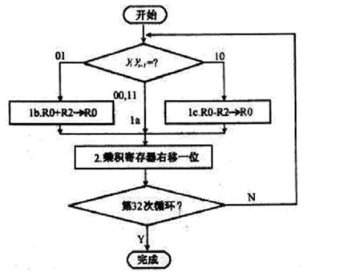
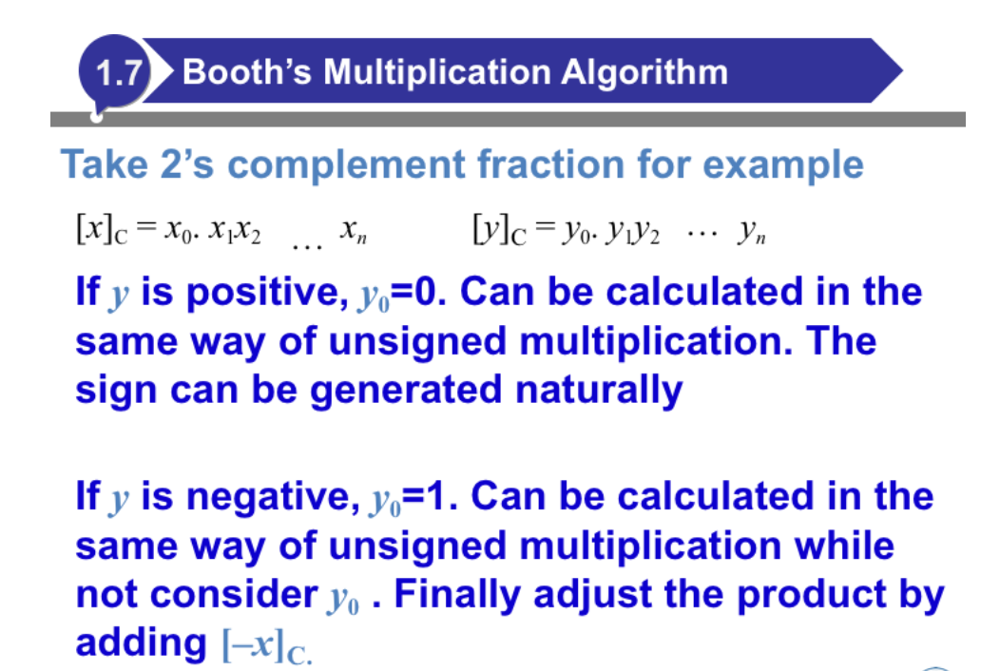
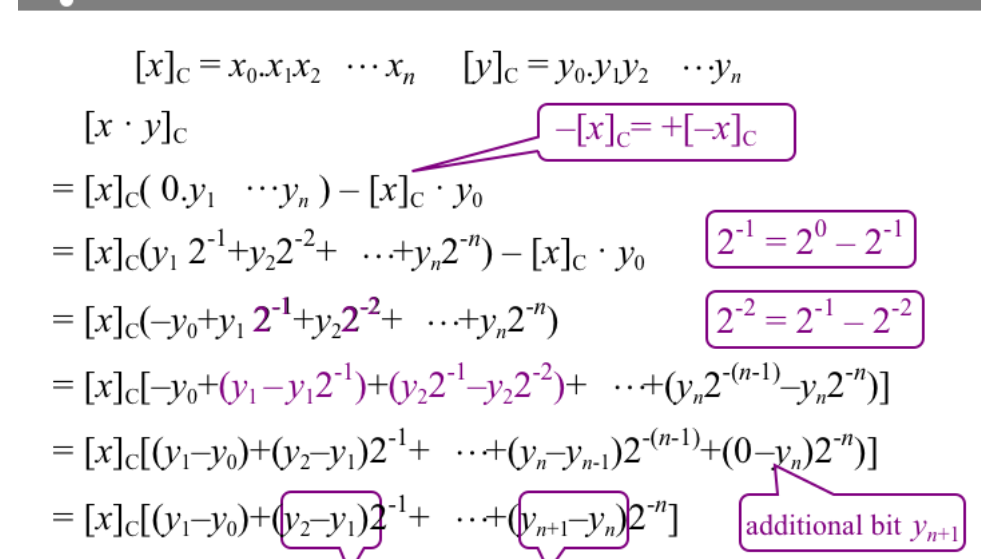
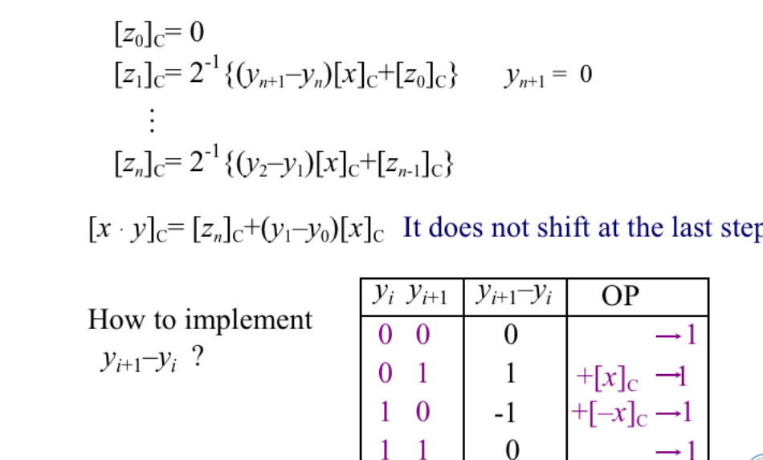

<!-- @format -->

# 二进制乘法的 booth 算法

## wiki 的解释

> 算法原理
> 考虑一个由若干个 0 包围着若干个 1 的正的二进制乘数，比如 00111110，积可以表达为：

> ${\displaystyle M\times \,^{\prime \prime }0\;0\;1\;1\;1\;1\;1\;0\,^{\prime \prime }=M\times (2^{5}+2^{4}+2^{3}+2^{2}+2^{1})=M\times 62}$
> 其中，M 代表被乘数。变形为下式可以使运算次数可以减为两次：
>
> ${M\times \,^{\prime \prime }0\;1\;0\;0\;0\;0\;0\;0{-1}\;0\,^{\prime \prime }=M\times (2^{6}-2^{1})=M\times 62}$
> 事实上，任何二进制数中连续的 1 可以被分解为两个二进制数之差：
>
> ${\displaystyle (\ldots 0\overbrace {1\ldots 1} ^{n}0\ldots )_{2}\equiv (\ldots 1\overbrace {0\ldots 0} ^{n}0\ldots )_{2}-(\ldots 0\overbrace {0\ldots 1} ^{n}0\ldots )_{2}}{\displaystyle (\ldots 0\overbrace {1\ldots 1} ^{n}0\ldots )_{2}\equiv (\ldots 1\overbrace {0\ldots 0} ^{n}0\ldots )_{2}-(\ldots 0\overbrace {0\ldots 1} ^{n}0\ldots )_{2}}$。
> 因此，我们可以用更简单的运算来替换原数中连续为 1 的数字的乘法，通过加上乘数，对部分积进行移位运算，最后再将之从乘数中减去。它利用了我们在针对为零的位做乘法时，不需要做其他运算，只需移位这一特点，这很像我们在做和 99 的乘法时利用 99 = 100 − 1 这一性质。这种模式可以扩展应用于任何一串数字中连续为 1 的部分（包括只有一个 1 的情况）。那么，
>
> ${\displaystyle M\times \,^{\prime \prime }0\;0\;1\;1\;1\;0\;1\;0\,^{\prime \prime }=M\times (2^{5}+2^{4}+2^{3}+2^{1})=M\times 58}$ > ${\displaystyle M\times \,^{\prime \prime }0\;1\;0\;0{-1}\;0\;1\;0\,^>{\prime \prime }=M\times (2^{6}-2^{3}+2^{1})=M\times 58}$。
>
> 布斯算法遵从这种模式，它在遇到一串数字中的第一组从 0 到 1 的变化时（即遇到 01 时）执行加法，在遇到这一串连续 1 的尾部时（即遇到 10 时）执行减法。这在乘数为负时同样有效。当乘数中的连续 1 比较多时（形成比较长的 1 串时），布斯算法较一般的乘法算法执行的加减法运算少。

## [个人的理解](https://blog.csdn.net/ZHjiao_1997/article/details/52475498)

## 具体的实现

1. booth 算法中讲到的右移是算术右移，即符号位为 1 右移补符号位，符号位为 0，右移补 0 位
2. booth 执行步骤：
   初始化一个$2\times n+1$的空间，编号为$-1\sim (2*n-1)$, 其中编号$-1$是一个补充位，初始化为 0，其余$2*n$位是乘法所需的 2\*n 位.

    _算法的执行步骤为:_
    1. initialize:

        高n位初始化为0，低n位初始化位$[y]_{C}$, $-1$位初始化为0

    2. 判断第 0 位和第-1 位，执行方式由下表而定.
       
       $y_{0}$|$y_{-1}$|执行方式
       -|-|-
       0|0|右移一位
       0|1|加上$[x]_{C}$，右移一位
       1|0|加上$[-x]_{C}$, 右移一位
       1|1|右移一位
        这里的**加上$^{.......}$**指的是$2\times n+1$位的高n位加上被乘数$x$或者是$-x$的补码.

        循环执行上述步骤，一直执行n次, n为二进制数长度，例如32位机器的n就是32

## 具体的例子:
例如$7\times -4$,采用四位二进制补码表示. 

$7$的二进制补码表示为`0111`

$-7$的二进制补码表示为`1001`

$-4$的二进制补码表示为`1100`

**执行步骤如下**

> 高四位|低四位|第-1位
> -|-|-
> 0000|1100|0

1. 第一步
    > 判断第0位和第-1位的状态:**00**
    > 于是: 

    > 右移1位:
    > 高四位|低四位|第-1位
    > -|-|-
    > 0000|0110|0

2. 第二步
    > 判断第0位和第-1位的状态:**00**
    > 于是: 
    > 右移1位:

    > 高四位|低四位|第-1位
    > -|-|-
    > 0000|0011|0

3. 第三步
    > 判断第0位和第-1位的状态:**10**
    > 于是: 
    > 高四位加上$[-x]_{C}$, 右移1位:

    * 加上$[-x]_{C}$:
        > 高四位|低四位|第-1位
        > -|-|-
        > 1001|0011|0

    * 右移一位
        > 高四位|低四位|第-1位
        > -|-|-
        > 1100|1001|1
 
4. 第四步
    > 判断第0位和第-1位的状态:**11**
    > 于是: 
    > 不右移，所以结束

    _**最终我们有**_
    > 高四位|低四位|第-1位
    > -|-|-
    > 1110|0100|1

    于是结果为`1110_0100`
    符号位不变，其余位取反加一变成原码:

    `1001_1011 + 1`=`1001_1100`==-28

## 算法流程图:

## 原理推导

