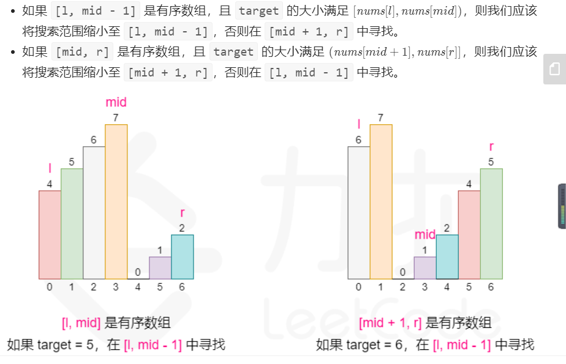

## 33. 搜索旋转排序数组

1.  最简单的方法顺序查找，时间复杂度$O(n)$
2.  二分查找，这个leetcode的官方题解写的非常的好。
    *   [点我看leetcode的官方题解](https://leetcode-cn.com/problems/search-in-rotated-sorted-array/solution/sou-suo-xuan-zhuan-pai-xu-shu-zu-by-leetcode-solut/)
    *   

```java
class Solution {
    int len_;
    int target_;

    public int search(int[] nums, int target) {
        len_ = nums.length;
        target_ = target;
        if (len_ == 0) {
            return -1;
        }
        int left = 0, right = len_ - 1;
        while (left <= right) {
            int mid = (left + right) / 2;
            if (target_ == nums[mid]) {
                return mid;
            }
//            这种情况下搜索需要同时更改left和right
            if (nums[0] <= nums[mid]) {
                if (nums[0] <= target_ && target_ < nums[mid]) {
                    right = mid - 1;

                } else {
                    left = mid + 1;
                }
            } else {
                if (nums[mid] < target_ && target_ <= nums[len_ - 1]) {
                    left = mid + 1;
                } else {
                    right = mid - 1;
                }
            }

        }
        return -1;
    }
}
```

