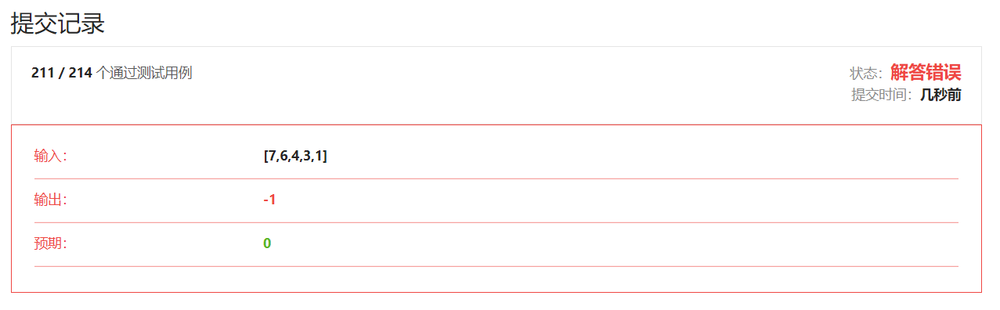

## 题解

[只能说官方的题解想法实在是太妙了](https://leetcode-cn.com/problems/best-time-to-buy-and-sell-stock-iii/solution/mai-mai-gu-piao-de-zui-jia-shi-ji-iii-by-wrnt/)

1.  官方的题解妙就妙在我根本想不到这么做，官方题解思路的下面贴了一个我的思路。
2.  官方的题解妙就妙在这句话**无论题目中是否允许「在同一天买入并且卖出」这一操作，最终的答案都不会受到影响，这是因为这一操作带来的收益为零。**，这样的话可以极大的减小状态转移方程的复杂程度。
3.  下面我的写法显然可以优化空间，官方题解就是这么做的。
4.  时间复杂度$O(n)$，空间复杂度$O(n)$，空间复杂度可以优化到$O(1)$

```c++
class Solution {
public:
    int dp[100005][4];
    int maxProfit(vector<int>& prices) {
        int n=prices.size();
        if(n<=1){
            return 0;
        }
        if(n<=2){
            return max(prices[1]-prices[0],0);
        }
        if(n<=3){
            return max(max(prices[1]-prices[0],prices[2]-prices[0]),max(0,prices[2]-prices[1]));
        }

        dp[0][0]=-prices[0];// 只买入一次
        dp[0][2]=0;         // 只卖出一次
        dp[0][1]=-prices[0];// 买入第二次
        dp[0][3]=0;         // 卖出第二次
        for(int i=1;i<n;i++){
            // 手中第一次持有股票
            dp[i][0]=max(dp[i-1][0],-prices[i]);
            // 手中持有第一次股票后售出，现在手中无股票
            dp[i][2]=max(dp[i-1][2],dp[i][0]+prices[i]);
            // 手中第二次持有股票
            dp[i][1]=max(dp[i-1][1],dp[i][2]-prices[i]); 
            // 手中持有第二次股票后售出，现在手中无股票  
            dp[i][3]=max(dp[i-1][3],dp[i][1]+prices[i]);
        }
        int res=max(dp[n-1][2],dp[n-1][3]);
        printf("%d\n",res);
        return res;
    }
};
```


## 我的一个解法

1.  首先是五个状态(这五个状态怎么想出来的？因为做过**[309. 最佳买卖股票时机含冷冻期](https://leetcode-cn.com/problems/best-time-to-buy-and-sell-stock-with-cooldown/)**)这题，自然而然想出来了：

    *   还什么股票都没有买过（这个状态不需要表示，显然收益为$0$）
    *   第一次买股票，股票在手。
    *   第一次卖股票，股票离手。
    *   第二次买股票，股票在手。
    *   第二次卖股票，股票离手。

2.  我们用

    >   $dp[i][0]$代表第一次买股票，股票在手
    >
    >   $dp[i][1]$代表第二次买股票，股票在手
    >
    >   $dp[i][2]$代表第一次卖股票，股票离手
    >
    >   $dp[i][3]$代表第二次卖股票，股票离手
    >
    >   $dp[i][0,1,2,3]$都代表在第$i$天结束后我们的收益状况，买加上$-prices[i]$，卖减去$prices[i]$

3.  下面一个比较麻烦的东西是边界条件的确定：

>   *   $n=1,2,3$ 的情况特殊处理。
>
>   *   ```c++
>       dp[0][0]=-prices[0];
>       dp[0][1]=0,dp[1][1]=0,dp[2][1]=prices[1]-prices[0]-prices[2];
>       dp[0][2]=0,dp[1][2]=prices[1]-prices[0];
>       dp[0][3]=0,dp[1][3]=0,dp[2][3]=0,dp[3][3]=prices[1]-prices[0]+prices[3]-prices[2];
>       ```

4.  循环怎么写？

>   *   ```c++
>       for(int i=1;i<n;i++){
>           // 手中第一次持有股票
>           dp[i][0]=max(dp[i-1][0],-prices[i]);
>           if(i>=2){
>               // 手中持有第一次股票后售出，现在手中无股票
>               dp[i][2]=max(dp[i-1][2],dp[i-1][0]+prices[i]);
>           }
>           if(i>=3){
>               // 手中第二次持有股票
>               dp[i][1]=max(dp[i-1][1],dp[i-1][2]-prices[i]);
>           }
>           if(i>=4){
>               // 手中持有第二次股票后售出，现在手中无股票  
>               dp[i][3]=max(dp[i-1][3],dp[i-1][1]+prices[i]);
>           }
>       }
>       int res=max(dp[n-1][2],dp[n-1][3]);
>       ```
>
>   *   这样写带来了什么问题？（**很严重的问题，很难发现的问题，搞得人糊涂的问题**）
>
>   *   
>
>   *   没有这个测试样例还真发现不了这个错误。
>
>   *   我们前面定义状态的时候，本身就是**有一个什么都没买的状态**的，所以最终的解应该是三个状态中取最大值，也就是：
>
>   *   ```c++
>       int res=max(max(0,dp[n-1][2]),dp[n-1][3]);
>       ```

```c++
class Solution {
public:
    int dp[100005][4];
    int maxProfit(vector<int>& prices) {
        int n=prices.size();
        if(n<=1){
            return 0;
        }
        if(n<=2){
            return max(prices[1]-prices[0],0);
        }
        if(n<=3){
            return max(max(prices[1]-prices[0],prices[2]-prices[0]),max(0,prices[2]-prices[1]));
        }

        dp[0][0]=-prices[0];
        dp[0][1]=0,dp[1][1]=0,dp[2][1]=prices[1]-prices[0]-prices[2];
        dp[0][2]=0,dp[1][2]=prices[1]-prices[0];
        dp[0][3]=0,dp[1][3]=0,dp[2][3]=0,dp[3][3]=prices[1]-prices[0]+prices[3]-prices[2];
        for(int i=1;i<n;i++){
            // 手中第一次持有股票
            dp[i][0]=max(dp[i-1][0],-prices[i]);
            if(i>=2){
                // 手中持有第一次股票后售出，现在手中无股票
                dp[i][2]=max(dp[i-1][2],dp[i-1][0]+prices[i]);
            }
            if(i>=3){
                // 手中第二次持有股票
                dp[i][1]=max(dp[i-1][1],dp[i-1][2]-prices[i]);
            }
            if(i>=4){
                // 手中持有第二次股票后售出，现在手中无股票  
                dp[i][3]=max(dp[i-1][3],dp[i-1][1]+prices[i]);
            }
        }
        int res=max(max(0,dp[n-1][2]),dp[n-1][3]);
        printf("%d\n",res);
        return res;
    }
};
```

