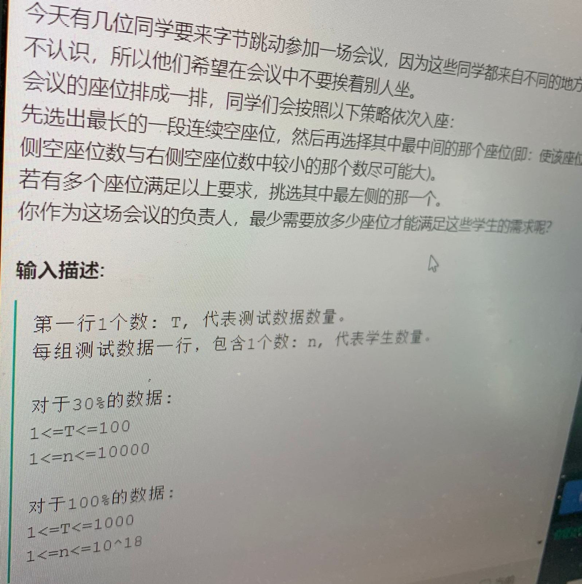

##  思路

$dp[i][0]$代表当前数组的长度为n，数组的两边都能放人

$dp[i][1]$代表当前数组的长度为n，数组的最左边不可以放人

$dp[i][2]$代表当前数组的长度为n，数组的最右边不可以放人

$dp[i][3]$代表当前数组的长度为n，数组的两边都不能放人

那么状态转移方程为：

if i为奇数，当前数组的长度为i:

$dp[i][0]=dp[i/2][2]+dp[i/2][1]+1$

$dp[i][1]=dp[i/2][3]+dp[i/2][1]+1$

$dp[i][2]=dp[i/2][2]+dp[i/2][3]+1$

$dp[i][3]=dp[i/2][3]+dp[i/2][3]+1$

if(i为偶数)，当前数组的长度为i:

$dp[i][0]=dp[i/2-1][2]+dp[i/2][1]+1$

$dp[i][1]=dp[i/2-1][3]+dp[i/2][1]+1$

$dp[i][2]=dp[i/2-1][2]+dp[i/2][3]+1$

$dp[i][3]=dp[i/2-1][3]+dp[i/2][3]+1$

可以自底向上计算，也可以自顶向下计算。

```cpp
#include <iostream>
#include <algorithm>
#include <vector>
#include <string>
#include <map>
typedef long long ll;
using namespace std;

ll T, n;
map<pair<ll, ll>, ll> mp;

// i个座位能够坐下的人数
ll solve(ll i, ll w)
{
	// 0个座位能够坐下的人数为0
	if (i == 0) {
		return 0;
	}

	pair<ll, ll> curPair = make_pair(i, w);
	// 前面四个座位,初始状态直接返回
	if (i <= 4) {
		return mp[curPair];
	}

	// 已经计算过直接返回
	if (mp[curPair] != 0) {
		return mp[curPair];
	}

	if (i % 2 == 1) {
		// 两边都可以放
		if (w == 0) {
			mp[curPair] = solve(i / 2, 2) + solve(i / 2, 1) + 1;
		}
		// 右边的数组，最左边不可以放
		else if (w == 1) {
			// 右边的数组中间放了一个元素，这下右边的数组左边的那一段两边都不可以放元素了
			// 右边的数组中间放了一个元素，这下右边的数组右边的那一段左边都不可以放元素了
			mp[curPair] = solve(i / 2, 3) + solve(i / 2, 1) + 1;
		}
		// 左边的数组，最右边不可以放
		else if (w == 2) {
			// 左边的数组中间放了一个元素，这下左边的数组左边的那一段右边不能放元素了
			// 左边的数组中间放了一个元素，这下左边的数组右边的那一段左右都不能放元素了
			mp[curPair] = solve(i / 2, 2) + solve(i / 2, 3) + 1;
		}
		// 左右都不给放元素的数组中间放了一个元素，左右还是不能放数组
		else {
			mp[curPair] = 2 * solve(i / 2, 3) + 1;
		}
	}
	else {
		// 两边都可以放
		if (w == 0) {
			mp[curPair] = solve(i / 2 - 1, 2) + solve(i / 2, 1) + 1;
		}
		// 右边的数组，最左边不可以放
		else if (w == 1) {
			mp[curPair] = solve(i / 2 - 1, 3) + solve(i / 2, 1) + 1;
		}
		// 左边的数组，最右边不可以放
		else if (w == 2) {
			mp[curPair] = solve(i / 2 - 1, 2) + solve(i / 2, 3) + 1;
		}
		// 左右都不给放元素的数组中间放了一个元素，左右还是不能放数组
		else {
			mp[curPair] = solve(i / 2 - 1, 3) + solve(i / 2, 3) + 1;
		}
	}
	return mp[curPair];
}

int main() {
	mp[make_pair(1, 0)] = 1;
	mp[make_pair(2, 0)] = 1;
	mp[make_pair(3, 0)] = 1;
	mp[make_pair(4, 0)] = 2;

	mp[make_pair(1, 1)] = 0;
	mp[make_pair(2, 1)] = 1;
	mp[make_pair(3, 1)] = 1;
	mp[make_pair(4, 1)] = 2;

	mp[make_pair(1, 2)] = 0;
	mp[make_pair(2, 2)] = 1;
	mp[make_pair(3, 2)] = 1;
	mp[make_pair(4, 2)] = 1;

	mp[make_pair(1, 3)] = 0;
	mp[make_pair(2, 3)] = 0;
	mp[make_pair(3, 3)] = 1;
	mp[make_pair(4, 3)] = 1;

	cin >> T;
	while (T--){
		cin >> n;
		ll left = 1, right = 5 * n, mid;
		while (left < right) {
			mid = (left + right) / 2;
			if (solve(mid, 0) >= n) {
				right = mid;
			}
			else {
				left = mid + 1;
			}
		}
		cout << left << "\n";
	}
	return 0;
}

```

