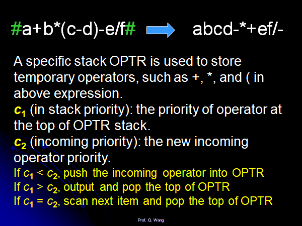
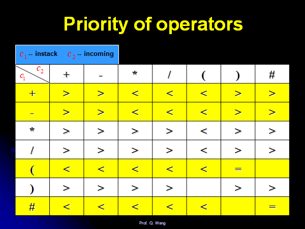

## 解题思路

1. 首先,python大法好

```python
class Solution:
    def calculate(self, s: str) -> int:
        s1=[]
        for i in range(len(s)):
            s1.append(s[i])
            if s[i]=='/':
                s1.append('/')
        s1="".join(s1)
        return eval(s1)
```


1. 表达式运算符优先级算法。

2. 定义运算符的优先级

3. 1\2代表前一个和后一个运算符。例如$+$在$-$后面，那么$+$属于$2$指示的那个维度。

4. 假设表达式的开头和结尾有$\#$

5. | 1\2  | +    | -    | x    | /    | #    |
    | ---- | ---- | ---- | ---- | ---- | ---- |
    | +    | >    | >    | <    | <    | >    |
    | -    | >    | >    | <    | <    | >    |
    | x    | >    | >    | >    | >    | >    |
    | /    | >    | >    | >    | >    | >    |
    | #    | <    | <    | <    | <    | =    |

6. 这个方法适用于所有的表达式。

7. 贴一下书上的原算法：

    

    

    

## 源代码(PS，自己代码估计写麻烦了)

```c
class Solution {
public:
    stack<int>s1;
    stack<char>s2;

    int cal(char ctop,int x1,int x2){
        int res=0;
        switch (ctop){
            case '+':{
                res=x1+x2;
                break;
            }
            case '-':{
                res=x2-x1;
                break;
            }
            case '*':{
                res=x1*x2;
                break;
            }
            case '/':{
                res=x2/x1;
                break;
            }
        }
        return res;
    }

    int toNum(string &str){
        int res=0;
        for(int i=0;i<str.size();i++){
            res=res*10+(int)(str[i]-'0');
        }
        return res;
    }
    int calculate(string s) {
        int n=s.size();
        s2.push('#');

        string last_num="";
        for(int i=0;i<s.size();i++){
            char& c=s[i];
            if(c==' '){
                continue;
            }
            else if(c>='0'&&c<='9'){
                string snum="";
                snum+=c;
                while(i<s.size()&&s[++i]>='0'&&s[i]<='9'){
                    snum+=s[i];
                }
                int num=toNum(snum);
                s1.push(num);
                if(i!=s.size()){
                    i--;
                }
            }
            else{
                char ctop=s2.top();
                if(ctop=='#'){
                    s2.push(c);
                }
                else if((ctop=='+'||ctop=='-')&&(c=='*'||c=='/')){
                    s2.push(c);
                }
                else{
                    while(!((ctop=='+'||ctop=='-')&&(c=='*'||c=='/'))&&ctop!='#'){
                        s2.pop();
                        int x1,x2;
                        x1=s1.top();
                        s1.pop();
                        x2=s1.top();
                        s1.pop();
                        int res=cal(ctop,x1,x2);
                        s1.push(res);
                        ctop=s2.top();
                    }
                    s2.push(c);
                }
            }
        }
        int res=s1.top();
        while(s1.size()!=1){
            char ctop=s2.top();
            s2.pop();
            int x1=s1.top();
            s1.pop();
            int x2=s1.top();
            s1.pop();
            res=cal(ctop,x1,x2);
            s1.push(res);
        }
        return res;
    }
};
```

