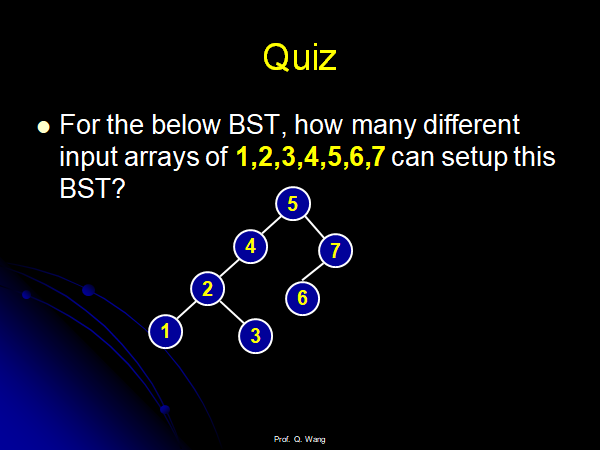
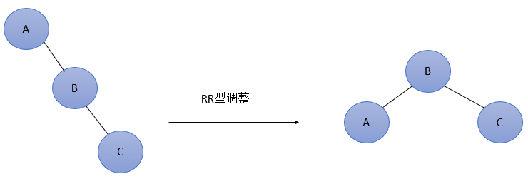
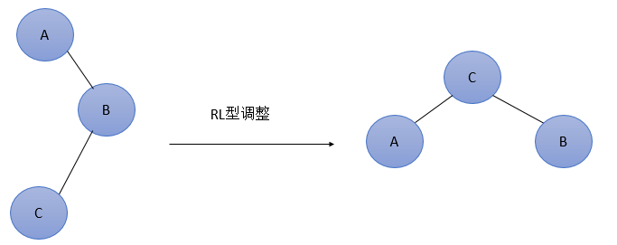
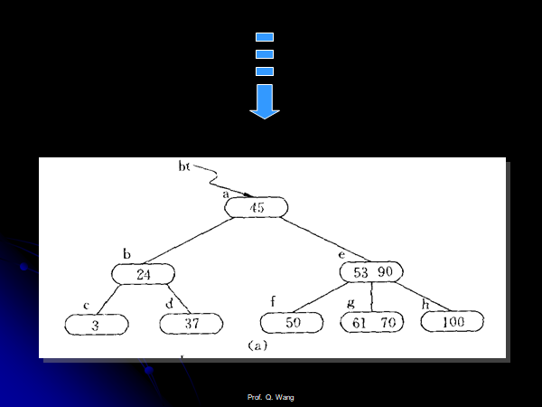
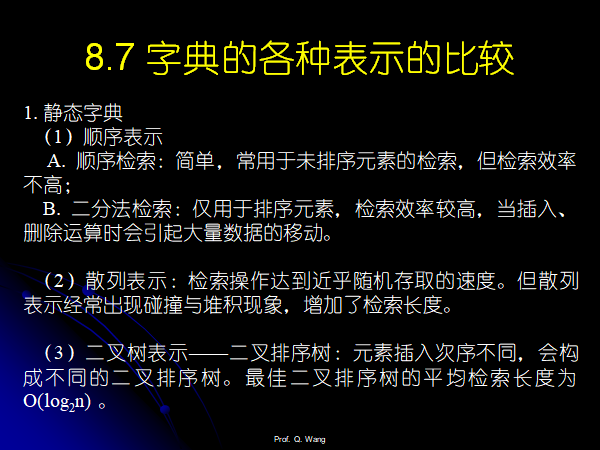

[  

[ 前序中序后序数列得到树的方式](https://blog.csdn.net/suliangkuanjiayou/article/details/102960971)

# Chapter 08 Searching

## 检索效率的标准

Average Searching lenght(平均检索长度)

$ASL=\sum{p_i}{c_i}$

## 顺序查找

顾名思义，十分的简单，为了提高效率，按照查找的概率进行排序，使得概率大的记录被访问。

**为每一个记录增加一个访问频度的变量**，按照访问频率从高到低进行排序，查找表按照访问频率有序。

假设查找成功和失败的概率相等，那么平均查找长度为：


### 折半查找

```cpp
// 找到大于等于val的第一个元素的位置，如果没有大于val的元素，返回的是begin_pos-1
int binarySearch(vector<int>& llist, int begin_pos, int end_pos, int val) {
    int left = begin_pos, right = end_pos;
    int mid;
    while (left<=right) {
        mid = (left + right) / 2;// (1,3)->2得到的中间的数字,(1,4)组合，那么得到(1+4)/2=2，得到一个偏近1的位置。。。 (a,b)代表left和right的位置分别为(a,b)
                                            // 特殊的，(1,1)->1, (1,2)->1
        if (llist[mid] == val) {
            return mid;
        }
        else if (llist[mid] < val) {
            left = mid + 1;
        }
        else {
            right = mid - 1;
        }
    }
    // 这个时候我们如何找到这个>=val的pos?
    // 跳出循环的条件只有left>right
    // 由于mid<=right，所以left最多只能大right 1个单位，也就是跳出循环的条件是right=left+1
    // 那么问题来了
    // 1. 假设之前通过else if(llist[mid]<val)增加left，left==(根据假设得到)mid+1==(通过left>right的跳出条件得到)right+1，也即是mid==right，那么a[mid]<=val,不是等于，
    //    那么必然是a[mid]==a[right]<val，这个时候肯定是返回left==mid+1==right+1
    // 2. 假设之前通过else if(llist[mid]<val)减小right, right==(根据假设得到)mid-1,left==right+1(通过left>right的跳出条件得到)，那么left=mid，也就是要么(1,1)这样的，要么(1,2)这样的，
    //    那么这个时候,a[mid]==a[left]>val，val是最小的元素，我们需要返回的是right，这是插入val的位置
    //    那么如果right<begin_pos，我们需要返回的是right，因为这个时候所有的元素都比val要大，我们直接返回right
    //    如果right>=0，说明>val的第一个元素是left==mid
    // 下面的代码很好记是吧？
    if (right < begin_pos) {
        return right;
    }
    if (left > end_pos) {
        return left;
    }
    return mid;
}
```


**具有n个节点的判定树的深度最多为$\lceil log_2{n} \rceil$**，折半查找成功的比较的次数最多为$\lceil log_2{n} \rceil$，查找不成功的次数为$\lceil log_2{n} \rceil$，于是$AVL$如下所求：


当各个节点出现的概率不相等的时候，上面那样构造出来的二叉搜索树未必是最优的，只考虑查找成功的情况下，产生性能最佳的判定树的目标是使得**$PH=\sum_{i=1}^{n}w_ih_i$**最小，$PH$最小的叫做**静态最优查找树**，近似较小的叫做**次优查找树**。

**静态最优查找树**的构造较为困难，在这里构造**静态次优查找树**。


```cpp
#pragma warning(disable:4996)
#include<cstdio>
#include<iostream>
#include<vector>
#include<algorithm>
using namespace std;
const int maxn = 10005;
const int INF = 0x3f3f3f3f;

struct Node {
	int w;
	int val;
	Node(int _val = 0, int _w = 0) {
		val = _val;
		w = _w;
	}
};

struct TreeNode {
	Node node;
	TreeNode* left, * right;
	TreeNode() {}
	TreeNode(Node _node, TreeNode* _left = NULL, TreeNode* _right = NULL) {
		node = _node;
		left = _left;
		right = _right;
	}
};


TreeNode* makeTree(int left, int right, vector<Node>& vs, vector<int>& wsums) {
	if (left > right) {
		return NULL;
	}
	int minval = INF, minpos = -1;
	for (int i = left; i <= right; i++) {
		int sumtmp = wsums[i] - wsums[left];//[left,i-1]
		int sumtmp1 = wsums[right + 1] - wsums[i + 1];//[i+1,right]
		if (minval > abs(sumtmp - sumtmp1)) {
			minval = abs(sumtmp - sumtmp1);
			minpos = i;
		}
	}
	TreeNode* root = new TreeNode();
	Node& node = root->node;
	node = vs[minpos];
	TreeNode*& childleft = root->left, *& childright = root->right;
	// 划分
	childleft = makeTree(left, minpos - 1, vs, wsums);
	childright = makeTree(minpos + 1, right, vs, wsums);
	return root;
}

TreeNode* makeSuboptimumTree(vector<Node>& vs) {
	vector<int>wsums(vs.size() + 1);
	wsums[0] = 0;
	for (int i = 1; i < wsums.size(); i++) {
		int& w = vs[i - 1].w;
		wsums[i] = wsums[i - 1] + w;
	}
	int left = 0, right = vs.size() - 1;
	TreeNode* root = makeTree(left, right, vs, wsums);
	return root;
}


void searchTree(TreeNode* root) {
	if (root == NULL) {
		return;
	}
	cout << root->node.val << endl;
	TreeNode* childleft=root->left, * childright=root->right;
	searchTree(childleft);
	searchTree(childright);
}
int main() {
	int vals[] = { 5,4,3,7,9 };
	int ws[] = { 2,3,4,5,1 };
	vector<Node>vs;
	for (int i = 0; i < 5; i++) {
		vs.push_back(Node(vals[i], ws[i]));
	}
	TreeNode*root=makeSuboptimumTree(vs);
	// 先序遍历输出
	searchTree(root);
}
```

### 斐波那契查找和插值查找

顺序查找法的一种。


### 索引顺序法


思想很简单，建立一个索引表，索引表的每一项指向分块的第一个元素的位置，首先查找这个数字在哪个分块，然后再在对应的分块中进行查找，两个地方都用二分或者是顺序查找的方法。

## Dynamic searching table

### Binary Seaching Tree(二叉搜索树)

1. 定义：二叉搜索树或者是空二叉树，或者是具有以下性质的二叉树。

    * 若左子树不为空，则左子树上的所有的节点都小于根节点的值。
    * 若右子树不为空，则右子树上的所有的节点都大于根节点的值。
    * 左右子树也分别为二叉搜索树。

2. BST的搜索：

    ```cpp
    #pragma warning(disable:4996)
    #include<cstdio>
    #include<iostream>
    #include<vector>
    #include<algorithm>
    using namespace std;
    const int maxn = 10005;
    const int INF = 0x3f3f3f3f;
    struct Node {
        int val;
        Node* left, * right;
        Node() {}
        Node(int _val, Node* _left = NULL, Node* _right = NULL) {
            val = _val;
            left = _left;
            right = _right;
        }
    };
    
    // 已经有返回false,没有插入成功返回true
    // 传入的参数为根节点
    int addNode(Node*& root, int val) {
        if (root == NULL) {
            Node* node = new Node(val);
            root = node;
            return 1;
        }
        if (root->val == val) {
            return 0;
        }
        else if (root->val < val) {
            return addNode(root->right, val);
        }
        else {
            return addNode(root->left, val);
        }
    }
    
    void inorderSearchBST(Node* root) {
        if (root == NULL) {
            return;
        }
        inorderSearchBST(root->left);
        cout << root->val << "\n";
        inorderSearchBST(root->right);
    }
    
    bool searchBST(Node* curnode, int val) {
        if (curnode == NULL) {
            return false;
        }
        if (val == curnode->val) {
            return true;
        }
        if (val < curnode->val) {
            return searchBST(curnode->left, val);
        }
        return searchBST(curnode->right, val);
    }
    
    
    bool searchBSTNonrecursive(Node* root, int val) {
        if (root == NULL) {
            return false;
        }
        Node* curnode = root;
        while (curnode) {
            if (curnode->val == val) {
                return true;
            }
            if (curnode->val > val) {
                curnode = curnode->left;
            }
            else {
                curnode = curnode->right;
            }
        }
        return false;
    }
    
    int main() {
        vector<int>vs({ 2,1,3,4,5 });
        Node* root = NULL;
        for (auto& val : vs) {
            addNode(root, val);
        }
        inorderSearchBST(root);
        for (int i = 0; i < 10; i++) {
            //cout<<searchBST(root, i)<<"\n";
            cout<<searchBSTNonrecursive(root,i)<<"\n";
        }
        return 0;
    }
    ```

    

3. BST的建立算法：

    * 如果二叉搜索树为空，那么新插入的节点作为根节点
    * 如果二叉搜索树非空，那么新节点的关键码和根节点的关键码进行比较，若新节点的关键码 小，新节点插入到根节点的左子树中，否则，插入到右子树中。
    * 子树中的插入过程和在树中的插入过程相同，如此进行下去，直到找到该节点，或者直到新节点成为叶子节点为止。

    建立二叉搜索树的递归算法在上面的代码中写过。

4. **中序遍历二叉搜索树产生关键字的有序序列**，因为左子树的值一定小于根的值，根的值一定小于右子树的值。

5. 二叉搜索树是动态查找表中的一种有效的表示方法。

6. 给定n个元素的序列，可以创建出多少的二叉搜索树？换句话说，由于**中序遍历**的序列是唯一的，中序和先序可以唯一的确定一棵树，**先序遍历的产生的序列的个数等于这个序列产生的二叉搜索树的个数**。

    * 设calHowManyBST(n)代表n个节点可以产生多少的二叉搜索树，那么我们以i号节点作为根节点，可以得到的二叉搜索树的个数为：

        $f(i)=calHowManyBST(i-1,n-i);  1<=i<=n$

        其中：

        $calHowManyBST(0)=calHowManyBST(1)=1; 初始条件$

        上面的公式在$n>=1$的时候成立，n==0的时候应该结果为0。

        记忆化搜索的代码如下：

    ```cpp
    // 这个函数代表n个节点的序列的二叉搜索树的个数
    // vis()的size的大小为n+1,初始化为0
    int calHowManyBST(int n, vector<int>& vis) {
    	if (n == 0 || n == 1) {
    		return 1;
    	}
    	if (vis[n]) {
    		return vis[n];
    	}
    
    	int res = 0;
    	// 以i号节点作为根节点
    	//for (int i = 1; i <= n; i++) {
    	//	res += calHowManyBST(i - 1, vis) * calHowManyBST(n - i, vis);
    	//}
    	for (int i = 1; i <= n / 2; i++) {
    		res += calHowManyBST(i - 1, vis) * calHowManyBST(n - i, vis);
    	}
    	res = res << 1;
    	if (n & 1) {
    		int tmp = calHowManyBST(n >> 1, vis);
    		res += tmp * tmp;
    	}
    
    	vis[n] = res;
    	return res;
    }
    ```

    ```cpp
    #pragma warning(disable:4996)
    #include<cstdio>
    #include<iostream>
    #include<vector>
    #include<algorithm>
    #include<map>
    using namespace std;
    const int maxn = 10005;
    const int INF = 0x3f3f3f3f;
    
    // 完整的代码如下：
    // 这个函数代表n个节点的序列的二叉搜索树的个数
    
    int calHowManyBST(int n, vector<int>& vis) {
    	if (n == 0 || n == 1) {
    		return 1;
    	}
    	if (vis[n]) {
    		return vis[n];
    	}
    
    	int res = 0;
    	// 以i号节点作为根节点
    	//for (int i = 1; i <= n; i++) {
    	//	res += calHowManyBST(i - 1, vis) * calHowManyBST(n - i, vis);
    	//}
    	for (int i = 1; i <= n / 2; i++) {
    		res += calHowManyBST(i - 1, vis) * calHowManyBST(n - i, vis);
    	}
    	res = res << 1;
    	if (n & 1) {
    		int tmp = calHowManyBST(n >> 1, vis);
    		res += tmp * tmp;
    	}
    
    	vis[n] = res;
    	return res;
    }
    
    int main() {
    	int n = 11;//n>=1;
    	int res = 0;
    	vector<int>vis(n + 1);
    	res = calHowManyBST(n, vis);
    	cout << res << endl;
    	cout << numTrees5(n) << endl;
    	return 0;
    }
    ```

7. 其实，满足这个条件的二叉搜索树的个数是一个特殊的数列：**卡特兰序列**。

    [材料来自这，关于二叉搜索树的东西写的很好](https://blog.csdn.net/weixin_45333934/article/details/107357839)

    

    相应的代码如下：

    ```cpp
    public int numTrees5(int n) {
        long catalan = 1;
        for (int i = 0; i < n; ++i) {
            catalan = catalan * 2 * (2 * i + 1) / (i + 2);
        }
        return (int) catalan;
    }
    // 代码来自网上
    ```

8. 给定一个二叉搜索树，有多少种通过不同的序列可以建成这个二叉搜索树？

    

    **其实这个问题不难，只要父亲节点在孩子节点的前面出现，这样的序列都满足要求，我们要求的是有多少种拓扑序列，使得父子满足偏序关系。**

    以上面的例子来说，我们在TreeNode中增设两个变量**num和res**。

    * num代表以当前节点为根的树的子孙的个数，叶子节点的子孙的个数为0，例如上图中的1和3，非叶子节点例如2的子孙的个数为2，4的子孙的个数为3，5的子孙的个数为6。
    * res代表以当前节点为根的树得到的排列的个数，可以建成这颗树，那么根节点5的res就是我们想要求的答案。

    于是我们来**动态规划**:

    假设我们现在有一个节点root, 两个孩子分别为left和right，那么有:

    > $root->res=C_{root->num}^{left->num+1}*left->res*right->res.$
    >
    > 解释：首先$left->res*right->res$代表左右两颗子树各自拥有各自的排列的数目的乘积，$C_{root->num}^{left->num+1}$代表组合数的数目，将两个各自有序的序列按照偏序关系组合在一块，想象一下两个序列a和b，例如a={1,4,5,7,9},b={2,5,7,8,10,11}，a的长度为5,b的长度为6，把两个序列组合成一个序列，不改变偏序关系，一共有多少种组合？也就是(5+6=11)11个位置中任意挑5个给a，其余的给b，也就是$C^{a}_{a+b}~or~ C^{b}_{a+b}$，$C_{root->num}^{left->num+1}$就代表左子树和右子树合并这样得到的序列的个数，$left->num+1$的$1$代表左孩子的根节点那一个,$root->num$代表左右孩子总共的个数，上面说了，两个序列$a和b$合并有这么多可能，$a和b$各自内部有各自的排列，这就是后面$*left->res$和$*right->res$的原因。

    这样我们从叶子节点自底向上的求就可以得到我们的结果。

    在这看一下组合数的递归求法：

    

    写法:

    ```cpp
    // c(a,b)
    vector<vector<int>>c;
    int C(int n, int m) {
    	if (m > n) {
    		return 0;
    	}
    	if (c[n][m]) {
    		return c[n][m];
    	}
    	if (m > n - m) {
    		m = n - m;
    	}
    	// c(n,m)=c(n-1,m)+c(n-1,m-1);
    	c[0][0] = 1;
    	for (int i = 1; i <= n; i++) {
    		if (!c[i][0]) {
    			c[i][0] = 1;
    		}
    		for (int j = 1; j <= m; j++) {
    			if (!c[i][j]) {
    				c[i][j] = c[i - 1][j] + c[i - 1][j - 1];
    			}
    		}
    	}
    	return c[n][m];
    }
    ```

    快速幂:

    ```cpp
    // a^b%p
    long long fastPower(int a,int b,int p){
        long long res=1;
        while(b){
            if(b&1){
                res=res*a%p
            }
            a=a*a*p;
            b>>=1;
        }
        return res;
    }
    ```

    [一种比较快的求组合数的方法，有问题？没细看](https://blog.csdn.net/weixin_40136732/article/details/90171601)：

    1. 基本概念

    * 同余
        同余是数论中的重要概念。
        给定一个正整数m，如果两个整数a和b满足a-b能够被m整除，即(a-b)/m得到一个整数，那么就称整数a与b对模m同余，记作a≡b(mod m)
        例1：4 ≡ 9 (mod 5)，即4和9对模5同余
        例2：13 ≡ 23（mod 10)，即13和23对模10同余

    2. 模的加减乘除运算
        取模运算的等价变形适合加法、减法、乘法
        (a + b) % p = (a % p + b % p) % p
        (a - b) % p = (a % p - b % p) % p
        (a * b) % p = (a % p * b % p) % p
        例3：(30 + 40) % 11 = 70 % 11 = 4
        (30% 11 + 40%11) % 11 = (8 + 7) % 11 = 15 % 11 = 4
        例4：(80 - 20) % 7 = 60 % 7 = 4
        (80 % 7 - 20 % 7) % 7 = (3 - 6) % 7 = -3 % 7 = 4 （取模是让商尽可能小，所以这里有 -3 / 7 = -1 …… 4)
        例5：(18 * 20) % 7 = 360 % 7 = 3
        （18%7 * 20%7）% 7 = （4 * 6）% 7 = 3
        但是，取模运算的等价变形不符合除法
        a/b % p ≠ (a%p / b%p) % p
        例6：（100 % 20）% 11 = 5 % 11 = 5
        （100%11 / 20%11) % 11 = (1 / 9) % 11 = 0 % 11 = 0

    3. 逆元
        逆元：对于a和p，若gcd(a, p) = 1（a和p互素）且 a\*b%p≡1，则称b为a%p的逆元。
        那这个逆元有什么用呢？试想一下求(a / b)%p，如果你知道b%p的逆元是c，那么就可以转变成(a/b)%p = (a/b) \* 1 % p = (a / b) \* (b\* c % p) % p = a\*c % p = (a%p) (c%p) % p，这样的话，除法运算就可以转化为乘法运算。
        那怎么求逆元呢？这时候就要引入强大的费马小定理！

        ```cpp
        费马小定理：对于a和素数p，满足a^(p-1) % p ≡ 1
        ```

        接着因为a^(p−1) = a^(p−2) * a，所以有a^(p−2) * a % p ≡ 1。
        对比逆元的定义可得，a^(p−2)就是a的逆元。
        所以问题就转换成求解a^(p−2)，即变成求快速幂的问题了。

    4. 快速幂
        这部分的内容可以参考 小朋友学算法（6）：求幂pow函数的四种实现方式中的第四种方法
        （二）逆元 + 快速幂求组合思路
        现在目标是求C(n, m) %p，p为素数（经典p=1e9+7）。
        虽然有C(n, m) = n! / [m! (n - m)!]，但由于取模的性质对于除法不适用，则有

        

        所以需要利用逆元把“除法”转换成“乘法”，才能借助取模的性质计算组合数。
        求解C(n, m)%p的步骤：
        （1）通过循环，预先算好所有小于max_number的阶乘（%p）的结果，存到fac[max_number]里 (fac[i] = i! % p)
        （2）求m! % p的逆元（即求fac[m]的逆元）：根据费马小定理，x%p的逆元为x^(p−2)， 因此通过快速幂，求解fac[m]^(p−2) % p，记为M
        （3）求(n-m)! % p的逆元：同理就是求解fac[n−m]^(p−2) % p，记为NM
        （4）C(n, m) % p = ((fac[n] * M) % p * NM) % p

    完整的解法的代码如下：

    ```cpp
    #pragma warning(disable:4996)
    #include<cstdio>
    #include<iostream>
    #include<vector>
    #include<algorithm>
    #include<map>
    using namespace std;
    const int maxn = 10005;
    const int INF = 0x3f3f3f3f;
    
    // 
    struct TreeNode {
    	int val;
    	int num;
    	int res;
    	TreeNode* left, * right;
    	TreeNode() {}
    	TreeNode(int _val, int _num = 1, int _res = 1, TreeNode* _left = NULL, TreeNode* _right = NULL) {
    		val = _val;
    		num = _num;
    		res = _res;
    		left = _left;
    		right = _right;
    	}
    };
    
    // 已经有返回false,没有插入成功返回true
    // 传入的参数为根节点
    int addTreeNode(TreeNode*& root, int val) {
    	if (root == NULL) {
    		TreeNode* node = new TreeNode(val);
    		root = node;
    		return 1;
    	}
    	if (root->val == val) {
    		return 0;
    	}
    	else if (root->val < val) {
    		return addTreeNode(root->right, val);
    	}
    	else {
    		return addTreeNode(root->left, val);
    	}
    }
    // c(a,b)
    vector<vector<int>>c;
    int C(int n, int m) {
    	if (m > n) {
    		return 0;
    	}
    	if (c[n][m]) {
    		return c[n][m];
    	}
    	if (m > n - m) {
    		m = n - m;
    	}
    	// c(n,m)=c(n-1,m)+c(n-1,m-1);
    	c[0][0] = 1;
    	for (int i = 1; i <= n; i++) {
    		if (!c[i][0]) {
    			c[i][0] = 1;
    		}
    		for (int j = 1; j <= m; j++) {
    			if (!c[i][j]) {
    				c[i][j] = c[i - 1][j] + c[i - 1][j - 1];
    			}
    		}
    	}
    	return c[n][m];
    }
    
    TreeNode* calHowManyCombination(TreeNode* root) {
    	if (root == NULL) {
    		return NULL;
    	}
    	TreeNode* left = root->left;
    	TreeNode* right = root->right;
    	if (left == NULL && right == NULL) {
    		root->num = 0;// 孩子的个数
    		root->res = 1;// 已有的排列的个数
    		return root;
    	}
    	else if (left == NULL || right == NULL) {
    		if (left == NULL) {
    			calHowManyCombination(right);
    			root->num = 1 + right->num;
    			root->res = right->res;
    		}
    		else {
    			calHowManyCombination(left);
    			root->num = 1 + left->num;
    			root->res = left->res;
    		}
    		return root;
    	}
    	else {
    		calHowManyCombination(left);
    		calHowManyCombination(right);
    		root->num = left->num + right->num + 2; // 左右孩子的个数
    		root->res = left->res * right->res * C(root->num, left->num + 1);
    		return root;
    	}
    	return root;
    }
    
    
    int main() {
    	TreeNode* root = NULL;
    	vector<int>a({ 5,4,7,2,6,1,3 });
    	//vector<int>a({ 1,2,3,4,5,7,6,0 });
    	int n = a.size();
    	for (int i = 0; i < n; i++) {
    		addTreeNode(root, a[i]);
    	}
    	c.resize(n + 1, vector<int>(n + 1, 0));
    	cout << calHowManyCombination(root)->res << endl;
    	//cout << C(5, 0) << " " << C(5, 1) <<" "<< C(5,6) << endl;
    }
    
    ```


9. Node removal of BST（二叉排序树节点的删除）。

    * 分为三种情况

    * 没有孩子节点（直接删除）。

    * 只有左子树或者只有右子树。假设指针p指向需要删除的节点，指针f指向p的父亲节点，指针c是p的孩子节点，删除了p只需要设置f指向p的那个指针改成指向c的就可以了。

    * 两个孩子都有，这个情况稍微复杂一些，假设要删除的节点为p，节点f指向p的父亲节点，假设p是f的左孩子（右孩子一样处理），那么有：

        

        一种方法，设s为中序遍历得到的序列种p的直接前驱，那么删除p之后，需要把p的左子树直接作为f的子树，p的右子树作为s的右子树，这是其中的一种操作的方式，用图片表示就是这样：

        

        还有一种操作方式是，用p的直接前驱s去代替p，由于p的直接前驱s最多只有一个子树，所以直接删除原本的s，然后把s的孩子节点接上就好，用图片表示就是这样：

        

    * 具体的实现如下所示(采用第二种相接的策略)：

    ```cpp
    #pragma warning(disable:4996)
    #include<cstdio>
    #include<iostream>
    #include<vector>
    #include<algorithm>
    using namespace std;
    const int maxn = 10005;
    const int INF = 0x3f3f3f3f;
    
    struct TreeNode {
    	int val;
    	TreeNode* left, * right;
    	TreeNode() {}
    	TreeNode(int _val, TreeNode* _left = NULL, TreeNode* _right = NULL) {
    		val = _val;
    		left = _left;
    		right = _right;
    	}
    };
    
    // 已经有返回false,没有插入成功返回true
    // 传入的参数为根节点
    int addNode(TreeNode*& root, int val) {
    	if (root == NULL) {
    		TreeNode* node = new TreeNode(val);
    		root = node;
    		return 1;
    	}
    	if (root->val == val) {
    		return 0;
    	}
    	else if (root->val < val) {
    		return addNode(root->right, val);
    	}
    	else {
    		return addNode(root->left, val);
    	}
    }
    
    void inorderSearchBST(TreeNode* root) {
    	if (root == NULL) {
    		return;
    	}
    	inorderSearchBST(root->left);
    	cout << root->val << " ";
    	inorderSearchBST(root->right);
    }
    
    // 这里采用引用是为了直接更改父亲的左右子树
    void deleteNode(TreeNode*& T) {
    	//if (T->left == NULL && T->right == NULL) {
    	//	return;
    	//}
    	// 左子树为空，重接右子树
    	if (T->left == NULL) {
    		TreeNode* p = T;
    		T = p->right;
    		free(p);
    		return;
    	}
    	else if (T->right == NULL) {
    		TreeNode* p = T;
    		T = p->left;
    		free(p);
    		return;
    	}
    	TreeNode* prev = T->left, * prevPrev = T;
    	// T的右子树必不为空
    	while (prev->right) {
    		prevPrev = prev;
    		prev = prev->right;
    	}
    
    	// 下面将prev的内容复制到T种去，复制val即可，更改指针太过于繁琐
    	T->val = prev->val;
    	// 下面的相接分成两种情况，处理prev的左孩子
    	if (prevPrev == T) {
    		prevPrev->left = prev->left;// T的左孩子没有右孩子，那么直接删除prev节点
    		free(prev);
    	}
    	else {// T的左孩子还有右孩子，这个时候设置prev的前驱接管prev的左孩子
    		prevPrev->right = prev->left;
    		free(prev);
    	}
    }
    
    bool deleteBST(TreeNode*& T, int key)
    {
    	/* 若二叉树中存在关键字等于key的元素时，则删除该元素 */
    	if (!T)
    		return false;
    	if (key == T->val) {
    		deleteNode(T);
    		return true;
    	}
    	else if (key < T->val)
    		deleteBST(T->left, key);
    	else
    		deleteBST(T->right, key);
    	return true;
    }
    
    
    
    
    int main() {
    	vector<int>vs({ 2,1,4,3,5 });
    	TreeNode* root = NULL;
    	for (auto& val : vs) {
    		addNode(root, val);
    	}
    	inorderSearchBST(root);
    	cout << "\n";
    	deleteBST(root,4);
    	inorderSearchBST(root);
    	cout << "\n";
    
    	return 0;
    }
    
    ```

10. 性能分析

    不平衡的二叉搜索树的最坏的情况下查找的复杂度蜕变为$(n+1)/2$，随机的情况下的平均性能为$P(n)<=2(1+1/n)log_en$。

    也就是一般情况下查找的复杂度和$log_en$是等数量级的。

### Balanced binary searching tree(平衡二叉树)AVL

1. 定义：平衡二叉树或者是一颗空树，或者是一颗具有以下性质的树；

* 左右子树均为平衡二叉树，并且左右子树的深度之差的绝对值不超过1.

2. **平衡因子(Balance factor)：**左子树的深度减去右子树的深度

3. 通过对节点实施旋转操作将非平衡二叉树转化为平衡二叉树。考虑**失去平衡的点和其祖先节点的路径**。

4. 实现代码，比较复杂，没手写（呜呜┭┮﹏┭┮

    ```cpp
    typedef struct AVLNode AVLNode;
    struct AVLNode
    {
        KeyType key;		/* 结点的关键码 */
        DataType other;		/* 结点的其它信息 */
        int bf;			/* 结点的平衡因子 */
        AVLNode *llink, *rlink;	/* 分别指向结点的左、右子女 */
    }AVLNode, *PAVLNode, AVLTree, *PAVLTree;
    
    PAVLNode  LL (PAVLNode a) {
        PAVLNode b = a->llink;
        a->bf = 0;  
        a->llink = b->rlink;
        b->bf = 0;  	
        b->rlink = a;		/* b指向调整后的子树的根结点 */
        return(b);
    }
    
    PAVLNode  RR (PAVLNode a) {
        PAVLNode b = a->rlink;
        a->bf = 0;  
        a->rlink = b->llink;
        b->bf = 0;  
        b->llink = a;		/* b指向调整后的子树的根结点 */
        return(b);
    }
    
    PAVLNode  LR (PAVLNode a)
    {  
        PAVLNode b, c;
        b = a->llink;
        c = b->rlink;
        a->llink=c->rlink;
        b->rlink=c->llink;
        c->llink=b;  c->rlink=a;
        switch (c->bf) {
            case 0:  a->bf=0;  b->bf=0;  break;		/* LR(0)型调整 */
    
            case 1:  a->bf=-1;  b->bf=0;  break;		/* 新结点插在*c的左子
    						树中，LR(L)型调整 */
            case –1: a->bf=0;  b->bf=1;  break;		/* 新结点插在*c的右子
    						树中，LR(R)型调整 */
        }
        c->bf=0;
        return (c);
    }
    
    PAVLNode  RL (PAVLNode a)
    {
        PAVLNode b, c;
        b = a->rlink;
        c = b->llink;
        a->rlink=c->llink;  
        b->llink=c->rlink;
        c->llink=a;  c->rlink=b;
        switch (c->bf) {
            case 0:  a->bf=0;  b->bf=0;  break;		/* *c本身就是插入结点，						RL(0)型调整 */
            case 1:  a->bf=0;  b->bf=-1;  break;		/* 插在*c的左子树中，						RL(L)型调整 */
            case –1: a->bf=1;  b->bf=0;  break;		/* 插在*c的右子树中，						RL(R)型调整 */
        }
        c->bf=0;
        return (c);
    } 
    
    void R_Rotate (PAVLTree *T) 		/*Right Rotation */
    {
        BSTree  lc;
        lc = (*T)->llink;
        (*T)->llink = lc->rlink;
        lc->rlink = *T;
        *T = lc;		/* 原来的根的左孩子结点作为新的根结点 */
    } /* End of R_Rotate() */
    
    
    void L_Rotate (PAVLTree *T)		 /* Left Rotation */
    {
        BSTree  rc;
        rc = (*T)->rlink;
        (*T)->rlink = rc->llink;
        rc->llink = *T;
        *T = rc; 		/* 原来的根的右孩子结点作为新的根结点 */
    } /* End of L_Rotate() */
    
    void LeftBalance (PAVLTree *T) {
        BSTree  lc, rd;
        lc = (*T)->llink;
        switch (lc->bf) {
            case LH:
                (*T)->bf = lc->bf = EH;	 R_Rotate(T);  break;
            case RH:
                rd = lc->rlink;
                switch (rd->bf) {
                    case LH:
                        (*T)->bf = RH; lc->bf  = EH;  break;
                    case EH: 	/*  针对左子树的根结点的右子树只有刚插入的			一个结点的情况 */
                        (*T)->bf = lc->bf = EH; break;	
                    case RH:
                        (*T)->bf = EH;	lc->bf  = LH; break;
                } /* switch(rd->bf) */
                rd->bf = EH;
                L_Rotate (&(*T)->llink);
                R_Rotate (T);
        }	/* switch(lc->bf) */
    }	/* End of LeftBalance() */
    
    
    void RightBalance (PAVLTree *T) {
        ...
            ...
            ...
    }
    
    ```

    

四种基本情况：

#### [关于平衡二叉树的实现](https://blog.csdn.net/qq_24336773/article/details/81712866)

下面的内容摘抄自上面的链接

1. 概念

    平衡二叉树的递归定义：平衡二叉树是一棵二叉树，其可以为空，或满足如下2个性质：

    ① 左右子树深度之差的绝对值不大于1。

    ② 左右子树都是平衡二叉树。

    S平衡因子的概念：结点的平衡因子 = 结点的左子树深度 - 结点的右子树深度。若平衡因子的取值为-1、0或1时，该节点是平衡的，否则是不平衡的。

    最低不平衡结点的概念：用A表示最低不平衡结点，则A的祖先结点可能有不平衡的，但其所有后代结点都是平衡的。

2. 平衡化的实现
    整个实现过程是通过在一棵平衡二叉树中依次插入元素(按照二叉排序树的方式)，若出现不平衡，则要根据新插入的结点与最低不平衡结点的位置关系进行相应的调整。分为LL型、RR型、LR型和RL型4种类型，各调整方法如下(下面用A表示最低不平衡结点)：

    * LL型调整：
        由于在A的左孩子(L)的左子树(L)上插入新结点，使原来平衡二叉树变得不平衡，此时A的平衡因子由1增至2。下面图1是LL型的最简单形式。显然，按照大小关系，结点B应作为新的根结点，其余两个节点分别作为左右孩子节点才能平衡，A结点就好像是绕结点B顺时针旋转一样。

    

    <center>图1  最简单的LL型调整</center>

    * LL型调整的一般形式如下图2所示，表示在A的左孩子B的左子树BL(不一定为空)中插入结点(图中阴影部分所示)而导致不平衡( h 表示子树的深度)。这种情况调整如下：①将A的左孩子B提升为新的根结点；②将原来的根结点A降为B的右孩子；③各子树按大小关系连接(BL和AR不变，BR调整为A的左子树)。

    

<center>图2  一般形式的LL型调整</center>

*  RR型调整
    * 由于在A的右孩子(R)的右子树(R)上插入新结点，使原来平衡二叉树变得不平衡，此时A的平衡因子由-1变为-2。图3是RR型的最简单形式。显然，按照大小关系，结点B应作为新的根结点，其余两个节点分别作为左右孩子节点才能平衡，A结点就好像是绕结点B逆时针旋转一样。

        

<center>图3  最简单的RR型调整</center>

* RR型调整

    * RR型调整的一般形式如下图4所示，表示在A的右孩子B的右子树BR(不一定为空)中插入结点(图中阴影部分所示)而导致不平衡( h 表示子树的深度)。这种情况调整如下：①将A的右孩子B提升为新的根结点；②将原来的根结点A降为B的左孩子；③各子树按大小关系连接(AL和BR不变，BL调整为A的右子树)。

        

<center>图4  一般形式的RR型调整</center>

* LR型调整：

    * 由于在A的左孩子(L)的右子树(R)上插入新结点，使原来平衡二叉树变得不平衡，此时A的平衡因子由1变为2。图5是LR型的最简单形式。显然，按照大小关系，结点C应作为新的根结点，其余两个节点分别作为左右孩子节点才能平衡。

    

<center>图5  最简单的LR型调整</center>

* LR型调整：
    * LR型调整的一般形式如下图6所示，表示在A的左孩子B的右子树(根结点为C，不一定为空)中插入结点(图中两个阴影部分之一)而导致不平衡( h 表示子树的深度)。这种情况调整如下：①将C的右孩子B提升为新的根结点；②将原来的根结点A降为C的右孩子；③各子树按大小关系连接(BL和AR不变，CL和CR分别调整为B的右子树和A的左子树)。

    

<center>图6  一般形式的LR型调整</center>


* RL型调整：

    * 由于在A的右孩子(R)的左子树(L)上插入新结点，使原来平衡二叉树变得不平衡，此时A的平衡因子由-1变为-2。图7是RL型的最简单形式。显然，按照大小关系，结点C应作为新的根结点，其余两个节点分别作为左右孩子节点才能平衡。

    

<center>图7  最简单的RL型调整</center>


* RL型调整

    * 一般形式如下图8所示，表示在A的右孩子B的左子树(根结点为C，不一定为空)中插入结点(图中两个阴影部分之一)而导致不平衡( h 表示子树的深度)。这种情况调整如下：①将C的右孩子B提升为新的根结点；②将原来的根结点A降为C的左孩子；③各子树按大小关系连接(AL和BR不变，CL和CR分别调整为A的右子树和B的左子树)。

    

<center>图8  一般形式的RL型调整</center>


* 平衡二叉树的深度接近log2n的数量级，从而保证在二叉排序树上插入、删除和查找等操作的平均时间复杂度为O(log2n)。

------------------------------------------------
版权声明：本文为CSDN博主「清塘荷韵_kathy」的原创文章，遵循CC 4.0 BY-SA版权协议，转载请附上原文出处链接及本声明。
原文链接：https://blog.csdn.net/qq_24336773/article/details/81712866

* 算法描述：

    > ​    在平衡二叉树AVL上插入一个新的数据元素e的递归算法如下：
    >
    > ​    1) 若AVL为空树，则插入一个数据元素为e的新结点作为AVL的根结点，**树的深度****+1**；
    >
    > ​    2) 若e的关键字和AVL的根结点的关键字相等，则不进行插入；
    >
    > ​    3) 若e的关键字小于AVL的根结点的关键字，而且在AVL的左子树中不存在和e有相同关键字的结点，则将e插入到AVL的左子树上。并且当插入之后的**左子树深度增加（****+1****）时**，分别就下列不同情况处理：
    >
    > ​    (1) AVL的根结点的平衡因子为-1，则将根结点的平衡因子改为0，AVL的深度不变；
    >
    > ​    (2) AVL的根结点的平衡因子为0，则将根结点的平衡因子改为1，AVL的深度增1；
    >
    > ​    (3) AVL的根结点的平衡因子为1，则
    >
    > ​    若AVL的左子树根结点的平衡因子为1，需进行单向右旋平衡处理，并且在**右旋处理后**，将根结点和其右子树根结点的平衡因子更改为0，**树的深度不变**；
    >
    > ​    若AVL的左子树根结点的平衡因子为-1，需进行先向左、后向右的**双向旋转**平衡处理，并且的旋转后，修改根结点和其左右子树根结点的平衡因子，**树的深度不变**；
    >
    > ​    4) 若e的关键字大于AVL的根结点的关键字，而且在AVL的右子树中不存在和e有相同关键字的结点，则将e插入在AVL的右子树上，并且**当插入之后的右子树深度增加（****+1****）**时，分别就不同情况处理之。其处理操作和(3)中所述对称。

* 查找的时间复杂度**O(logn)**

* 详细的代码殷人昆数据结构c++版本上有详细的描述。

### Static m-searching Tree


* 多级索引，每一级索引是一个列表，列表的每一个元素存储了下一级的一个列表的最大的元素，这样我们就可以逐级向下去索引去查找我们的值。

### B Tree and B+ Tree                                                                                                                                                                                                                                                                                                                                                                                                                                                                                                                                                                                                                                                                                                                                                                                                                                                                                                                                                                                                                                                                                                                                                                                                                                                                                                                                                                                                                                                                                                                                                                                                                                                                                                                                                                                                                                                                                                                                                                                                                                                                                                                                                                                                                                                                                                                                                                                                                                                                                                                                                                                                                                                                                                                                                                                                                                                                                                                                                                                                                                                                                                                                                                                                                                                                                                                                                                                                                                                                                                                                                                                                                                                                                                                                                                                                                                                                                                                                                                                                                                                                                                                                                                                                                                                                                                                                                                                                                                                                                                                                                                                                                                                                                                                                                                                   

1. 主要用于**高维数据检索和文件的索引**。

2. 一颗**m阶**的B树，或者是一颗空树，或者是一颗具有一下性质的树：

    * 树中的每一个节点至多有m颗子树。

    * 非叶子节点的根节点至少拥有两颗子树。

    * 除根节点和叶子节点之外的所有的非终端的节点至少含有$\lceil m/2 \rceil$颗子树，也就是关键字的个数为**$\lceil m/2 \rceil-1$**

    * 所有的非终端节点包含有以下的信息。

        ```cpp
        (n, A0, K1, A1, K2, …, Kn, An)
        其中Ki(i=1,..,n)为关键字，且Ki < Ki+1(i=1,…,n-1); Ai(i=0,…,n)为指向子树根结点的指针，且Ai-1所指子树中所有结点的关键字均小于Ki(i=1,…,n), An所指子树中所有结点的关键字均大于Kn, n（ m/2 <= n <= m-1）为关键字的个数（或n+1为子树个数）。
        ```

    *  所有叶子结点都出现在同一层上，并且不带信息。实际上这些结点不存在，指向这些结点的指针为空。

    * 这和数据结构的定义是一致的：

        ```cpp
        #define m 3
        typedef struct BTNode
        {
            int  keyNum;			/* 关键字个数 */
            struct BTNode  *parent;	/* 指向父结点*/
            // key[0]不存放东西
            KeyType  key[m+1];		/* 关键字向量 */
            struct BTNode  *ptr[m+1];	/* 子树指针向量 */
            Record  *recPtr[m+1];	/* 指向文件中的记录号 */
        }BTNode, *BTree;
        
        ```

        

3. B树上的查找：

    ```cpp
    Result SearchBTree (BTree T, KeyType k){
    /* 没有找到，返回k的插入位置信息 */
        Btree  p, q;
        int  i, n;
        Result  result;
        p = T;		/* p指向待查结点 */
        q = NULL;		/* q指向p的双亲结点 */
        found = FALSE;
        i = 0;
        while (p && !found) {
            n = p->keyNum;
            i = Search(p, k);		/*  p->key[i]  <= k  < p->key[i+1]*/
            if (i > 0 && p->key[i] == k)
                found = TRUE;
            else {
                q = p; 
                p = p->ptr[i];
            }
        }
        if (found) {
            result.pt = p;
            result.i = i;
            result.tag = 1;	
        }
        else { 
            result.pt = q;
            result.i = i;
            result.tag = 0;
        }
        return (result);
    }
    
    ```

4. 性能分析：

    ​    在B树上进行查找包含两种基本操作：

    ​    (1) 在B树中找结点；

    ​    (2) 在结点中找关键字。

    ​    由于B树通常存储在磁盘上，因此**前一操作是在磁盘上进行的**，而**后一操作是在内存中进行的**，即在磁盘上找到指针p所指结点后，先将结点中信息读入内存，然后查询。

    ​    而在磁盘上进行操作比在内存中操作慢得多，因此在磁盘上进行查找的次数，即待查关键字所在结点在B树是的层次数，是决定B树查找效率的关键因素。

    ​    现在考虑最坏的情况：看含N个关键字的m阶B树的最大深度是多少？ 

    

    

5. 插入和删除：

    ​    B树的生成也是从空树起，逐个插入关键字而得。但由于B树结点中的关键字个数必须大于等于$\lceil m/2 \rceil －1$，因此每次插入一个关键字不是在树中添加一个叶子结点，而是首先**在最低层的非终端结点中添加一个关键字**，若该结点关键字个数不超过m-1，则插入完成，否则，要产生结点的“**分裂**”。

    

    

6. 插入的代码如下：

    ```cpp
    算法如下：
    Status InsertBTree (BTree *T, KeyType k, Btree q, int i)
    {
        /* 在T上结点*q的key[i]和key[i+1]之间插入关键字k */
        KeyType  x;
        BTree  ap;
        int  s;
        x = k;
        ap = NULL;
        finished = FALSE;
        while (q && !finished) {
            Insert(q, i, x, ap);	/* 将x和ap分别插入到q->key[I+1]
    					和q->ptr[I+1]*/
            if (q->keyNum < m)
                finished = TRUE;
            else {
                s = m/2 +1;
                split(q, ap);
                x = q->key[s];
                q = q->parent;
                if (q)
                    i = Search(q,x);	/* 在双亲结点中查找x的插入位置*/
            }
        }
        if (!finished)	/* T是空树(参数q初值为NULL)或者根结点已分裂
    		为结点*q和*ap*/
        NewRoot(T, q, x, ap);	/* 生成含信息(T, x, ap)的新的根结点*T,原T
    		和ap为子树指针*/
    }
    ```

7. 下面讨论**删除**的情况:

    ​     首先找到该关键字所在结点，并从中删除之，若该结点为最下层的非终端结点，且其中的关键字数目不少于$\lceil m/2 \rceil$，则删除完成，否则要进行**“合并结点”**的操作。

    ​    假若所删关键字为非终端结点中的Ki，则可以用指针Ai所指子树中最小关键字Y替代Ki，然后在相应的结点中删去Y。而Y肯定在最下层的结点中，因此下面只需讨论删除最下层非终端结点中关键字的情形，这有三种可能：

      

    

    

    

    

    

8. B**＋树

​    B＋树是应文件系统的需要而提出的一种B树的变形树。

​    一棵m阶的B＋树和B树的差异在于：

​    (1) 有n棵子树的结点中含有n个关键字；

​    (2) **所有的叶子结点中包含了全部关键字的信息以及指向含这些关键字记录的指针，且叶子结点的本身依关键字的大小从小到大顺序链接。**

​    (3) 所有的非终端结点可以看成是**索引部分**，结点中仅含有其子树(根结点)中最大(或最小)关键字。


B+树进行两种搜索运算：

**循叶结点链顺序搜索**

**从根结点开始，进行自顶向下，直至叶结点的随机搜索**

在B+树上进行随机搜索、插入和删除的过程基本上与B-树类似。只是在搜索过程中，*如果非叶结点上的关键码等于给定值，搜索并不停止，而是继续沿右指针向下，一直查到叶结点上的这个关键码。*

B+树的插入仅在叶结点上进行。每插入一个关键码-指针索引项后都要判断结点中的子树棵数是否超出范围。

B+树的删除仅在叶结点上进行。

## Hash Table

1. 定义：

    ​    前面介绍的查找方法都是建立在“**比较**”的基础上，查找的效率依赖于查找过程中所进行比较的次数。

    ​    理想情况是希望不进行任何比较，一次存取便能得到所查记录。这样就需要在记录的存储位置和关键字之间建立一个**确定的对应关系**，使每个关键字都和结构中一个唯一的存储位置对应。查找时只要根据这个关系就能找到给定值K的像f(K)。若结构中存在关键字和K相等的记录，它必定在f(K)的存储位置上。这样的一个对应关系我们称为**哈希函数**(Hash Function)。

    ​	哈希函数的特性：

    ​    (1) 函数值必须落在表长允许的范围内；

    ​    (2) 对不同的关键字可能得到同一哈希地址。这种现象称为**冲突****(Collision)**。具有相同函数值的关键字对该哈希函数来说称作**同义词(Synonym)。    

    **哈希表（散列表）**：根据设定的哈希函数H(key)和处理冲突的方法将一组关键字映象到一个有限的连续地址集上，并以关键字在地址集中的“象”作为记录在表中的存储位置。这一映象的过程称为哈希造表或**散列**。所得的存储位置称为**哈希地址**或**散列地址**

2. 构造：

    ​    什么是“好”的哈希函数？若对应关键字集合中的任一个关键字，经哈希函数映象到任何一个地址的概率是相等的，则称此类哈希函数是**均匀**(Uniform)的哈希函数。

    ​    换句话说，就是使关键字经过哈希函数得到一个“随机的地址”，以便使一组关键字的哈希地址均匀地分布在逐个地址区间，从而减少冲突。

    ​    常用的构造方法有：

    ​    (1) 直接地址法

    ​    取关键字或关键字的某个线性函数值为哈希地址。如年龄。

    ​    (2) 数字分析法

    ​    假设关键字是以r为基的数，并且哈希表中可能出现的关键字都是事先知道的，则可取关键字的若干数位组成哈希地址

    ​    (3) 平方取中法

    ​    取关键字平方后的中间几位为哈希地址。

    ​    (4) 折叠法

    ​    将关键字分割成位数相同的几部分，然后取这几部分的叠加和（舍去进位）作为哈希地址。

    ​    (5) 除留余数法

    ​    取关键字被某个不大于哈希表长度m的数p除后所得余数为哈希地址。

    ​    数p的选取：一般可选它为质数或不包含小于20的质因素的和数。

    ​    (6) 随机数法

    ​    通常当关键字的长度不等时采用此法比较恰当。

    ​    实际工作中需视情况的不同而采用不同的哈希函数，通常需要考虑的因素有：

    ​    (1) 计算哈希函数所需时间

    ​    (2) 关键字的长度

    ​    (3) 哈希表的大小

    ​    (4) 关键字的分布情况

    ​    (5) 记录的查找频率

3. 冲突处理方法：

    **(1****)** **开放定址法**

    ​    Hi = (H(key) + di) MOD m, i = 1, 2, …, k ( k <=m-1)

    其中：m为表长，di为增量序列，可有三种取法：

    ​    A. di = 1, 2, 3, …, m-1, 称线性探测再散列；

    ​    B. di = 12, -12, 22, -22, …, k2, -k2(k <=m/2), 称为二次    探测再散列；

    ​    C. di = 伪随机数序列，称伪随机探测再散列；

    

    ​    线性探测再散列容易出现**二次聚集**的情况，即在处理同义词的过程中又添加了非同义词的冲突。好处是可以保证总能找到一个不发生冲突的地址Hk，而二次探测再散列只有在m为形如4*j+3的素数时才可能。

    **(2)** **再散列法**

    ​    在同义词产生地址冲突时计算另一个哈希函数地址，直到冲突不再发生。

    ​    该法的优点是不易产生聚集，但增加了计算的时间。

    

    **(3)** **链地址法**

    ​    将所有关键字为同义词的记录存储在同一线性链表中。

    

    **(4)** **溢出向量表**

    ​    建立一个公共溢出区另设立一个**溢出向量表**，把所有冲突的关键字记录都填入溢出表。

4. 查找和分析

    ​    在哈希表上进行查找和哈希造表的过程基本一致。

    ​    给定K值，根据造表时设定的哈希函数求得哈希地址，若表中没有记录，则查找不成功；否则比较关键字，若和给定值相等，则查找成功；否则根据造表时设定的冲突处理方法找“**下一地址**”，直到哈希表某个位置为空或表中所填记录的关键字等于给定值时为止。

    ```cpp
    // 线性探测再散列
    typedef struct
    {
        DicElement element[REGION_LEN];
        int m;
    }HashDictionary;
    
    int linearSearch (HashDictionary * phash, KeyType key, int *position)  
    {
        int d, inc;
        d = h(key);		/* d为散列地址，散列函数为h(key) */
        for (inc=0; inc<phash->m; inc++) {
            if (phash->element[d].key==key) {
                *position=d;		/* 检索成功 */
                return(TRUE);
            }
            else if (phash->element[d].key==nil) {
                *position=d;	/* 检索失败，找到插入位置 */
                return(FALSE);
            }
            d=(d+1) % phash->m;
        }
        *position=-1;			/* 散列表溢出 */
        return(FALSE);
    }
    int linearInsert (HashDictionary *phash, KeyType key)
    {
        int position;
    
        if (linearSearch(phash, key, &position) ==TRUE ) 
    	 /* 散列表中已有关键码为key 的结点 */
            printf(“Find\n”);
        else if (position!=-1)
            phash->element[position].key=key;  	/* 插入结点 */
        else
            return (FALSE);				/* 散列表溢出 */
    
        return (TRUE);
    }
    
    ```

    

    

    

## 字典的各种比较




## 键树，字典树

键树用孩子兄弟表示法或者是Tri树（字典树）

[键树和字典树](http://data.biancheng.net/view/62.html)

## Splay树

[splay树](https://blog.csdn.net/u014634338/article/details/49586689)