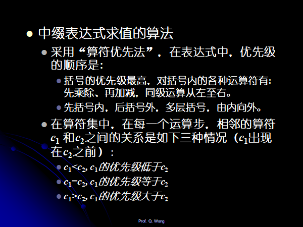
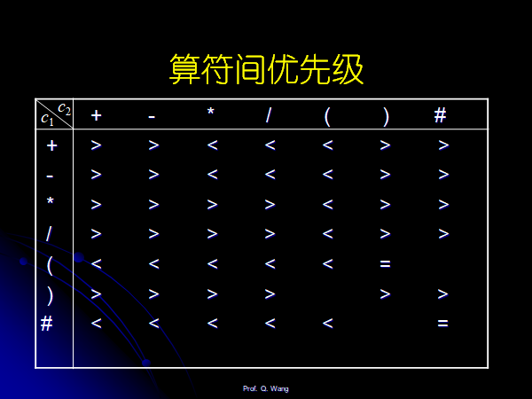
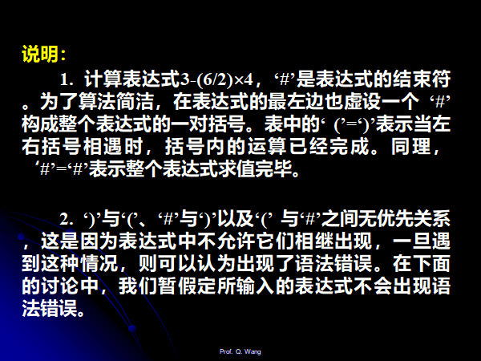
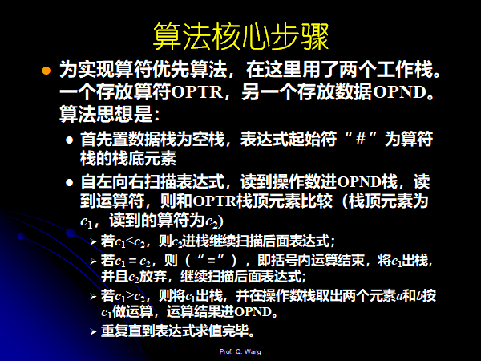
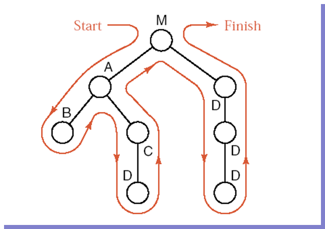
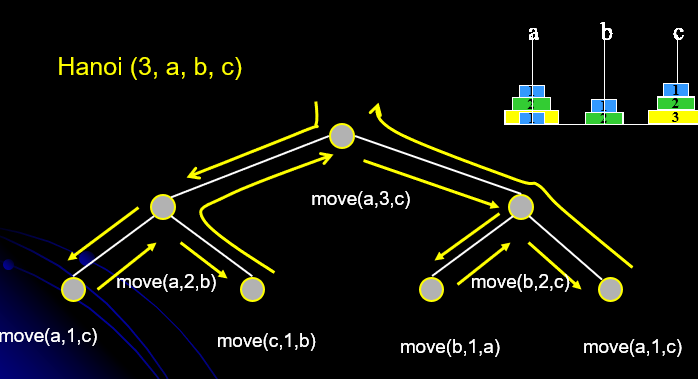
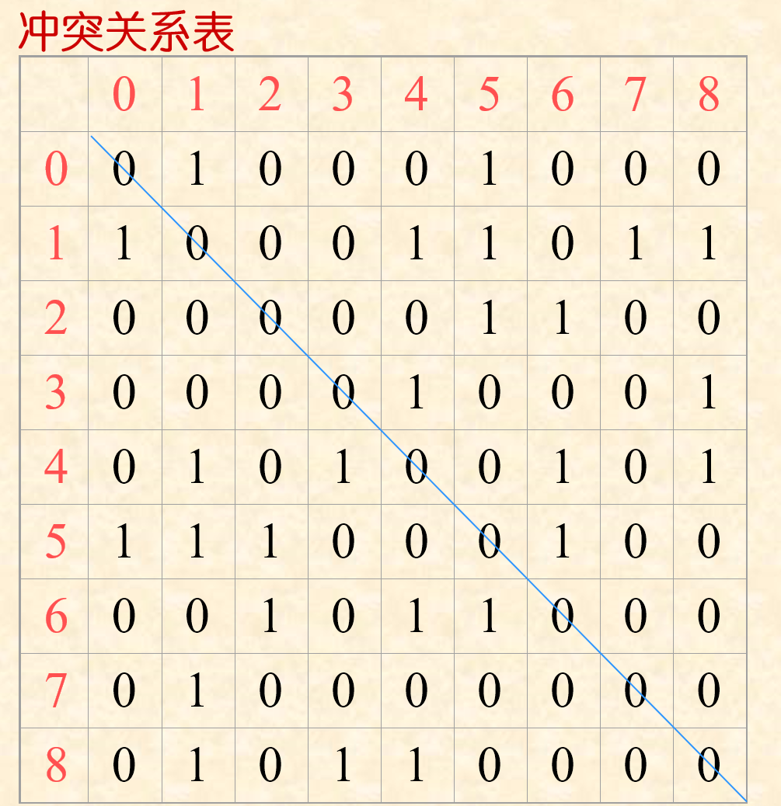

# Chapter03Stack&Queue

## Stack

1. 栈顶的两种指示方式：

    top元素指示栈顶，**栈为空的时候值为-1**

    top元素指示栈顶的下一个元素，**栈为空的时候值为0**（常用）

2. 可变大小的栈的实现：

    刚开始分配一个固定栈的大小，不够用的时候realloc.

3. 两个栈共享同一个内存的实现：

    两个栈的栈底设置再同一个线性表的两端，向中间延伸。

4. 两种实现方式：线性栈的实现和链表栈的实现。

## 栈的应用

### 括号匹配

> * Develop a program to check that brackets are correctly matched in an input text file.
>
> * The brackets are limited in {, }, (, ), [, and ].

很简单就不写了。

顺带提一嘴：n组括号不同的进出栈的个数是卡特兰序列。

### 中缀表达式计算器

算符优先法：





* 简单的解释
    * 第一排+的最后一个元素，>，遇见#就预示着结尾，需要处理栈中的数据，直至结束为止。
    * ()的组合，(遇见)，=的意思代表现在处理的就是()中的运算，遇见 )就说明()运算处理完毕。
    * (遇见#是错误的表达式





```cpp
OperandType  EvaluateExpression() {
        InitStack(OPTR); Push(OPTR, ‘#’); InitStack(OPND); c=getchar();
        while (c!= ‘#’ ||  GetTop(OPTR)!= ‘#’) {
            	// 操作数直接进栈
                if (!In (c, OP)) { Push((OPND, c); c=getchar(); }    
                else    
                switch (Precede(GetTop(OPTR), c)) {
                        case ‘<’ :  		//栈顶元素优先权低
                                Push(OPTR, c);  c=getchar(); break;
                        case ‘=’ :		//脱括号并接收下一字符
                                Pop(OPTR, x);  c=getchar(); break;
                        case  ‘>’ :  		//退栈并将运算结果入栈
                                Pop(OPTR, theta); Pop(OPND, b); Pop(OPND, a);
                                Push(OPND, Operate(a, theta, b)); break;
                }
        }
        return  GetTop(OPND);
}
```

### 逆波兰计算器

比中缀简单：

```cpp
Elemtype  EvaluateExpression_postfix( )
{
    initStack(OPND);  c=getchar( )；
    while(c != ‘#’ ) {    
        if (!In(c, OP))  {  Push((OPND, c)；c=getchar( )；}    
        else {     //退栈并将运算结果入栈
           Pop(OPND, b) ; Pop(OPND, a)；
           Push(OPND, Operate(a, theta, b))；
           c=getchar( );
        }
    }
    return  GetTop(OPND)； 
}
```


### 表达式转换(中缀转逆波兰)

很简单，计算中缀表达式的值的简单的变形：

```cpp
void postfix (expression e) {
    Stack <char> OPTR; char ch, c1;
    OPTR.clear(); OPTR.push(‘#’);
	while (cin.get(ch)) {
        if (isdigit(ch)) cout <<ch;
        else {
            c1=OPTR.top();
            switch(c1, ch) {
                case <:   OPTR.push(ch); break;
                case >:   cout << c1; OPTR.pop(); break;
                case =:   OPTR.pop();
        }
    }
}
```

## 递归和栈

### 背包问题

一个背包可以放入的物品重量T，现有n件物品，重量分别为$w_1,w_2,…,w_n$，问能否从这些物品中选若干件放入背包中，使得放入的重量之和正好是T。

简单题：

```cpp
int knap (int t, int n)
{
        if ( t==0)
                return 1;
        else if (t<0 || t>0 && n<1)
                return 0;
        else if (knap (t-w[n-1], n-1) == 1) {
                printf (“result:n=%d,w[%d]=%d\n”, n, n-1, w[n-1]);
                return 1;
        }
        else
                return knap (t, n-1);
}
```

#### 非递归调用的实现

首先我们设计一个栈st，栈中的每个结点包含以下四个字段：**参数s, n(S就是上面说到的t), 返回地址r 和结果单元k（存储返回值）**。由于knap算法中有两处要递归调用knap算法，所以返回地址一共有三种情况：

第一，计算knap( s0 , n0 )完毕，返回到调用本函数的其它函数；

第二，计算knap( s - w[n-1] , n - 1 )完毕，返回到本调用函数中继续计算；

第三，计算knap( s , n - 1 )完毕，返回到本调用函数继续计算。

为了区分三种不同的返回，r 分别用1，2，3表示，另外引入一个变量x作为进出栈的缓冲。

```cpp
// 栈用顺序存储结构实现，栈中元素和变量的说明如下：
struct  NodeBag 	/* 栈中元素的定义 */
{
    int  s, n ;
    int  r ;  		/* r的值为1,2,3 */
    int  k;
};
typedef  struct NodeBag  DataType;
PSeqStack  st;
struct NodeBag  x;
```

> 转换的做法按以下规律进行，凡调用语句
>
> knap(s1, n1)均代换成：
>
> (1) x.s = s1；
>
>    x.n = n1 ；
>
>    x.r = 返回地址编号；
>
> (2) push_seq( st, x );
>
> (3) goto 递归入口。
>
> 将调用返回统一处理成：
>
> (1) x = top_seq( st );
>
> (2) pop_seq( st );
>
> (3) 根据x.r的值，进行相应处理
>
>    x.r = 1, 返回;
>
>    x.r = 2, 继续处理1;
>
>    x.r = 3, 继续处理2;

```cpp
int  nknap (int s,int n)
{
    struct NodeBag  x;
    PSeqStack st;
    st = createEmptyStack_seq( );
    /* entry0:  初始调用入口 */
    x.s = s;
    x.n = n;
    x.r = 1;
    push_seq (st, x);
    entry1:  	/* 递归调用入口 */
        if ( top_seq(st).s == 0 ) {     
            st->s[st->top].k = TRUE;
            goto exit2;
        }
        else if (top_seq(st).s<0 || (top_seq(st).s>0 && top_seq(st).n<1)) {
            st->s[st->top].k = FALSE;
            goto exit2;
        }
        else {
            x.s = top_seq(st).s - w[top_seq(st).n-1];
            x.n = top_seq(st).n - 1;
            x.r = 2;
            push_seq(st,x);
            goto entry1;
        }
    exit2:  /* 返回处理 */
        x = top_seq(st);  pop_seq(st);
        switch  ( x.r )  {
            case 1: return(x.k);
            case 2: goto  L3;
            case 3: goto  L4;
        }
    L3:  /* 继续处理1 */
        if ( x.k == TRUE ) {
            st->s[st->top].k = TRUE;
            printf("res: n=%d, w=%d \n", top_seq(st).n,w[top_seq(st).n-1]);
            goto  exit2;
        }
        else {
            x.s = top_seq(st).s;   x.n = top_seq(st).n - 1;   x.r = 3;     
            push_seq(st,x);
            goto  entry1;
        }
 L4:  /* 继续处理2 */
        st->s[st->top].k = x.k;
        goto  exit2;
}
```


### 关于函数调用

1. 调用之前

    * 首先将实参，返回地址等交给被调用的函数保存。

    * 为被调用函数的局部变量分配空间。

    * 将控制权交给被调用函数。

2. 调用之后
    * 保存被调用函数的计算的结果。
    * 释放被调用函数的数据区。
    * 依照被调用函数保存的返回地址将控制权交给调用函数。

### 栈和树的遍历之间的关系



对树的一个遍历，从还未进根节点开始，到遍历每一个节点之后出去，就是tm的一个出栈的次序。

因此，n个节点的出栈的顺序其实就是一种树的形态的遍历。因此n个节点的出栈的顺序的个数是**卡特兰序列**，n个节点组成的树的个数也是**卡特兰序列**。

### 汉诺塔问题

Description
假设有3个分别命名为X，Y，Z的塔座，在塔座X上插有n个直径大小各不相同、依小到大编号为1,2,…,n的圆盘。现要求将X轴上的n个圆盘移至塔座Z上并且仍按同样顺序叠放，圆盘移动时必须遵循下列规则：
每次只能移动一个圆盘；
圆盘可以插在X,Y,Z的任一塔座上；
任何时刻都不能将一个较大的圆盘压在较小的圆盘之上。

解答：假设f(n,x,y)代表将n个盘子经过x移动到y上, move(1,x,y)代表将1号盘子从x直接移动到y上。

那么初始状态是f(n,Y,Z)

f(n,Y,Z)可以分解成两个步骤f(n-1,Z,Y)和move(n,X,Z)和f(n-1,Z,X)

代码:

```cpp
#include<cstdio>
#include<iostream>
#include<vector>
#include<algorithm>
#include<stack>
using namespace std;
void move(char x, int n, char y)
{
    printf("Move disk %d from %c to %c\n", n, x, y);
}

void Hanoi(int n, char x, char y, char z)
{
    if (n == 1)
        move(x, 1, z);// 1号盘子x移动到z
    else {
        Hanoi(n - 1, x, z, y);// n-1个盘子从x经过z移动到y
        move(x, n, z);
        Hanoi(n - 1, y, x, z);
    }
}

int main() {
    Hanoi(2, 'X', 'Y', 'Z');
}
```




### 迷宫的栈写法

> **do** {
>
> ​    **若**当前位置可通，
>
> ​    **则**{ 
>
> ​        将当前位置插入栈顶；
>
> ​        若该位置是出口位置，则结束；
>
> ​        否则切换当前位置的东邻块为新的当前位置；
>
> ​    }
>
> ​    **否则**，
>
> ​        **若**栈不空且栈顶位置尚有其它方向未经搜索，
>
> ​          **则**设定新的当前位置为沿顺时针方向旋转找到的栈顶位置的下一邻块；
>
> ​        **若**栈不空且栈顶位置的四周均不可通，
>
> ​        **则**{ 
>
> ​           删去栈顶位置；
>
> ​           若栈不空，则重新测试新的栈顶位置，
>
> ​              直至找到一个可通的相邻块或出栈至栈空；
>
> ​        }
>
> } **while** (栈不空)；

## Queue

1. 队列的两种结构的实现（链式结构，固定序列的结构）

2. 链式结构的实现较为简单，下面探讨固定长度的序列的结构的问题：

    一般设立两个指针，一个是front，指向队列的第一个元素，一个是rear，指向队列的最后的一个元素的下一个:

    **front==rear的时候代表这个队列为空**

    front和rear一直增长会导致空间被用完，使用**循环队列**来解决：

    ​	问题：循环队列的话，当队列满的时候front==rear，而空也是这样表示，究竟是**满了还是空的**?

    ​	于是我们可以**增加一个头节点，头节点不存储任何元素，初始化队列的时候front==rear指向头节点下面的元素，这是空，当rear指向头节点时候，这是满**

### 斐波那契数列计算用到队列存储一定的值（存储俩就可以）

### 杨辉三角的计算存储队列的值

计算下一行的时候保留好上一行的信息就可以，下一行的第一个值直接复制，下面计算每得到一个值可以去掉一个数字。

### 划分无冲突子集问题求解

某运动会设立n个比赛项目，每个运动员可以参加1至3个项目。试问如何安排比赛日程既可以使同一运动员参加的项目不安排在同一单位时间进行，又使总的竞赛日程最短。

若将此问题抽象成数学模型，则归属于“划分子集”问题。n个比赛项目构成一个大小为n的集合，有同一运动员参加的项目则抽象为“冲突”关系。

> 例如：
> 某运动会设有 9 个项目:
>     A ={ 0, 1, 2, 3, 4, 5, 6, 7, 8 }，
> 7名运动员报名参加的项目分别为：
> (1, 4, 8), (1, 7), (8, 3), (1, 0, 5), (3, 4), (5, 6, 2), (6, 4)
> 它们之间的冲突关系为: 
> R = {(1, 4), (4, 8), (1, 8), (1, 7), (8, 3), (1, 0), (0, 5), (1, 5), (3, 4), (5, 6), (5, 2), (6, 2), (6, 4)} 
> |R|=13

**对集合A划分为k个互不相交的子集$A_1,A_2,...,A_k(k<n)$，使得同一个子集中的元素均无冲突关系，并且需要划分的子集的个数尽可能的少。**

**过筛**的方法去解决：

从第一个元素开始考虑，凡是不和第一个元素发生冲突的项目都和其分在同一个子集中。

如何解决？什么意思？



实现思路：

首先我们设置一个队列，这个队列中维护的是还没有被划分的顶点的集合，比如最开始的时候这个队列里面的数字就都是0到n-1这n个数字，然后比如0237已经被划分到一个子集去了，下一次循环这个队列中维护的就是14568这五个数字。

设置一个clash数组，这个数组的长度为n，初始化为0，这个数组中对应位置处的冲突数字为1代表这个数字和初始队列中剩余的某些元素冲突，不能用。

详细的代码如下所示：

[代码来自](https://blog.csdn.net/Leo_B_O/article/details/78132825)

```cpp
#include <iostream>  
#include "SqQueue.h"  
  
#define ITEM 9                                                                //ITEM宏表示待处理集合中元素的项数  
  
using namespace std;  
  
int R[ITEM][ITEM] = {                                                      //该矩阵用来存储待划分集合中元素之间的冲突关系，0代表不冲突，1代表冲突  
{0, 1, 0, 0, 0, 1, 0, 0, 0},  
{1, 0, 0, 0, 1, 1, 0, 1, 1},  
{0, 0, 0, 0, 0, 1, 1, 0, 0},  
{0, 0, 0, 0, 1, 0, 0, 0, 1},  
{0, 1, 0, 1, 0, 0, 1, 0, 1},  
{1, 1, 1, 0, 0, 0, 1, 0, 0},  
{0, 0, 1, 0, 1, 1, 0, 0, 0},  
{0, 1, 0, 0, 0, 0, 0, 0, 0},  
{0, 1, 0, 1, 1, 0, 0, 0, 0}};  
  
int result[ITEM];                                                               //该数组用来存放分组后的结果  
  
/*********************************************************** 
 *功能：划分给定集合的无冲突子集 
 *输入：集合中元素关系集，集合中基本元素的个数，存储结果的数组 
 *时间：2016年10月17日 
 ***********************************************************/  
void DivideSubset(int R[][ITEM], int n, int result[])  
{  
        int PreIndex = n, GroupIndex = 0;                       //PreIndex表示前一次出队列的元素序号，GroupIndex表示当前分配的组的编号  
        SqQueue SQ;  
        InitQueue(SQ);                                                       //初始化一个队列，长度与被划分集合的基本元素个数相同，本例中取9  
        for(int i = 0 ; i < n ; ++i)                                        //该循环用来给分配的队列附上初值，该例中为（0-8）  
        {  
                EnQueue(SQ, i);  
        }  
        int currVal;                                                            //该变量用来表示当前待考察的队列中的一个元素  
        int clash[ITEM];                                                     //该数组用来表示当前分配组的已经添加的元素与其它元素的关系，即是否产生冲突  
        while(!QueueEmpty(SQ))                                       //该循环用来处理队列中的每一个元素，知道所有元素都分配完成时结束  
        {  
                DeQueue(SQ, currVal);                                   //取出一个元素进行处理  
                if(currVal <= PreIndex)                                  //如果当前元素小于前一个，则表示队列已经循环遍历所有的元素，应该新建另一个组  
                {  
                        ++GroupIndex;  
                        for(int i = 0 ; i < n ; ++i)  
                                clash[i] = 0;  
                }  
                if(clash[currVal] == 0)                                   //查询当前分配组的clash数组的值，当值为0时表示该元素没有与当前组中已经添加的元素产生冲突  
                {  
                        result[currVal] = GroupIndex;              //将当前元素编入该组  
                        for(int i = 0 ; i < n ; ++i)                       //添加与被添加元素冲突的信息  
                                clash[i] += R[currVal][i];  
                }  
                else  
                {  
                        EnQueue(SQ, currVal);                          //如果该元素与当前组中的所有元素都冲突，将该元素继续入栈  
                }  
                PreIndex = currVal;  
        }  
}  
  
int main()  
{  
        DivideSubset(R, ITEM, result);  
          
        for(const auto &e : result)  
        {  
                cout << e << " ";  
        }  
        cout << endl;  
          
        return 0;  
}  
```

### 双端队列

**3.8.1 Doubled-End Queue (双端队列)**

​    双端队列是一种特殊的线性表，对它所有的插入和删除都限制在表的两端进行。这两个端点分别记作end1和end2。它好象一个特别的书架，取书和存书限定在两边进行。

**3.8.2 Double Stack (双栈)**

​    双栈是一种增加限制的双端队列，它规定从end1插入的元素只能从end1端删除，而从end2插入的元素只能从end2端删除。它就好象两个底部相连的栈。

**3.8.3 Super Queue (超队列)**

​    超队列是一种输出受限的双端队列，即删除限制在一端(例如end1)进行，而插入仍允许在两端进行。它好象一种特殊的队列，允许有的最新插入的元素最先被删除。

**3.8.4 Super Stack (超栈)**

​    超栈是一种输入受限的双端队列，即插入限制在一端（例如end2）进行，而删除仍允许在两端进行。它可以看成对栈溢出时的一种特殊的处理，即当栈溢出时，可将栈中保存最久（end1端）的元素删除。

### 优先队列


