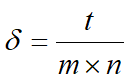
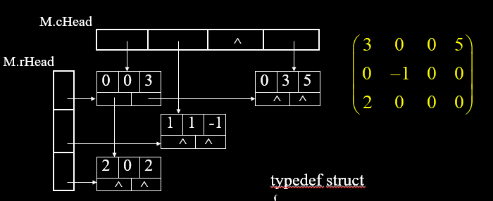
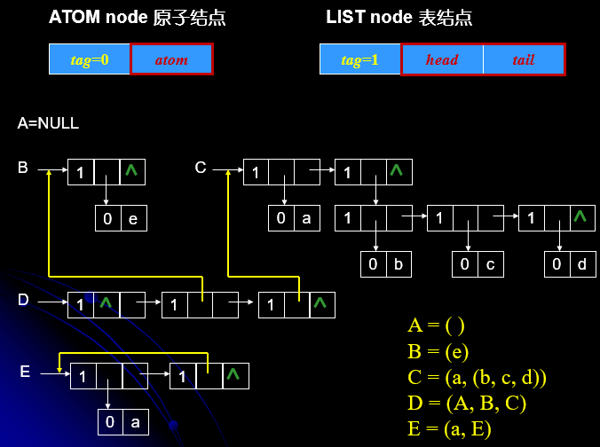
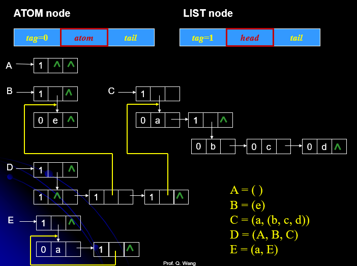
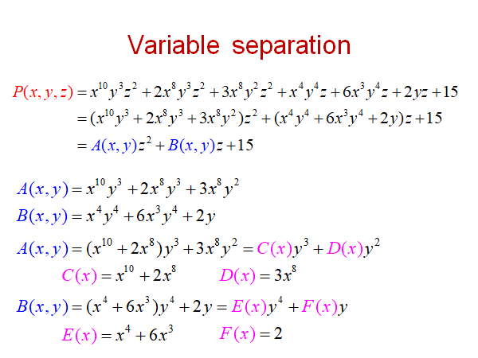
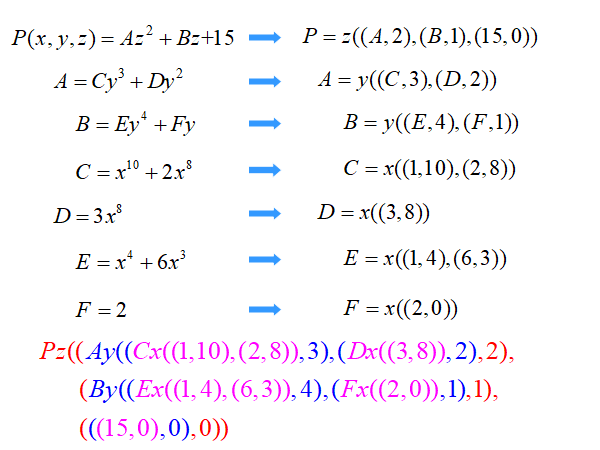
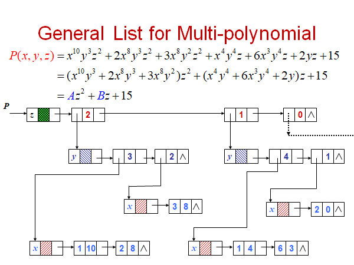
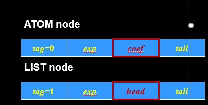

# Chapter05SparseMatrix&Lists

## 稀疏矩阵



$\delta <0.05$称为稀疏矩阵

### 三元组表：

```cpp
#define MaxSize 20000
typedef struct
{
        int  i, j;		/* 行号和列号 */
        ElemType  elem;	/* 元素值 */
}Triple;

typedef struct
{
        Triple  data[MaxSize];
        int  mu, nu, tu;	/* 行数、列数和非零元个数*/
}TSMatrix;
```

按照行存储在链表中。

转置运算，预先统计出每一列元素的个数，然后计算一个前缀和，放到对应的位置，这样的复杂度低。

### 行逻辑链接的顺序表。

**可以快速的知道每行的第一个元素在三元组表中的位置**，这样表示在**矩阵乘法**中会表现出极大的优越性。

存储结构：

```cpp
typedef struct{
        Triple  data[MaxSize];
        int  rpos[MaxRC+1];
        int  mu, nu, tu; // 行数目列数目和非零元素的个数
}RLSMatrix;
```

计算矩阵的乘法：

设置两个变量分别指向当前计算第一个矩阵的第i行，第二个矩阵的第j列，然后设置两个变量p,q分别指向第i行的第一个变量所在的位置和第j列的第一个变量所在的位置，设置一个累加变量ssum=0, 如果p指向的元素的列号和q指向的元素的行号相等，就两元素相乘累加到ssum上，等到q指向的元素列好变的时候就停止，计算得到的元素填到相应的位置上去。

```cpp
Status MultiSMatrix (RLSMatrix M, RLSMatrix N, RLSMatrix *Q)
{
        int   arow, brow, ccol, p, q, t;    float ctemp[];
        if (M.mu != N.nu) return ERROR;
        Q->mu = M.nu;
        Q->nu = N.mu;
        Q->tu = 0;
        if (M.tu*N.tu != 0) {
                for (arow=0; arow< M.mu; ++arow) {
                        ctemp[]=0;  	//memset(ctemp,0,n*sizeof(float));
                        Q->rpos[arow]=Q->tu;	
                        for (p=M.rpos[arow]; p< M.rpos[arow+1]; ++p) {
                                brow=M.data[p].j;	//处理那一行的乘法
                                for (q = N.rpos[brow]; q<N.rpos[brow+1]; ++q)  {
                                        ccol=N.data[q].j;
                                        ctemp[ccol]+=M.data[p].elem*N.data[q].elem;
                                } //for q
                        } // for p				
                        for (ccol=0; ccol<Q.nu; ++ccol) {
                                if (ctemp[ccol] {
                                        if (++Q->tu > MAXSIZE) 
                                                return ERROR;
                                        else {
                                                Q->data[T->tu].i = arow;
                                                Q->data[T->tu].j = ccol;
                                                Q->data[T->tu].elem = ctemp[ccol];
                                                Q->tu++;
                                        }  //else
                                } //if
                        } //for ccol
                } //for arrow
        }  //if
      return OK;
}

```

### Orthogonal list

1. 邻接表也有一个orthogonal list的存储结构，那个 存储结构是为了解决无法快速获得邻接表的入度问题。

2. 这里的orthogonal list主要用来存储矩阵，每一个元素的存储结构如下：

    ```cpp
    typedef struct OLNode
    {
            int  i, j;
            ElemType  elem;
            struct OLNode *right, *down;
    }OLNode, *OLink;
    
    // 头节点的两个链表
    typedef struct
    {
            OLink  *rHead, *cHead;
            int  mu, nu, tu;
    }CrossList;
    ```



3. 十字链表的创建：

    需要进行行和列的插入。

    ```cpp
    Status CreateOLSMatrix (CrossList *M)
    {
        if (M) free(M); scanf(&m, &n, &t);
        M.mu=m; M.nu=n; M.tu=t;
        if (!(M.rhead=(OLink *) malloc ((m+1)*sizeof(OLink)))) 
            exit (OVERFLOW);
        if (!(M.chead=(OLink *) malloc ((n+1)*sizeof(OLink)))) 
            exit (OVERFLOW);
        for (scanf(&i, &j, &e); i!=0; scanf(&i, &j, &e))  {
            if (!(p=(OLink*) malloc (sizeof(OLNode))) exit (OVERFLOW);
            p->i=i; p->j=j; p->elem=e;
            if (M.rhead[i]==NULL || M.rhead[i]->j > j)  {
                p->right=M.rhead[i]; M.rhead[i]=p; 
            }
            else {
                for (q=M.rhead[i]; (q->right) && q->right->j < j; q=q->right);
                p->right=q->right; q->right=p;
            }  //完成行插入
            if (M.chead[j]==NULL || M.chead[j]->i > i)  {
                p->down=M.chead[j]; M.rhead[j]=p; 
            }
            else {
                for (q=M.chead[j]; (q->down) && q->down->i < i; q=q->down);
                p->down=q->down; q->down=p;
            }  //完成列插入
        }
        return OK;
    }
    ```

    十字链表实现矩阵的加法：

    ```cpp
    typedef struct
    {
            OLink  *rHead, *cHead;
            int  mu, nu, tu;
    }CrossList;// Cross Linked List Class
    
    enum Boolean { False, True };
    struct Triple { int row, col;  float value; };
    
    class Matrix;
    
    class MatrixNode {           
    friend class Matrix;
    friend istream &operator >> ( istream &, Matrix & );	
    private:
         MatrixNode *down, *right;
         Boolean head;
         Union { Triple triple;  MatrixNode *next; }
         MatrixNode ( Boolean, Triple* );
    }
    typedef MatrixNode *MatrixNodePtr;
    
    class Matrix {			
    friend istream& operator >> ( istream &, Matrix & );
    public:
        ~Matrix ( );
    private:
        MatrixNode *headnode;
    };
    MatrixNode::MatrixNode ( Boolean b, Triple *t ) {
        head = b;			
        if ( b ) { right = next = this; }
        else triple = *t;
    }
    // Initialization of Sparse Matrix using Orthogonal list
    istream & operator >> ( istream & is, Matrix & matrix ) {
        Triple s;  int p;
        is >> s.row >> s.col >> s.value;  
        if ( s.row > s.col ) p = s.row;		
        else p = s.col;
        matrix.headnode = new MatrixNode ( False, &s );	
        if ( !p ) {
            matrix.headnode→right = matrix.headnode;
            return is;
        }
        MatrixNodePtr *H = new MatrixNodePtr ( p );
        for ( int i = 0; i < p; i++ )
            H[i] = new MatrixNode ( True, 0 );
        int CurrentRow = 0;
        MatrixNode *last = H[0]; 
        for ( i = 0; i < s.value; i++ ) {
            Triple t;  is >> t.row >> t.col >> t.value;
            if ( t.row > CurrentRow ) {
                 last→right = H[CurrentRow]; CurrentRow = t.row;  
                 last = H[CurrentRow];	
             }
             last = last→right = new MatrixNode ( False, &t );
             H[t.col]→next = H[t.col]→next→down =  last; 
         }
         last→right = H[CurrentRow];
         for ( i = 0; i < s.col; i++ ) H[i]→next→down = H[i];	 
         for ( i = 0; i < p-1; i++ )  H[i]→next =H[i+1];
         H[p-1]→next = matrix.headnode;
         matrix.headnode→right = H[0];
         delete [ ] H;     return is;
    }
    
    
    
    enum Boolean { False, True };
    typedef struct Triple { int i, j;  float elem; };
    
    typedef struct {           
        MatrixNode *down, *right;
        Boolean head;
        Union { 
            Triple triple;  
            MatrixNode *next; 
        }
    } MatrixNode;
    
    typedef struct
    {
        MatrixNode *headnode;
    } Matrix;
    
    
    
    
    
    
    
    
    #define MaxSize 20000
    typedef struct
    {
            int  i, j;	
            ElemType  elem;
    }Triple;
    typedef struct
    {
            Triple  data[MaxSize];
            int  mu, nu, tu;
    }TSMatrix;
    typedef struct{
            Triple  data[MaxSize];
            int  rpos[MaxRC+1];
            int  mu, nu, tu;
    }RLSMatrix;
    typedef struct OLNode
    {
            int  i, j;
            ElemType  elem;
            struct OLNode *right, *down;
    }OLNode, *OLink;
    typedef struct
    {
            OLink  *rHead, *cHead;
            int  mu, nu, tu;
    }CrossList;
    ```

    

## 广义表

​    **广义表**是线性表的推广，也称为列表(Lists)。广泛应用于人工智能等领域。

​	    一般记作：

​	 LS = (a1,a2,…, an)

​	其中，LS是广义表的名称，n是它的长度。

​	ai (i=1,2,…,n)可以是单个元素(**原子**)，也可以是广义表(**子表**)。习惯上用小写字母代表原子，大写字母代表子表。

* 定义：

    当广义表非空时，称其第1个元素a1为LS的**表头**(即Head)，称其余元素组成的表(a2, a3,…, an**)** 为**表尾**(即Tail)。

### 广义表的表示

#### 表头表尾表示法

```cpp
typedef enum {ATOM, LIST} ElemTag;  
//ATOM==0 原子; LIST==1子表
typedef int AtomType;

typedef struct _GLNode
{
    ElemTag  tag;
    union
    {
        AtomType  atom;	//原子结点的值域
        struct		/* 想一想，为什么这儿又使用一个结构体 */
        {
            struct _GLNode  *head,  *tail;
        } ptr; 	//表结点的指针域，ptr.head是表头，ptr.tail是表尾
    };
} *GList;
```




#### 表节点头指针+下一个节点表示

```cpp
typedef enum {ATOM, LIST} ElemTag; 
//ATOM==0 原子; LIST==1子表
typedef int AtomType;

typedef struct _GLNode
{
    ElemTag  tag;
    union
    {
        AtomType  atom;	   		//原子结点的值域
        struct _GLNode  *head; 		//表结点的表头指针
    };
    struct _GLNode  *tail; 		//指向下一个元素结点
} *GList;
```



#### 广义表的应用

##### 表达式计算







利用类似于第二种的数据结构，每一个表节点中都有若干个元素，使用表节点的next指针指示下一个。

数据结构的定义如下：

```cpp
typedef enum {ATOM, LIST} ElemTag;
//ATOM==0 原子; LIST==1子表

typedef struct MPNode {
    ElemTag  tag;
    int  exp;
    union {
        float  coef;
        struct MPNode  *head;
    }
    struct MPNode  *tail;
} *MPList;
```



### 求广义表的深度

```cpp
int GListDepth (GList L) {
    if (!L) return 1;  				//空表深度为1
    if (L->tag == ATOM) return 0; 	//原子深度为0
    for ( max=0, pp=L; pp; pp=pp->ptr.tail) {
        dep = GListDepth (pp->ptr.head); //求以为头指针的子表深度
        if (dep > max) max = dep;
    }
    return (max+1);
}
```

### 复制广义表

> l基础
>
> l任何一个非空广义表均可以分解成表头和表尾；
>
> l一对确定的表头和表尾可唯一确定一个广义表。
>
> l复制一个广义表只要分别复制其表头和表尾，然后合成即可。
>
> l步骤
>
>  基本项：InitGList(NewLS) {置空表} 当LS为空表时
>
>  归纳项：Copy(GetHead(LS)->GetHead(NewLS)) {复制表头}
>
> ​      Copy(GetTail(LS)->GetTail(NewLS)) {复制表尾}

```cpp
Status CopyGList (GList T, GList L) {
    if (!L) T = NULL; //复制空表
    else {
        if (!(T = (GList) malloc (sizeof(GLNode)) exit(OVERFLOW);
        T->tag = L->tag;	 				        //建表结点
        if (L->tag == ATOM ) //复制单原子
            T->atom = L->atom;
        else {
            CopyGList (T->ptr.head, L->ptr.head);
            // 复制广义表 L->ptr.head 的一个副本 T->ptr.head
            CopyGList (T->ptr.tail, L->ptr.tail);
            // 复制广义表 L->ptr.tail 的一个副本 T->ptr.tail
        }
    }
    return OK;
}
```


### 广义表的存储结构