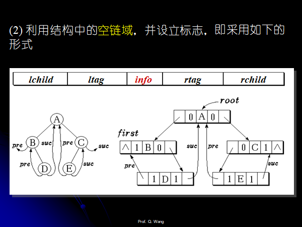
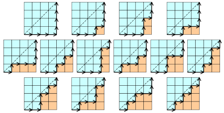

# 树和二叉树

## 表示和定义


## 存储结构


* 广义表的存储结构，叶子节点里面存储值，非叶子节点存储指针。
* 二叉树的存储：二叉链表和三叉链表（静态链表）。

## 二叉树的性质

1. 叶子节点的个数为$n_0$，只有一颗子树的节点个数为$n_1$，有两颗节点的子树的个数为$n_2$，那么有$n_0=n_2+1$。

    > 证明:
    >
    > $n=n_0+n_1+n_2$
    >
    > 除了根节点，所有的节点都有一个父亲节点，则$n=N+1$，$N$为边的个数。
    >
    > 所有的分支N都是由度为1和2的节点构成的$N=n_1+2n_2$
    >
    > 所以$n_0+n_1+n_2=n_1+2n_2+1$
    >
    > 于是得证
    >
    
2. 具有n个节点的完全二叉树的深度为**$\lfloor log_2n \rfloor$**。

3. Extended Binariy Tree

    对二叉树进行扩充，原本有0个孩子的节点增加两个孩子，原本只有一个孩子的节点增加一个孩子，原本有两个孩子的节点不变。

    假设原本的树有*n*个节点，那么扩充之后的二叉树有*2n+1*个节点。

4. 

    > 证明：数学归纳法证明。
    >
    > 1. n=1时候成立，I=0, E=2, E=I+2n成立，
    >
    > 2. 假设n时候成立，即有E=I+2n。
    >
    >     那么n+1时，假设新增那个节点的高度为h，那么$I_{new}=I+h$，那么$E_{new}=E-h+2(h+1)=E+h+2=I+2n+h+2$，
    >
    >     那么$E_{new}=I_{new}+2(n+1)$，得证。

 ## 二叉树的遍历

1. 先根，中根，后根遍历分别得到先序中序后序序列，得到的表达式分别对应先根表达式，中缀表达式，**后缀表达式（逆波兰表达式）。**

2. **插播：c++的find()函数学习**

3. 遍历的非递归算法：

    * 先序遍历

    ```cpp
    // 伪代码实现（正确）：
    void preOrderTraverse(TreeNode*root){
        if(root==NULL){
            return;
        }
        stack<TreeNode*>sstack;
        vector<int>res;
        TreeNode*curNode=root;
        
        do{
            // 不断的向下遍历左子树到最深
            while(curNode){
               	sstack.push(curNode);
                curNode=curNode->left;
            }
            // 从栈中弹出右子树
            if(!sstack.empty()){
                curNode=sstack.top();
    			sstack.pop();
                curNode=curNode->right;// 右子树可能为空
            }
        }while(!sstack.empty()||curNode);
    }
    ```
    
    
    
    ```cpp
    // 下面的代码仅仅经过简单的测试
    #include<cstdio>
    #include<iostream>
    #include<vector>
    #include<algorithm>
    #include<stack>
    using namespace std;
    
    class TreeNode {
    public:
        int val;
        TreeNode* left, * right;
        TreeNode() {}
        TreeNode(int _val, TreeNode* _left = NULL, TreeNode* _right = NULL) {
            val = _val;
            left = _left;
            right = _right;
        }
    };
    
    class PreOrder {
    public:
        stack<TreeNode*>sstack;//先序遍历的栈
        vector<int>res;//存放先序遍历的结果
        TreeNode* root;
    
        PreOrder() {
            root = NULL;
        }
        // 简单的建立一颗二叉搜索树
        void addTreeNode(int _val) {
            // root=addNode0(root,_val);
            addNode(root, _val);
        }
    private:
        void addNode(TreeNode*& node, int val) {
            if (node == NULL) {
                node = new TreeNode(val);
                return;
            }
            if (node->val == val) {
                return;
            }
            else if (node->val > val) {
                addNode(node->left, val);
            }
            else {
                addNode(node->right, val);
            }
        }
    public:
        void preOrder() {
            TreeNode* curNode = root;
            if (root == NULL) {
                return;
            }
            sstack.push(root);
            res.push_back(root->val);
    
            // 两个变量的意思要明确
            // 一个是curNode，指向的节点代表当前要向左边扩展
            // 一个是栈中的节点，栈的节点自己和左子树的根节点均已经被遍历过，下面只需要取出栈的元素遍历右子树就可以。
            while (!sstack.empty() || curNode) {
                if (curNode->left) {
                    while (curNode->left) {
                        curNode = curNode->left;
                        sstack.push(curNode);
                        res.push_back(curNode->val);
                    }
                    continue;
                }
                else {
                    curNode = sstack.top();
                    sstack.pop();
                    while (!sstack.empty() && curNode->right == NULL) {
                        curNode = sstack.top();
                        sstack.pop();
                    }
                    if (sstack.empty() && curNode->right==NULL) {
                        break;
                    }
                    curNode = curNode->right;
                    sstack.push(curNode);
                    res.push_back(curNode->val);
            }
    
        }
            for (auto& val : res) {
                cout << val << " ";
            }
        cout << endl;
        }
};
    
    
    
    ```

int main() {
        vector<int>a({ 2,6,3,4,8,1,0,9,10 });
        // 建立二叉搜索树
        // 2 1 6 3 4 8
        PreOrder preorder;
        for (auto& val : a) {
            preorder.addTreeNode(val);
        }
        preorder.preOrder();
    }
    ```
    
    * 中序遍历(和先序遍历不一样的地方就是遍历到根的时候先不加入res)
    
    ```cpp
    void inOrderTraverse(TreeNode*root){
        if(root==NULL){
            return;
        }
        stack<TreeNode*>sstack;
        stack<int>res;
        TreeNode*curNode=root;
        do{
            while(curNode){
                sstack.push(curNode);
                curNode=curNode->left;
            }
            if(!sstack.empty()){
            	curNode=sstack.top();
            	sstack.pop();
            	res.push(curNode.val);
                curNode=curNode->right;
            }
        }while(!sstack.empty()||curNode)
    }
    ```
    
    * 后序遍历
    * 后序遍历的节点有一个不一样的地方，首先还是走到最左下角，遍历到的节点入栈，然后**这些遍历的节点需要打上一个标记，代表当前正在遍历这个节点的左子树**，，当第一次从栈中取出它的时候，**如果标记显示的是当前正在遍历其左子树，那么下面遍历其右子树，如果标记显示的是当前正在遍历其右子树，那么下面遍历其自己，出栈，这个样子。**
    
    ```cpp
    // 伪代码
    //Postorder Traversal


​    
​    void PostOrderTraverse (PBinTree T ) {
​    Stack S; PBinTree  p;   StackNode w;
​        StackEmpty( S );    p = T;
​        do {
​            while ( p ) {
​                w.ptr = p;   w.tag = L;   Push( S, w);
​                p = p->lchild;
​            }
​            int continue = 1;
​            // 栈中的元素要是一直都是tag=R就一直退栈
​            // 一旦找到了一个L的，更改其tag，访问其右子树
​            while ( continue && ! IsEmpty( S ) ) {
​                w = getTop( S );   Pop( S );
​                p = w.ptr;
​                switch (w.tag) {
​                    case L :  w.tag = R;   Push( S, w);
​                                  continue = 0;
​                                  p = p->rchild;
​                                  break;
​                    case R :  printf (p->info);
​                                  break;
​                }
​            }
​        } while ( p || !IsEmpty( S ) );
​    }
​    
​    ```


​    
​    
​    ```cpp
​    // 未测试,写法较为繁琐
​    void postOrderTraverse(TreeNode*root){
​        if(root==NULL){
​            return;
​        }
​        struct Node{
​            TreeNode*node;
​            int tag;
​            Node(){}
​            Node(TreeNode*_node,int _tag=0){
​                node=_node;
​                tag=_tag;
​            }
​        };
​        stack<TreeNode*>sstack;
​        stack<int>res;
​        TreeNode*curNode=root;
​        Node*top;
​        int tag=0;
​        do{
​            while(curNode&&!tag){
​                sstack.push(Node(curNode,0));
​                curNode=curNode->left;
​            }
​            if(!sstack.empty()){
​                top=sstack.top();
​                curNode=top.node;
​                tag=top.tag;


​                
​                if(tag==0){// 遍历右子树，根节点重新入栈
​                    sstack.pop();
​                    sstack.push(Node(curNode,1));
​                    tag=1;
​                    curNode=curNode->right;
​                }
​                else{
​                    res.push(curNode->val);
​                    sstack.pop();
​                   	top=sstack.top();
​                    curNode=top.node;
​                    tag=top.tag;
​                }
​            }
​        }while(curNode||!sstack.empty())
​    }
​    ```
​    
​    * 层次遍历。
​    
    ```cpp
    // 队列实现，写法较为简单
    //Level order Traversal
    
    void LevelOrderTraverse (PBinTree T ) {
        Queue qu; PBinTree p;
        if ( !T )  {
            printf ( “End of level order traversal!\n”);
            return;
        }
        EnQueue ( qu, T ); 
        while ( !empty( qu ) )  {
            DeQueue ( qu, p ); printf ( p->info );	//DeQueue & output
            if ( p->lchild != NULL )         		//Left child
                EnQueue ( qu, p->lchild );   		//EnQueue
            if ( p->rchild != NULL )         		//Right child
                EnQueue ( qu, p->rchild );   		//EnQueue
         }
    }
    ```

## 二叉树的重建（掌握）


### 给定前序和中序，重建二叉树

```cpp
/**
 * Definition for a binary tree node.
 * struct TreeNode {
 *     int val;
 *     TreeNode *left;
 *     TreeNode *right;
 *     TreeNode() : val(0), left(nullptr), right(nullptr) {}
 *     TreeNode(int x) : val(x), left(nullptr), right(nullptr) {}
 *     TreeNode(int x, TreeNode *left, TreeNode *right) : val(x), left(left), right(right) {}
 * };
 */
class Solution {
public:
    TreeNode* buildTree(vector<int>& preorder, vector<int>& inorder) {
        int pn=preorder.size();
        int n=inorder.size();
        TreeNode* root=solve(0,0,n-1,preorder,inorder);
        return root;
    }

    TreeNode* solve(int i,int k,int m,vector<int>&preorder,vector<int>&inorder){
        // 中序遍历只有一个元素，那么k==m
        if(k==m){
            TreeNode*node =new TreeNode(inorder[k],NULL,NULL);
            return node;
        }
        // 不可能只有一个元素
        int pos=find(k,m,preorder[i],preorder,inorder);
        // 需要根据pos左右是否还有元素决定是否有左右子节点
        if(pos!=-1){
            // 注意要加上这两个if判断
            TreeNode*left=NULL;
            if(pos>k){// 还有左节点
                left=solve(i+1,k,pos-1,preorder,inorder);
            }
            TreeNode*right=NULL;
            if(pos<m){// 还有右节点
                right=solve(i+pos-k+1,pos+1,m,preorder,inorder);
            }
            TreeNode*root=new TreeNode(preorder[i],left,right);
            return root;
        }
        return NULL;
    }

    int find(int k,int m,int preorder_,vector<int>&preorder,vector<int>&inorder){
        // if(k==m){
        //     return k;
        // }
        for(int pos=k;pos<=m;pos++){
            if(inorder[pos]==preorder_){
                return pos;
            }
        }
        return -1;
    }
};
```


### 给定后序和中序，重建二叉树

```cpp
// 和前序类似的思想
```


### 给定前序和后序，某种情况下可以重建二叉树

### 给定层次遍历和中序遍历，建树。

```cpp
// 和前序类似的思想
```

### 给定一个先序遍历的序列，问这样的二叉树有多少颗?

* 
* 回忆二叉搜索树的问题？
* 给定n个元素的序列，可以创建出多少的二叉搜索树？换句话说，由于**中序遍历**的序列是唯一的，中序和先序可以唯一的确定一棵树，**先序遍历的产生的序列的个数等于这个序列产生的二叉搜索树的个数**。

* 设calHowManyBST(n)代表n个节点可以产生多少的二叉搜索树，那么我们以i号节点作为根节点，可以得到的二叉搜索树的个数为：

    $f(i)=calHowManyBST(i-1,n-i);  1<=i<=n$

    其中：

    $calHowManyBST(0)=calHowManyBST(1)=1; 初始条件$

    上面的公式在$n>=1$的时候成立，n==0的时候应该结果为0。

    记忆化搜索的代码如下：

    ```cpp
    // 这个函数代表n个节点的序列的二叉搜索树的个数
    // vis()的size的大小为n+1,初始化为0
    int calHowManyBST(int n, vector<int>& vis) {
    	if (n == 0 || n == 1) {
    		return 1;
    	}
    	if (vis[n]) {
    		return vis[n];
    	}
    
    	int res = 0;
    	// 以i号节点作为根节点
    	//for (int i = 1; i <= n; i++) {
    	//	res += calHowManyBST(i - 1, vis) * calHowManyBST(n - i, vis);
    	//}
    	for (int i = 1; i <= n / 2; i++) {
    		res += calHowManyBST(i - 1, vis) * calHowManyBST(n - i, vis);
    	}
    	res = res << 1;
    	if (n & 1) {
    		int tmp = calHowManyBST(n >> 1, vis);
    		res += tmp * tmp;
    	}
    
    	vis[n] = res;
    	return res;
    }
    ```

    ```cpp
    #pragma warning(disable:4996)
    #include<cstdio>
    #include<iostream>
    #include<vector>
    #include<algorithm>
    #include<map>
    using namespace std;
    const int maxn = 10005;
    const int INF = 0x3f3f3f3f;
    
    // 完整的代码如下：
    // 这个函数代表n个节点的序列的二叉搜索树的个数
    
    int calHowManyBST(int n, vector<int>& vis) {
    	if (n == 0 || n == 1) {
    		return 1;
    	}
    	if (vis[n]) {
    		return vis[n];
    	}
    
    	int res = 0;
    	// 以i号节点作为根节点
    	//for (int i = 1; i <= n; i++) {
    	//	res += calHowManyBST(i - 1, vis) * calHowManyBST(n - i, vis);
    	//}
    	for (int i = 1; i <= n / 2; i++) {
    		res += calHowManyBST(i - 1, vis) * calHowManyBST(n - i, vis);
    	}
    	res = res << 1;
    	if (n & 1) {
    		int tmp = calHowManyBST(n >> 1, vis);
    		res += tmp * tmp;
    	}
    
    	vis[n] = res;
    	return res;
    }
    
    int main() {
    	int n = 11;//n>=1;
    	int res = 0;
    	vector<int>vis(n + 1);
    	res = calHowManyBST(n, vis);
    	cout << res << endl;
    	cout << numTrees5(n) << endl;
    	return 0;
    }
    ```

    

### 先序和中序遍历序列相同的二叉树？

要么为空，要么只有右子树的二叉树

### 后序和中序遍历序列相同的二叉树？

要么为空，要么只有左子树的二叉树

## 先序和后序遍历序列相同的二叉树？

要么为空，要么没根打二叉树（没根？？？hhh）。

空或者，只有一个节点的二叉树。

### 给定一个带有空节点的先序序列，确定这个二叉树

```cpp
string str = "ABC##DE#G##F###";
int pos = 0;
// 根据带叶结点左右孩子的前序遍历建树
node* createWithPre(){
    if(str[pos] == '#') return NULL;
    node* root = new node();
    root->data = str[pos];
    pos++;
    root->left = createWithPre();
    pos++;
    root->right = createWithPre();
    return root;
}
```

### 二叉树的广义表存储结构


```cpp
// 递归写法不是很难，写过
```

## Threading binary tree(线索二叉树)

几个概念：

   

 遍历二叉树是按一定的规则将二叉树中结点排列成一个线性序列，这实际上是把一个非线性结构进行线性化的操作。

​    以二叉链表作为存储结构时，对于某个结点只能找到其左右孩子，而不能直接得到结点在任一序列中的**逻辑前驱**或**后继**。要想得到，只能通过遍历的动态过程才行。

​    **怎样保存遍历过程中得到的信息呢？**





### 中序线索二叉树

1. 什么时候使用中序线索二叉树？

    如果一个程序中需要经常遍历或者查找节点遍历得到的线性序列的前驱或者是后继，需要采用线索链表作为存储结构。

2. 如何寻找前驱和后继？

    

    

3. 中序遍历线索二叉树：

    首先一直向左得到中序遍历的第一个节点设置为当前节点，然后判断当前节点的tag是否为1并且右指针非空：

    是的话直接右指针设置为当前节点，然后再一直往左走走到最左边。

    不是的话直接走向右边

    ```cpp
    // 伪代码实现
    void InOrderTravse_Thr (PThrTree t)  
    {
        PThrTreeNode  p;
        if ( !t ) return ;
        p = *t;
        while (p->lchild!=NULL && p->ltag==0)	 /* 顺左子树一直向下 */
            p = p->lchild;
        while ( !p )  {
            visit(p); 			/* 访问该结点 ，printf(p->info);*/ 
            if ( p->rchild && p->rtag==0) {	/* 右子树不是线索时 */ 
                p = p->rchild;
                while ( p->lchild && p->ltag==0)  
                    p = p->lchild;    	 /* 顺右子树根结点的左子树一直向下 */
            }
            else
                p = p->rchild;   	 	/* 顺线索向下 */
        }
    }  
    
    ```

    

    ```cpp
    void inOrderTraverseThr(TreeNode*root){
        if(root){
            return;
        }
        TreeNode*curNode=p;
        while(curNode->left&&curNode->ltag==0){
            curNode=curNode->left;
        }
        while(curNode){
            // 
            vis(curNode);
            if(curNode->right&&curNode->rtag==0){
                curNode=curNode->right;
                // 然后走到最左边
                while(curNode->left&&curNode->ltag==0){
                    curNode=curNode->left;
                }
            }
            else if(curNode->right){
                curNode=curNode->right;
            }
        }
    }
    ```

4. 二叉树的中序线索化

    原理：

    * 中序的过程中修改二叉树中原有的n+1个空指针

    * 需要记录刚刚遍历过的pre节点

    递归写法和非递归写法

    * 递归的写法

    ```cpp
    // 中序线索化的递归写法
    // 需要修改正在遍历节点的left和right指针
    void inThreading(TreeNode*root,TreeNode*&pre){
        if(root==NULL){
            return;
        }
        // 遍历左子树
        inThreading(root->left,pre);
        // 修改当前节点的左指针,当前节点的左指针为空的时候需要修改
        if(!root->left){
            root->tag=1;
            root->left=pre;
        }
        // 修改pre的右指针，pre节点的右指针为空的术后需要修改
        if(!pre->right){
            pre->rtag=1;
            pre->right=root;
        }
        pre=root;
        // 遍历右子树
        
        inThreading(root->right,pre);
    }
    ```

    * 非递归的写法
    * 和中序遍历的非递归写法相似。

    ```cpp
    void thread(TreeNode*root){
        if(root==NULL){
            return;
        }
        TreeNode*curNode=root;
        TreeNode*pre=NULL;
        int first=0;
        stack<TreeNode*>sstack;
        do{
            while(curNode){
                sstack.push(curNode);            
                curNode=curNode->left;
            }
            if(!sstack.empty()){
                curNode=sstack.top();
                sstack.pop();
                // vis(curNode);
                // 主要增加了下面的部分
                if(!pre&&!first){
                    pre->rtag=1;
                    pre->right=curNode;
                }
                if(!curNode->left){
                	curNode->ltag=1;
                	curNode->left=pre;
                }
                pre=curNode;
                
                curNode=curNode->right;
            }
        }while(!sstack.empty()||curNode)
    }
    ```

5. 中序线索二叉树的线索指针总是指向父亲的。

    * 用来寻找先根的后继

        一颗树有左子树的时候，先根的后继为左子树的根节点。

        一棵树只有右子树的时候，根的后继为右子树的根节点。

        一个树只有根节点没有孩子节点的时候，根的后继为其双亲节点的右子树的根，也就是中序右线索指向节点的右子树的根。

    * 用来寻找后根的前驱

        当一个结点有右子树时，其后根的前驱为它的右子树的根结点；

        当一个结点没有右子树但有左子树时，其后根的前驱为它的左子树的根结点；

        当一个结点为叶子结点时，后根顺序的前驱恰好为其中序下左线索所指结点的左子树的根结点。

6. 中序二叉树中删除一个节点，二叉树中的线索将如何维护？

    * 如果删除的节点是双亲的左子树，可能需要修改双亲节点的前驱节点的right指针（如果双亲节点的前驱不是叶子节点则不需要修改）。

        还需要修改双亲节点的左孩子节点，和ltag指针域指向其前驱节点。

    * 如果删除的节点是双亲的右子树，可能需要修改双亲节点的右指针的tag域并修改指针指向删除的那个子树的最后一个节点指向的后继，同时修改这个后继的前驱。

    * ```cpp
        // 写法略
        ```

### 先序线索二叉树和后序线索二叉树


## 树和森林的表示

1. 双亲表示法

    这个表示法的Node中只设置一个指向双亲的指针，这样我们可以轻松的找到孩子节点的双亲节点。

    缺点：无法根据双亲找到孩子，无法判断孩子是左子树的孩子还是右子树的孩子

    解决第二个问题，可以改进一下，在一个表中存放这棵树的先根遍历，这样的话拥有同一个双亲并且排在前面的就是左子树，排在后面的就是右子树。

2. 子表表示法

    每一个元素的所有孩子节点用一个链表表示。

    ```cpp
    typedef struct EdgeNode		/* 子表中结点的结构 */
    {
        int  node_position;
        struct EdgeNode  *link;
    } EdgeNode;
    
    typedef struct ChiTreeNode		/* 结点表中结点的结构 */
    {
        DataType  info;
        struct EdgeNode  *children;
    } ChiTreeNode;	
    typedef struct  ChiTree	/* 树结构 */
    {
        ChiTreeNode  node_list[MAXNUM];
        int  root;			/* 根结点的位置 */
        int  n;			/* 结点的个数 */
    } ChiTree, *PChiTree;	
    ```

    例如这样表示：

    

    或者孩子节点里面直接存放值。

3. 孩子兄弟表示法，左孩子右兄弟。

    ```cpp
    typedef  struct CSNode
    {
        DataType  info;
        struct CSNode  *lchild;
        struct CSNode  *rsibling;
    }CSTree, *PCSTree;
    ```

    

## Traversal of Tree and Forest

1. 增加头节点的森林也可以转化为多叉树。

2. 森林转化为二叉树（孩子兄弟表示法）

    > ​    如果F＝{T1, T2, …, Tm}是森林，则可按如下规则转换成一棵二叉树B＝{root, LB, RB}。
    >
    > ​    (1) 若F为空，则B为空树；
    >
    > ​    (2) 若F非空，则B的根root为森林中第一棵树的根Root(T1)，B的左子树LB是从T1中根结点的子树森林F1＝{T11, T12 ,…, T1m1}转换而成的二叉树；其右子树RB是从森林F’＝{T2, T3, … , Tm}转换而成的二叉树。

3. 二叉树转化为森林：

    > ​    如果B＝{root, LB, RB} 是一棵二叉树，则可按如下规则转换成森林F＝{T1, T2, …, Tm}
    >
    > ​    (1) 若B为空，则F为空树；
    >
    > ​    (2) 若B非空，则为森林中第一棵树的根Root(T1)即为 B的根root， T1中根结点的子树森林F1＝{T11, T12,…, T1m1} 是由B的左子树LB转换而来的森林；F中除T1之外的其余树组成的森林F’＝{T2, T3, … , Tm}是由B的右子树转换而成的。

## Huffman树和编码

带权的外部路径长度最小的扩充二叉树叫做**哈夫曼树**。

算法描述：

> ​     (1) 根据给定的n个权值{*w*1, *w*2, …, *w**n*}，构成n棵二叉树的集合F={T1,T2,…,Tn}，其中每一棵二叉树Ti中只有一个带权为*w**i*的根结点，其左右子树为空。
>
> ​    (2) 在F中选取**两棵权值最小**的树作为左右子树(原则上没有要求左边的小或者右边的小)构造一棵新的二叉树，且新二叉树的根结点的权值为**其左右子树的根结点权值之和**。
>
> ​    (3) 在F中删除这两棵树，同时将新得到的二叉树加入F中。
>
> ​    (4) 重复(2)和(3)，直到F中只含一棵树为止。该树即为哈夫曼树。

具体的实现：

1. 初始化：设置一个优先队列存储所有初始节点，节点中含有权值信息，优先队列队顶的元素为权值最小的元素。

2. 当优先队列中的元素的个数>=2的时候：

    > 取出优先队列中队头的两个元素，计算权值和构造一个新节点，新节点的两个孩子指向刚取出的两个节点，新节点加入优先队列。

3. 结束。

用静态链实现的一个：

```cpp
PHtTree huffman (int n, int *w)	
/* 构造具有n个叶结点的哈夫曼树*/
/* 数组w[1…n]中存放n个权值 */
{
    PHtTree  pht;
    int  i, j, x1, x2, m1, m2;
    pht = (PHtTree) malloc (sizeof (struct HtTree));    /* 创建空哈夫曼树 */
    assert(pht);
    for( i=1; i<=2*n - 1; i++ ) { 	/* 置初态 */
        pht->ht[i].lchild = 0;
        pht->ht[i].rchild = 0;
        pht->ht[i].parent = 0;
        if (i<=n)  
            pht->ht[i].weight = w[i];
        else
            pht->ht[i].weight = 0;
      }
    /* 每循环一次构造一个内部结点 */
    for( i=1; i < n ; i++ ) {
        Select (pht, n+i, &x1, &x2);
        pht->ht[x1].parent = n + i;	/* 构造一个内部结点 */
        pht->ht[x2].parent = n + i;
        pht->ht[n+i].weight = pht->ht[x1].weight + pht->ht[x2].weight;
        pht->ht[n+i].lchild = x1;
        pht->ht[n+i].rchild = x2;
        pht->root = n+i;
    }
    return pht;
}
void Select (PHtTree pht, int pos, int *x1, int *x2)
{
    int  m1 = MAXINT, m2 = MAXINT;	 /* 相关变量赋初值 */
    for (j=1; j<pos; j++) {/* 找两个最小权的无父结点的结点 */
        if (pht->ht[j].weight<m1 && pht->ht[j].parent == 0) {
            m2 = m1;
            x2 = x1;
            m1 = pht->ht[j].weight;
            x1 = j;
        }
        else if (pht->ht[j].weight<m2 && pht->ht[j].parent == 0) {
            m2 = pht->ht[j].weight;
            x2 = j;
        }
    }
}
```

4. 一些相关概念：

    l编码(coding): 需建立码本来表达数据

    l码本(codebook): 用来表达一定量的信息或一组事件所需的一系列符号（如字母、数字等）

    l码字(code): 对每个信息或事件所赋的码符号序列

    l码字的长度(字长)(code length): 每个码字里的符号个数

5. 哈夫曼编码：

    ​    在一个字符集中，任何一个字符的编码**都不是**另一个字符编码的前缀，这种编码称为**前缀编码**。

    ​    我们可以利用二叉树来设计二进制的前缀编码。约定左分支表示字符’0’，右分支表示字符’1’，则可以用从根结点到叶子结点的路径上的分支字符串作为该叶子结点字符的编码。如此得到的编码必是*前缀编码*。

    假设某一个叶子x结点的编码是另一个叶子结点y编码的前缀，说明从根结点到叶子结点y中间需经过结点x，从而说明x有左或右子树，这与x是叶子结点矛盾。

    ​    那么现在求最短的二进制编码实际上就是构造哈夫曼树的过程，由此得到的二进制编码，称为**哈夫曼编码**。

6. **性质**

    * 哈夫曼树中没有度为1的节点？

        从哈夫曼树的构造中我i们可以看到，没有度为1的节点。

        **严格的（正则的）二叉树**

7. 哈夫曼树的遍历较为简单，这里略过。

## Huffman编码的一个有趣的性质

**huffman编码的平均编码长度（即根节点到叶子节点的带权路径长度和）等于非根节点的权值之和。**


> 考虑任意的一颗哈夫曼树：
>
> 根节点的权值等于其所在树的所有的叶子节点的权值。
>
> 例如上面的13，他的权值等于它所在树3，4，6的权值和。
>
> 比如7，它的权值等于3，4的权值之和。
>
> 考虑计算叶子节点的带权路径的方法，例如上面说到的3，怎么计算的？3\*3，第一个3是根节点到3的路径长度，第二个3是叶子节点自己的权值，再考虑一下非根节点的权值和的计算，13+7+3，一共3个数字相加，这和根节点到叶子节点的长度是对应的。
>
> 于是我们得到以下的结论，一个叶子节点（例如上面的3）对其**所有**非根祖先节点（例如上面3的祖先7和13）的权值的贡献加上其自己的权值（例如叶子节点3的权值）**等于**根节点到叶子节点的长度\*该叶子节点的权值。
>
> 于是上述结论得证。

## Tree的计数的一个问题：


## 卡特兰数的一个总结

[下面内容的部分参考](https://blog.csdn.net/dacc123/article/details/50922138)

### 卡特兰数前几项

**1, 1, 2, 5, 14, 42, 132, 429, 1430, 4862, 16796, 58786,……..**

### 递推公式

$h(n)= h(0)*h(n-1)+h(1)*h(n-2) + … + h(n-1)h(0) (n>=2)$

#### 根据递推公式的记忆化搜索求法

设calHowManyBST(n)代表n个节点可以产生多少的二叉搜索树，那么我们以i号节点作为根节点，可以得到的二叉搜索树的个数为：

$f(i)=calHowManyBST(i-1,n-i);  1<=i<=n$

其中：

$calHowManyBST(0)=calHowManyBST(1)=1; 初始条件$

上面的公式在$n>=1$的时候成立，n==0的时候应该结果为0。

记忆化搜索的代码如下：

```cpp
// 这个函数代表n个节点的序列的二叉搜索树的个数
// vis()的size的大小为n+1,初始化为0
int calHowManyBST(int n, vector<int>& vis) {
	if (n == 0 || n == 1) {
		return 1;
	}
	if (vis[n]) {
		return vis[n];
	}

	int res = 0;
	// 以i号节点作为根节点
	//for (int i = 1; i <= n; i++) {
	//	res += calHowManyBST(i - 1, vis) * calHowManyBST(n - i, vis);
	//}
	for (int i = 1; i <= n / 2; i++) {
		res += calHowManyBST(i - 1, vis) * calHowManyBST(n - i, vis);
	}
	res = res << 1;
	if (n & 1) {
		int tmp = calHowManyBST(n >> 1, vis);
		res += tmp * tmp;
	}

	vis[n] = res;
	return res;
}
```

### 迭代公式：

$h(n)=h(n-1)*(4*n-2)(n+1);$

#### 根据迭代公式的搜索求法

```cpp
public int numTrees5(int n) {
    long catalan = 1;
    for (int i = 0; i < n; ++i) {
        catalan = catalan * 2 * (2 * i + 1) / (i + 2);
    }
    return (int) catalan;
}
// 代码来自网上
```

### 通项公式


### n个点构成的不同形态的二叉树的个数是卡特兰数

### n个元素的序列，例如（1，2，…，n）能够组成的二叉搜索树的个数

上面的两个问题的解答为什么都是卡特兰数？

可以从求解过程去解答，求解的过程都是给定一个（1，2，3，…，n的序列，在n+1的空挡的位置插板分成两块，递归的进行下去）。

*由于二叉搜索树的中序序列是唯一的，先序和中序可以唯一的确定一个二叉搜索树，因此，每一个类型的二叉搜索树对应唯一的一个先序遍历。*

### n+1个节点不同形态的树的个数等于n个节点不相似的二叉树的个数都是卡特兰数。

### 有n+1个叶子的满二叉树的个数

其实n+1个叶子节点的满二叉树的个数，也就是n个节点的二叉树的个数，就是卡特兰序列。


### 括号匹配问题：给你2*n个括号，当然是n个左括号，n个右括号，这样才能匹配，有多少种匹配的方式。

解法，设$dp[i][j]$代表前$i$个括号，前缀和为$j$的情况，（左括号为1，右括号当作-1），那么我们得到$dp[i][j]=dp[i-1][j-1]+dp[i-1][j+1]$.

那么我们的解就是$dp[2n][0]$

```cpp
      memset(dp,0,sizeof(dp));
      dp[0][0]=1;
      for(int i=1;i<=2*n;i++)
      {
          for(int j=0;j<=n;j++)
          {
               if(j+1<=n) dp[i][j]=(dp[i][j]+dp[i-1][j+1];
               if(j-1>=0) dp[i][j]=(dp[i][j]+dp[i-1][j-1];
          }
      }
```

### n个元素出栈的次序的个数

和上面的括号匹配的问题本质上是一样的，先进才能出，也是卡特看兰数字，也可以和上面一样的方法做。

但是这次我们换一个想法，假设f(k)代表k个元素出栈得到的顺序的个数，比k小的元素需要在k进栈之前出栈，那么一共有f(k-1)种方法，比k大的要在k的后面入栈，那么一共有f(n-k)种，因此，我们的结果为：

$h(n)= h(0)*h(n-1)+h(1)*h(n-2) + … + h(n-1)h(0) (n>=2)$

dp[i][j]表示第i个数入栈，栈里还剩的元素。那么第i-1个数，栈里的元素可以是j-1（不出栈）也可以是比j大的数（出栈）。
状态转移方程：dp[i][j]=sum{dp[i-1][m….j-1]};
给出一篇题解博客吧
http://blog.csdn.net/dacc123/article/details/50922580

### 凸包三角形划分

凸包三角形划分：一个凸多边形种，通过若干条互不相交的对角线，把这个凸包划分成若干个三角形，求不同的划分的方案数。


答案就是h(n).
证明：在凸多边形上任意选一个顶点k，并选取任意两个不属于k的两个顶点，构成一个三角形。这个三角形把凸边形分成两个凸边形，由于两边的凸变形相互独立满足乘法原则，又由于k可以取1到n满足加法原则所以：f（n）=f（0）f（n-1）+f（1）f（n-2）+……+f（n-1）f（0）。

### n\*n的格子只能向右向上走，多少种不同的走法？



其实我们可以这么想，一共要走2n步，2n步中，n步向上走，n步向右走，那么我们就可以得到$C^{n}_{2n}$种不同的走路方式，这里不需要除以n+1。

但是如果我们规定，不能穿过对角线的走法，也即是只能在次对角线的下半和次对角线的上半去走，那么这就变成了一个进出栈的问题，只有先朝右走一步，才能朝上走一步，也就变成了进出栈问题了。

### 圆上选择2n个点，将这些点连起来，得到的n条线段不相交，不同的划分方案的个数。

 

连接的话首先这个线段划分得到的两个部分的点的个数必须是偶数，那么可以转化为类似的凸包问题。

### 用n个长方形填充一个高度为n的阶梯状图形的方法数


考虑第一个小矩阵占据的行和列的数目，可以转化为卡特兰序列问题。

#### 一个类似的问题，给定一个二叉搜索树，有多少种序列构成这个二叉搜索树


**其实这个问题不难，只要父亲节点在孩子节点的前面出现，这样的序列都满足要求，我们要求的是有多少种拓扑序列，使得父子满足偏序关系。**

以上面的例子来说，我们在TreeNode中增设两个变量**num和res**。

* num代表以当前节点为根的树的子孙的个数，叶子节点的子孙的个数为0，例如上图中的1和3，非叶子节点例如2的子孙的个数为2，4的子孙的个数为3，5的子孙的个数为6。
* res代表以当前节点为根的树得到的排列的个数，可以建成这颗树，那么根节点5的res就是我们想要求的答案。

于是我们来**动态规划**:

假设我们现在有一个节点root, 两个孩子分别为left和right，那么有:

> $root->res=C_{root->num}^{left->num+1}*left->res*right->res.$
>
> 解释：首先$left->res*right->res$代表左右两颗子树各自拥有各自的排列的数目的乘积，$C_{root->num}^{left->num+1}$代表组合数的数目，将两个各自有序的序列按照偏序关系组合在一块，想象一下两个序列a和b，例如a={1,4,5,7,9},b={2,5,7,8,10,11}，a的长度为5,b的长度为6，把两个序列组合成一个序列，不改变偏序关系，一共有多少种组合？也就是(5+6=11)11个位置中任意挑5个给a，其余的给b，也就是$C^{a}_{a+b}~or~ C^{b}_{a+b}$，$C_{root->num}^{left->num+1}$就代表左子树和右子树合并这样得到的序列的个数，$left->num+1$的$1$代表左孩子的根节点那一个,$root->num$代表左右孩子总共的个数，上面说了，两个序列$a和b$合并有这么多可能，$a和b$各自内部有各自的排列，这就是后面$*left->res$和$*right->res$的原因。

这样我们从叶子节点自底向上的求就可以得到我们的结果。

在这看一下组合数的递归求法：


写法:

```cpp
// c(a,b)
vector<vector<int>>c;
int C(int n, int m) {
	if (m > n) {
		return 0;
	}
	if (c[n][m]) {
		return c[n][m];
	}
	if (m > n - m) {
		m = n - m;
	}
	// c(n,m)=c(n-1,m)+c(n-1,m-1);
	c[0][0] = 1;
	for (int i = 1; i <= n; i++) {
		if (!c[i][0]) {
			c[i][0] = 1;
		}
		for (int j = 1; j <= m; j++) {
			if (!c[i][j]) {
				c[i][j] = c[i - 1][j] + c[i - 1][j - 1];
			}
		}
	}
	return c[n][m];
}
```

快速幂：

```cpp
// a^b%p
long long fastPower(int a,int b,int p){
    long long res=1;
    while(b){
        if(b&1){
            res=res*a%p
        }
        a=a*a*p;
        b>>=1;
    }
    return res;
}
```

求解代码：

```cpp
#pragma warning(disable:4996)
#include<cstdio>
#include<iostream>
#include<vector>
#include<algorithm>
#include<map>
using namespace std;
const int maxn = 10005;
const int INF = 0x3f3f3f3f;

// 
struct TreeNode {
	int val;
	int num;
	int res;
	TreeNode* left, * right;
	TreeNode() {}
	TreeNode(int _val, int _num = 1, int _res = 1, TreeNode* _left = NULL, TreeNode* _right = NULL) {
		val = _val;
		num = _num;
		res = _res;
		left = _left;
		right = _right;
	}
};

// 已经有返回false,没有插入成功返回true
// 传入的参数为根节点
int addTreeNode(TreeNode*& root, int val) {
	if (root == NULL) {
		TreeNode* node = new TreeNode(val);
		root = node;
		return 1;
	}
	if (root->val == val) {
		return 0;
	}
	else if (root->val < val) {
		return addTreeNode(root->right, val);
	}
	else {
		return addTreeNode(root->left, val);
	}
}
// c(a,b)
vector<vector<int>>c;
int C(int n, int m) {
	if (m > n) {
		return 0;
	}
	if (c[n][m]) {
		return c[n][m];
	}
	if (m > n - m) {
		m = n - m;
	}
	// c(n,m)=c(n-1,m)+c(n-1,m-1);
	c[0][0] = 1;
	for (int i = 1; i <= n; i++) {
		if (!c[i][0]) {
			c[i][0] = 1;
		}
		for (int j = 1; j <= m; j++) {
			if (!c[i][j]) {
				c[i][j] = c[i - 1][j] + c[i - 1][j - 1];
			}
		}
	}
	return c[n][m];
}

TreeNode* calHowManyCombination(TreeNode* root) {
	if (root == NULL) {
		return NULL;
	}
	TreeNode* left = root->left;
	TreeNode* right = root->right;
	if (left == NULL && right == NULL) {
		root->num = 0;// 孩子的个数
		root->res = 1;// 已有的排列的个数
		return root;
	}
	else if (left == NULL || right == NULL) {
		if (left == NULL) {
			calHowManyCombination(right);
			root->num = 1 + right->num;
			root->res = right->res;
		}
		else {
			calHowManyCombination(left);
			root->num = 1 + left->num;
			root->res = left->res;
		}
		return root;
	}
	else {
		calHowManyCombination(left);
		calHowManyCombination(right);
		root->num = left->num + right->num + 2; // 左右孩子的个数
		root->res = left->res * right->res * C(root->num, left->num + 1);
		return root;
	}
	return root;
}


int main() {
	TreeNode* root = NULL;
	vector<int>a({ 5,4,7,2,6,1,3 });
	//vector<int>a({ 1,2,3,4,5,7,6,0 });
	int n = a.size();
	for (int i = 0; i < n; i++) {
		addTreeNode(root, a[i]);
	}
	c.resize(n + 1, vector<int>(n + 1, 0));
	cout << calHowManyCombination(root)->res << endl;
	//cout << C(5, 0) << " " << C(5, 1) <<" "<< C(5,6) << endl;
}
```


