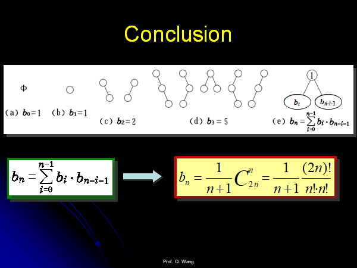

# 树和二叉树

## 表示和定义


## 存储结构


* 广义表的存储结构，叶子节点里面存储值，非叶子节点存储指针。
* 二叉树的存储：二叉链表和三叉链表（静态链表）。

## 二叉树的性质

1. 叶子节点的个数为$n_0$，只有一颗子树的节点个数为$n_1$，有两颗节点的子树的个数为$n_2$，那么有$n_0=n_2+1$。

    > 证明:
    >
    > $n=n_0+n_1+n_2$
    >
    > 除了根节点，所有的节点都有一个父亲节点，则$n=N+1$，$N$为边的个数。
    >
    > 所有的分支N都是由度为1和2的节点构成的$N=n_1+2n_2$
    >
    > 所以$n_0+n_1+n_2=n_1+2n_2+1$
    >
    > 于是得证
    >
    
2. 具有n个节点的完全二叉树的深度为**$\lfloor log_2n \rfloor$**。

3. Extended Binariy Tree

    对二叉树进行扩充，原本有0个孩子的节点增加两个孩子，原本只有一个孩子的节点增加一个孩子，原本有两个孩子的节点不变。

    假设原本的树有*n*个节点，那么扩充之后的二叉树有*2n+1*个节点。

4. 

    > 证明：数学归纳法证明。
    >
    > 1. n=1时候成立，I=0, E=2, E=I+2n成立，
    >
    > 2. 假设n时候成立，即有E=I+2n。
    >
    >     那么n+1时，假设新增那个节点的高度为h，那么$I_{new}=I+h$，那么$E_{new}=E-h+2(h+1)=E+h+2=I+2n+h+2$，
    >
    >     那么$E_{new}=I_{new}+2(n+1)$，得证。

 ## 二叉树的遍历

1. 先根，中根，后根遍历分别得到先序中序后序序列，得到的表达式分别对应先根表达式，中缀表达式，**后缀表达式（逆波兰表达式）。**

2. **插播：c++的find()函数学习**

3. 遍历的非递归算法：

    * 先序遍历

    ```cpp
    // 伪代码实现（正确）：
    void preOrderTraverse(TreeNode*root){
        if(root==NULL){
            return;
        }
        stack<TreeNode*>sstack;
        vector<int>res;
        TreeNode*curNode=root;
        
        do{
            // 不断的向下遍历左子树到最深
            while(curNode){
               	sstack.push(curNode);
                curNode=curNode->left;
            }
            // 从栈中弹出右子树
            if(!sstack.empty()){
                curNode=sstack.top();
    			sstack.pop();
                curNode=curNode->right;// 右子树可能为空
            }
        }while(!sstack.empty()||curNode);
    }
    ```
    
    
    
    ```cpp
    // 下面的代码仅仅经过简单的测试
    #include<cstdio>
    #include<iostream>
    #include<vector>
    #include<algorithm>
    #include<stack>
    using namespace std;
    
    class TreeNode {
    public:
        int val;
        TreeNode* left, * right;
        TreeNode() {}
        TreeNode(int _val, TreeNode* _left = NULL, TreeNode* _right = NULL) {
            val = _val;
            left = _left;
            right = _right;
        }
    };
    
    class PreOrder {
    public:
        stack<TreeNode*>sstack;//先序遍历的栈
        vector<int>res;//存放先序遍历的结果
        TreeNode* root;
    
        PreOrder() {
            root = NULL;
        }
        // 简单的建立一颗二叉搜索树
        void addTreeNode(int _val) {
            // root=addNode0(root,_val);
            addNode(root, _val);
        }
    private:
        void addNode(TreeNode*& node, int val) {
            if (node == NULL) {
                node = new TreeNode(val);
                return;
            }
            if (node->val == val) {
                return;
            }
            else if (node->val > val) {
                addNode(node->left, val);
            }
            else {
                addNode(node->right, val);
            }
        }
    public:
        void preOrder() {
            TreeNode* curNode = root;
            if (root == NULL) {
                return;
            }
            sstack.push(root);
            res.push_back(root->val);
    
            // 两个变量的意思要明确
            // 一个是curNode，指向的节点代表当前要向左边扩展
            // 一个是栈中的节点，栈的节点自己和左子树的根节点均已经被遍历过，下面只需要取出栈的元素遍历右子树就可以。
            while (!sstack.empty() || curNode) {
                if (curNode->left) {
                    while (curNode->left) {
                        curNode = curNode->left;
                        sstack.push(curNode);
                        res.push_back(curNode->val);
                    }
                    continue;
                }
                else {
                    curNode = sstack.top();
                    sstack.pop();
                    while (!sstack.empty() && curNode->right == NULL) {
                        curNode = sstack.top();
                        sstack.pop();
                    }
                    if (sstack.empty() && curNode->right==NULL) {
                        break;
                    }
                    curNode = curNode->right;
                    sstack.push(curNode);
                    res.push_back(curNode->val);
            }
    
        }
            for (auto& val : res) {
                cout << val << " ";
            }
        cout << endl;
        }
};
    
    
    
int main() {
        vector<int>a({ 2,6,3,4,8,1,0,9,10 });
        // 建立二叉搜索树
        // 2 1 6 3 4 8
        PreOrder preorder;
        for (auto& val : a) {
            preorder.addTreeNode(val);
        }
        preorder.preOrder();
    }
    ```
    
    * 中序遍历(和先序遍历不一样的地方就是遍历到根的时候先不加入res)
    
    ```cpp
    void inOrderTraverse(TreeNode*root){
        if(root==NULL){
            return;
        }
        stack<TreeNode*>sstack;
        stack<int>res;
        TreeNode*curNode=root;
        do{
            while(curNode){
                sstack.push(curNode);
                curNode=curNode->left;
            }
            if(!sstack.empty()){
            	curNode=sstack.top();
            	sstack.pop();
            	res.push(curNode.val);
                curNode=curNode->right;
            }
        }while(!sstack.empty()||curNode)
    }
    ```
    
    * 后序遍历
    * 后序遍历的节点有一个不一样的地方，首先还是走到最左下角，遍历到的节点入栈，然后**这些遍历的节点需要打上一个标记，代表当前正在遍历这个节点的左子树**，，当第一次从栈中取出它的时候，**如果标记显示的是当前正在遍历其左子树，那么下面遍历其右子树，如果标记显示的是当前正在遍历其右子树，那么下面遍历其自己，出栈，这个样子。**
    
    ```cpp
    // 伪代码
    //Postorder Traversal
    
    
    void PostOrderTraverse (PBinTree T ) {
    Stack S; PBinTree  p;   StackNode w;
        StackEmpty( S );    p = T;
        do {
            while ( p ) {
                w.ptr = p;   w.tag = L;   Push( S, w);
                p = p->lchild;
            }
            int continue = 1;
            // 栈中的元素要是一直都是tag=R就一直退栈
            // 一旦找到了一个L的，更改其tag，访问其右子树
            while ( continue && ! IsEmpty( S ) ) {
                w = getTop( S );   Pop( S );
                p = w.ptr;
                switch (w.tag) {
                    case L :  w.tag = R;   Push( S, w);
                                  continue = 0;
                                  p = p->rchild;
                                  break;
                    case R :  printf (p->info);
                                  break;
                }
            }
        } while ( p || !IsEmpty( S ) );
    }
    
    ```
    
    
    
    ```cpp
    // 未测试,写法较为繁琐
    void postOrderTraverse(TreeNode*root){
        if(root==NULL){
            return;
        }
        struct Node{
            TreeNode*node;
            int tag;
            Node(){}
            Node(TreeNode*_node,int _tag=0){
                node=_node;
                tag=_tag;
            }
        };
        stack<TreeNode*>sstack;
        stack<int>res;
        TreeNode*curNode=root;
        Node*top;
        int tag=0;
        do{
            while(curNode&&!tag){
                sstack.push(Node(curNode,0));
                curNode=curNode->left;
            }
            if(!sstack.empty()){
                top=sstack.top();
                curNode=top.node;
                tag=top.tag;
                
                
                if(tag==0){// 遍历右子树，根节点重新入栈
                    sstack.pop();
                    sstack.push(Node(curNode,1));
                    tag=1;
                    curNode=curNode->right;
                }
                else{
                    res.push(curNode->val);
                    sstack.pop();
                   	top=sstack.top();
                    curNode=top.node;
                    tag=top.tag;
                }
            }
        }while(curNode||!sstack.empty())
    }
    ```
    
    * 层次遍历。
    
    ```cpp
    // 队列实现，写法较为简单
    //Level order Traversal
    
    void LevelOrderTraverse (PBinTree T ) {
        Queue qu; PBinTree p;
        if ( !T )  {
            printf ( “End of level order traversal!\n”);
            return;
        }
        EnQueue ( qu, T ); 
        while ( !empty( qu ) )  {
            DeQueue ( qu, p ); printf ( p->info );	//DeQueue & output
            if ( p->lchild != NULL )         		//Left child
                EnQueue ( qu, p->lchild );   		//EnQueue
            if ( p->rchild != NULL )         		//Right child
                EnQueue ( qu, p->rchild );   		//EnQueue
         }
    }
    ```

## 二叉树的重建（掌握）


### 给定前序和中序，重建二叉树

```cpp
/**
 * Definition for a binary tree node.
 * struct TreeNode {
 *     int val;
 *     TreeNode *left;
 *     TreeNode *right;
 *     TreeNode() : val(0), left(nullptr), right(nullptr) {}
 *     TreeNode(int x) : val(x), left(nullptr), right(nullptr) {}
 *     TreeNode(int x, TreeNode *left, TreeNode *right) : val(x), left(left), right(right) {}
 * };
 */
class Solution {
public:
    TreeNode* buildTree(vector<int>& preorder, vector<int>& inorder) {
        int pn=preorder.size();
        int n=inorder.size();
        TreeNode* root=solve(0,0,n-1,preorder,inorder);
        return root;
    }

    TreeNode* solve(int i,int k,int m,vector<int>&preorder,vector<int>&inorder){
        // 中序遍历只有一个元素，那么k==m
        if(k==m){
            TreeNode*node =new TreeNode(inorder[k],NULL,NULL);
            return node;
        }
        // 不可能只有一个元素
        int pos=find(k,m,preorder[i],preorder,inorder);
        // 需要根据pos左右是否还有元素决定是否有左右子节点
        if(pos!=-1){
            // 注意要加上这两个if判断
            TreeNode*left=NULL;
            if(pos>k){// 还有左节点
                left=solve(i+1,k,pos-1,preorder,inorder);
            }
            TreeNode*right=NULL;
            if(pos<m){// 还有右节点
                right=solve(i+pos-k+1,pos+1,m,preorder,inorder);
            }
            TreeNode*root=new TreeNode(preorder[i],left,right);
            return root;
        }
        return NULL;
    }

    int find(int k,int m,int preorder_,vector<int>&preorder,vector<int>&inorder){
        // if(k==m){
        //     return k;
        // }
        for(int pos=k;pos<=m;pos++){
            if(inorder[pos]==preorder_){
                return pos;
            }
        }
        return -1;
    }
};
```


### 给定后序和中序，重建二叉树

```cpp
// 和前序类似的思想
```


### 给定前序和后序，某种情况下可以重建二叉树

### 给定层次遍历和中序遍历，建树。

```cpp
// 和前序类似的思想
```

### 给定一个先序遍历的序列，问这样的二叉树有多少颗?

* 
* 回忆二叉搜索树的问题？
* 给定n个元素的序列，可以创建出多少的二叉搜索树？换句话说，由于**中序遍历**的序列是唯一的，中序和先序可以唯一的确定一棵树，**先序遍历的产生的序列的个数等于这个序列产生的二叉搜索树的个数**。

* 设calHowManyBST(n)代表n个节点可以产生多少的二叉搜索树，那么我们以i号节点作为根节点，可以得到的二叉搜索树的个数为：

    $f(i)=calHowManyBST(i-1,n-i);  1<=i<=n$

    其中：

    $calHowManyBST(0)=calHowManyBST(1)=1; 初始条件$

    上面的公式在$n>=1$的时候成立，n==0的时候应该结果为0。

    记忆化搜索的代码如下：

    ```cpp
    // 这个函数代表n个节点的序列的二叉搜索树的个数
    // vis()的size的大小为n+1,初始化为0
    int calHowManyBST(int n, vector<int>& vis) {
    	if (n == 0 || n == 1) {
    		return 1;
    	}
    	if (vis[n]) {
    		return vis[n];
    	}
    
    	int res = 0;
    	// 以i号节点作为根节点
    	//for (int i = 1; i <= n; i++) {
    	//	res += calHowManyBST(i - 1, vis) * calHowManyBST(n - i, vis);
    	//}
    	for (int i = 1; i <= n / 2; i++) {
    		res += calHowManyBST(i - 1, vis) * calHowManyBST(n - i, vis);
    	}
    	res = res << 1;
    	if (n & 1) {
    		int tmp = calHowManyBST(n >> 1, vis);
    		res += tmp * tmp;
    	}
    
    	vis[n] = res;
    	return res;
    }
    ```

    ```cpp
    #pragma warning(disable:4996)
    #include<cstdio>
    #include<iostream>
    #include<vector>
    #include<algorithm>
    #include<map>
    using namespace std;
    const int maxn = 10005;
    const int INF = 0x3f3f3f3f;
    
    // 完整的代码如下：
    // 这个函数代表n个节点的序列的二叉搜索树的个数
    
    int calHowManyBST(int n, vector<int>& vis) {
    	if (n == 0 || n == 1) {
    		return 1;
    	}
    	if (vis[n]) {
    		return vis[n];
    	}
    
    	int res = 0;
    	// 以i号节点作为根节点
    	//for (int i = 1; i <= n; i++) {
    	//	res += calHowManyBST(i - 1, vis) * calHowManyBST(n - i, vis);
    	//}
    	for (int i = 1; i <= n / 2; i++) {
    		res += calHowManyBST(i - 1, vis) * calHowManyBST(n - i, vis);
    	}
    	res = res << 1;
    	if (n & 1) {
    		int tmp = calHowManyBST(n >> 1, vis);
    		res += tmp * tmp;
    	}
    
    	vis[n] = res;
    	return res;
    }
    
    int main() {
    	int n = 11;//n>=1;
    	int res = 0;
    	vector<int>vis(n + 1);
    	res = calHowManyBST(n, vis);
    	cout << res << endl;
    	cout << numTrees5(n) << endl;
    	return 0;
    }
    ```

    

### 先序和中序遍历序列相同的二叉树？

要么为空，要么只有右子树的二叉树

### 后序和中序遍历序列相同的二叉树？

要么为空，要么只有左子树的二叉树

## 先序和后序遍历序列相同的二叉树？

要么为空，要么没根打二叉树（没根？？？hhh）。

空或者，只有一个节点的二叉树。

### 给定一个带有空节点的先序序列，确定这个二叉树

```cpp
string str = "ABC##DE#G##F###";
int pos = 0;
// 根据带叶结点左右孩子的前序遍历建树
node* createWithPre(){
    if(str[pos] == '#') return NULL;
    node* root = new node();
    root->data = str[pos];
    pos++;
    root->left = createWithPre();
    pos++;
    root->right = createWithPre();
    return root;
}
```

### 二叉树的广义表存储结构


```cpp
// 递归写法不是很难，写过
```

## Threading binary tree(线索二叉树)

几个概念：

   

 遍历二叉树是按一定的规则将二叉树中结点排列成一个线性序列，这实际上是把一个非线性结构进行线性化的操作。

​    以二叉链表作为存储结构时，对于某个结点只能找到其左右孩子，而不能直接得到结点在任一序列中的**逻辑前驱**或**后继**。要想得到，只能通过遍历的动态过程才行。

​    **怎样保存遍历过程中得到的信息呢？**


### 中序线索二叉树

1. 什么时候使用中序线索二叉树？

    如果一个程序中需要经常遍历或者查找节点遍历得到的线性序列的前驱或者是后继，需要采用线索链表作为存储结构。

2. 如何寻找前驱和后继？

    

    

3. 中序遍历线索二叉树：

    首先一直向左得到中序遍历的第一个节点设置为当前节点，然后判断当前节点的tag是否为1并且右指针非空：

    是的话直接右指针设置为当前节点，然后再一直往左走走到最左边。

    不是的话直接走向右边

    ```cpp
    // 伪代码实现
    void InOrderTravse_Thr (PThrTree t)  
    {
        PThrTreeNode  p;
        if ( !t ) return ;
        p = *t;
        while (p->lchild!=NULL && p->ltag==0)	 /* 顺左子树一直向下 */
            p = p->lchild;
        while ( !p )  {
            visit(p); 			/* 访问该结点 ，printf(p->info);*/ 
            if ( p->rchild && p->rtag==0) {	/* 右子树不是线索时 */ 
                p = p->rchild;
                while ( p->lchild && p->ltag==0)  
                    p = p->lchild;    	 /* 顺右子树根结点的左子树一直向下 */
            }
            else
                p = p->rchild;   	 	/* 顺线索向下 */
        }
    }  
    
    ```

    

    ```cpp
    void inOrderTraverseThr(TreeNode*root){
        if(root){
            return;
        }
        TreeNode*curNode=p;
        while(curNode->left&&curNode->ltag==0){
            curNode=curNode->left;
        }
        while(curNode){
            // 
            vis(curNode);
            if(curNode->right&&curNode->rtag==0){
                curNode=curNode->right;
                // 然后走到最左边
                while(curNode->left&&curNode->ltag==0){
                    curNode=curNode->left;
                }
            }
            else if(curNode->right){
                curNode=curNode->right;
            }
        }
    }
    ```

4. 二叉树的中序线索化

    原理：

    * 中序的过程中修改二叉树中原有的n+1个空指针

    * 需要记录刚刚遍历过的pre节点

    递归写法和非递归写法

    * 递归的写法

    ```cpp
    // 中序线索化的递归写法
    // 需要修改正在遍历节点的left和right指针
    void inThreading(TreeNode*root,TreeNode*&pre){
        if(root==NULL){
            return;
        }
        // 遍历左子树
        inThreading(root->left,pre);
        // 修改当前节点的左指针,当前节点的左指针为空的时候需要修改
        if(!root->left){
            root->tag=1;
            root->left=pre;
        }
        // 修改pre的右指针，pre节点的右指针为空的术后需要修改
        if(!pre->right){
            pre->rtag=1;
            pre->right=root;
        }
        pre=root;
        // 遍历右子树
        
        inThreading(root->right,pre);
    }
    ```

    * 非递归的写法
    * 和中序遍历的非递归写法相似。

    ```cpp
    void thread(TreeNode*root){
        if(root==NULL){
            return;
        }
        TreeNode*curNode=root;
        TreeNode*pre=NULL;
        int first=0;
        stack<TreeNode*>sstack;
        do{
            while(curNode){
                sstack.push(curNode);            
                curNode=curNode->left;
            }
            if(!sstack.empty()){
                curNode=sstack.top();
                sstack.pop();
                // vis(curNode);
                // 主要增加了下面的部分
                if(!pre&&!first){
                    pre->rtag=1;
                    pre->right=curNode;
                }
                if(!curNode->left){
                	curNode->ltag=1;
                	curNode->left=pre;
                }
                pre=curNode;
                
                curNode=curNode->right;
            }
        }while(!sstack.empty()||curNode)
    }
    ```

5. 中序线索二叉树的线索指针总是指向父亲的。

    * 用来寻找先根的后继

        一颗树有左子树的时候，先根的后继为左子树的根节点。

        一棵树只有右子树的时候，根的后继为右子树的根节点。

        一个树只有根节点没有孩子节点的时候，根的后继为其双亲节点的右子树的根，也就是中序右线索指向节点的右子树的根。

    * 用来寻找后根的前驱

        当一个结点有右子树时，其后根的前驱为它的右子树的根结点；

        当一个结点没有右子树但有左子树时，其后根的前驱为它的左子树的根结点；

        当一个结点为叶子结点时，后根顺序的前驱恰好为其中序下左线索所指结点的左子树的根结点。

6. 中序二叉树中删除一个节点，二叉树中的线索将如何维护？

    * 如果删除的节点是双亲的左子树，可能需要修改双亲节点的前驱节点的right指针（如果双亲节点的前驱不是叶子节点则不需要修改）。

        还需要修改双亲节点的左孩子节点，和ltag指针域指向其前驱节点。

    * 如果删除的节点是双亲的右子树，可能需要修改双亲节点的右指针的tag域并修改指针指向删除的那个子树的最后一个节点指向的后继，同时修改这个后继的前驱。

    * ```cpp
        // 写法略
        ```

### 先序线索二叉树和后序线索二叉树


## 树和森林的表示

1. 双亲表示法

    这个表示法的Node中只设置一个指向双亲的指针，这样我们可以轻松的找到孩子节点的双亲节点。

    缺点：无法

2. 子表表示法

3. 