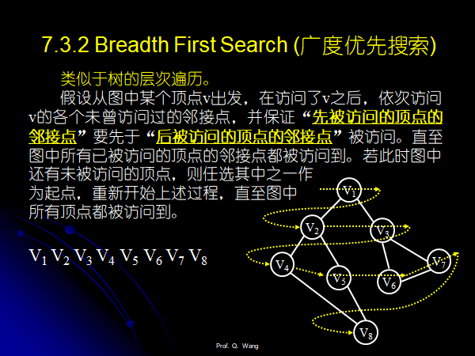

## 图的定义和表示

### 顶点，弧，有向图和无向图

<v,w>表示弧，v表示弧尾，w表示弧头。

### 稀疏图和稠密图

1. 边的数目e<nlogn
2. e>=nlogn

### 简单路径，回路或者环，有根图

1. 简单路径：顶点不重复出现的路径
2. 回路：第一个和最后一个顶点相同的路径
3. 简单回路：除了第一个和最后一个顶点，其余的顶点都不重复的路径
4. 有根图：存在一个顶点u，顶点u可以到达其它所有的顶点，顶点u称为根。

## 存储结构

1. **邻接表**和十字链表

    * 求得出度的时候需要遍历整个邻接表，可以用**带入度的邻接表进行优化**。

        * 也即是Orthogonal List

        * > ​    可以看成是有向图的邻接表和逆邻接表结合起来形成的一种链表。
            >
            > ​    在邻接表的弧(或边)结点中增加一个指针指向弧头相同的下一条弧，再增加一个该弧依附的弧尾顶点，即可以方便地求某个顶点的入度。
            >
            > ```cpp
            > typedef struct _ArcNode
            > {
            >   int tailVex, headVex; /* 弧的头尾顶点的位置*/
            >   struct _ArcNode *hLink; /* 弧头相同的弧的链域*/
            >   struct _ArcNode *tLink; /* 弧尾相同的弧的链域*/
            >   AdjType weight;
            > } ArcNode;
            > // 对于邻接表的顶点结点，需要增加一个指针指向第一条以该顶点为弧头的弧的指针。
            > typedef struct _VexNode
            > {
            >     VexType  vertex;
            >     ArcNode  *firstIn;		/* 指向该顶点的第一条入弧*/
            >     ArcNode  *firstOut;		/* 指向该顶点的第一条出弧*/
            > } VexNode;
            > typedef struct
            > {
            >     VexNode  xList[Max_Vert_Num];		/* 表头向量*/
            >     int  vexNum, arcNum;
            > } OLGraph;
            > ```
            >
            > 
            >
            > * 理解：
            > * 我们看到上图，就拿V1来说，V1有两个产生出度的边(v1,v2),(v1,v3)，这个就是一般的邻接表的存储结构，很好实现。
            > * V1有两个产生入度的边，分别是(V3,V1),(V4,V1)，我们知道，不管是(V3,V1)还是(V4,V1)我们都可以在V3和V4的邻接表的边节点中找到这两条边，也就是产生入度的边和邻接表中的边节点是一一对应的，于是我们可以利用这些一一对应的边节点，在V1的头部设置一个指针，指向产生该节点1入度的第一个边节点u，例子中也就是V3节点，这个边节点u中也设立一个next指针，指向产生该节点1入读的第二个边节点v，例子中也就是V4节点，于是我们得到了交叉的十字链表的结构。

        * 理解了这个就可以轻松的写出十字链表的代码：

        * ```cpp
            输入: n个顶点和e条弧的信息
            Status CreateDG (OLGraph *g) {
                AdjType weight;		/* 非0则输入弧的其他信息*/
                VexType v1,v2;
                int i, j, k;
                ArcNode *p;
                scanf("%d %d %d", &g->vexNum, &g->arcNum);
                /* 构造表头向量，即输入顶点 */
                for (i=0; i<g->vexNum; i++) { 
                    /* 输入所有顶点并初始化指针成员 */
                    scanf (“%d”, &g->xlist[i].vertex);	/* 输入顶点值 */
                    g->xlist[i].firstIn = NULL;		/* 初始化指针*/
                    g->xlist[i].firstOut = NULL;	/* 初始化指针*/
                }
                /* 输入各弧并构造十字链表 */
                for (k=0; k<g->arcNum; k++) {
                    scanf(“%d %d”, &v1, &v2);	/* 输入每条弧的始点和终点 */
                    i = LocateVex(*g, v1);	   	/* 确定v1和v2在图中的位置 */
                    j = LocateVex(*g, v2);
                    p = (ArcNode *)malloc(sizeof(ArcNode));	/* 创建弧结点*/
                    assert(p);
                    p->tailVex = i;			/* 弧的始点是弧的弧尾*/
                    p->headVex = j;			/* 弧的终点是弧的弧头*/
                    /* 当前结点插入到十字链表第一个的位置*/
                    p->hLink = g->xlist[j].firstIn;	/* 作为第j个顶点的第一条入弧 */
                    p->tLink = g->xlist[i].firstOut;	/* 作为第i个顶点的第一条出弧 */
                    /* 重新设置第一条入弧和出弧*/
                    g->xlist[j].firstIn = g->xlist[i].firstOut = p;	
                }
                return OK;
            }	/* End of CreateDG() */
            ```

        * 十字链表的优缺点

            * 优点，容易求有向图的入度和出度
            * 缺点：操作复杂

2. **邻接矩阵**

    * 入度和出度。

3. 邻接多重表(**无向图**的以边为核心的操作)

    1. 例如遍历郭一条边，删除一条边等主要针对边的操作，用邻接表为存储结构的话，一条无向图的边需要对该边的两个顶点节点分别进行操作，较为麻烦。

    2.  和邻接表相似的构造，同一条边，在邻接表中使用两个节点表示，在邻接多重表中使用一条边来表示，如何实现？

    3. 定义边的存储结构：

        > ```cpp
        > // 邻接多重表是无向图另一种链式存储结构，它的结构与十字链表类似。
        > // 在邻接多重表中，每一条边用一个结点表示，有6个属性。
        > typedef struct _EdgeNode
        > {
        >     VisitIf  mark;		/*访问标记*/
        >     int  iVex, jVex;		/*该边依附的两个顶点的位置*/
        >     struct _EdgeNode  *iLink, *jLink;  
        > 			/*分别指向依附这两个顶点的下一条边*/
        >     AdjType  weight;		/*边的权 */
        > } EdgeNode;
        > typedef struct _VexNode
        > {
        >     VexType  vertex;
        >     EdgeNode  *firstedge;	/*指向第一条依附该顶点的边*/
        > } VexNode;
        > typedef struct
        > {
        >     VexNode  adjMultiList[Max_Vert_Num];	/* 表头向量*/
        >     int  vexNum, edgeNum;
        > } AMLGraph;
        > ```
        >
        > 
        >
        > * 主要要理解上面的边的存储结构和顶点的那个指向边的指针的含义。
        > * 边节点中的两个指针iLink和rLink分别指向iVex和jVex这两个顶点的下一条边，顶点节点中的firstedge指针指向该顶点的第一个边的节点，这样就可以理解上面的图示的结构了。

## 图的遍历和最短路径

### 图的深度优先遍历。

1. 类似于树的先序遍历，是树的先序遍历的推广。
2. 
3. 很简单，代码就不写了。
4. 时间复杂度，邻接矩阵为存储结构，时间复杂度为$O(n^2)$，邻接表为存储结构，时间复杂度为$O(n+e)$。

### 图的广度优先遍历

1. 类似于图的层次遍历。
2. 
3. 时间复杂度，和深度优先遍历相同。

### 图的深度优先生成树和广度优先生成树

1. 

2. 每一个连通分量通过遍历都可以得到一棵生成树，这些连通分量的生成树就构成了非连通图的生成森林，使用**孩子兄弟表示法**可以生成森林。

    ```cpp
    typedef  struct CSNode
    {
        DataType  info;
        struct CSNode  *lchild;
        struct CSNode  *rsibling;
    }CSTree, *PCSTree;
    
    // 邻接表作为存储结构，构建深度优先生成森林
    // MGraph g代表图，CSTree*T代表生成森林的根节点
    // CSTree是一个结构体, T是传入的一个地址,*T代表更改这个位置的值
    void DFSForest(MGraph g,PCSTree*T){
    	// p代表在遍历的过程中新生成的节点,q代表当前节点的所有邻接节点中的第一个节点作为树的孩子节点
        PCSTree p,q;
        int v;// 当前节点的邻接节点
        *T=NULL;//树根清空
        // 初始化visited数组
        for(v=0;v<g.vexNum;v++){
            visited[v]=FALSE;
        }
        for(v=0;v<g.vexNum;v++){
            if(visited[v])continue;
            p=(CSNode*)malloc(sizeof(CSNode));
            assert(p);
            p->data=GetVex(g,v);//获得当前邻接节点的data
            p->firstChild=NULL;//当前的第一个临接节点暂时没孩子
            p->nextSibling=NULL;// 当前的第一个邻接节点暂时没兄弟，等会就有兄弟了
            if(*T==NULl){
                *T=p;// 初始化森林的根节点
            }
            else{// 否则的话设置其右边的兄弟
                q->nextSibling=p;
            }
            q=p;
            DFSTree(g,v,&p);//从邻接节点继续深搜，中间要设置好父亲节点也就是p节点的左孩子节点
        }
    }
    
    void DFSTree(MGraph g,int v,PCSTree*T){
        PCSTree p,q; int w;
        BOOL first;
        visited[v]=TRUE;first=TRUE;
        q=*T;
        for (w = FirstAdjVex (g, v); w!=-1; w = NextAdjVex (g, v, w)) {
            if(visited[w])continue;
            p = (CSTree) malloc(sizeof(CSNode));
            p->data = GetVex (g, w);
            p->firstChild = NULL;
            p->nextSibling = NULL;
            if (first) {
                (*T)->firstChild = p;  first = FALSE; // 设置父亲节点的孩子
            }
            else  q->nextSibling = p;// 设置兄弟
            q = p;
            DFSTree (g, w, &q);
        }  /* for */
    }
    ```

### 有向图中的强连通分量和生成森林

1. Kosaraju算法[算法详解](https://www.jianshu.com/p/0264cb308069)

    > 第一步：计算出有向图 (G) 的反向图 (G反) 的**逆后序排列**（代码中有介绍）
    >  第二步：在有向图 (G) 中进行标准的深度优先搜索，按照刚才计算出的逆后序排列顺序**而非**标准顺序，每次搜索访问的所有点即在同一强连通分量中

    > ```cpp
    > class Kosaraju {
    >     private Digraph G;
    >     private Digraph reverseG; //反向图
    >     private Stack<Integer> reversePost; //逆后续排列保存在这
    >     private boolean[] marked;
    >     private int[] id; //第v个点在几个强连通分量中
    >     private int count; //强连通分量的数量
    >     public Kosaraju(Digraph G) {
    >         int temp;
    >         this.G = G;
    >         reverseG = G.reverse();
    >         marked      = new boolean[G.V()];
    >         id          = new int[G.V()];
    >         reversePost = new Stack<Integer>();
    >         
    >         makeReverPost(); //算出逆后续排列
    >         
    >         for (int i = 0; i < marked.length; i++) { //重置标记
    >             marked[i] = false;
    >         }
    >         
    >         for (int i = 0; i < G.V(); i++) { //算出强连通分量
    >             temp = reversePost.pop();
    >             if (!marked[temp]) {
    >                 count++;
    >                 dfs(temp);
    >             }
    >         }
    >     }
    >     /*
    >      * 下面两个函数是为了算出 逆后序排列
    >      */
    >     private void makeReverPost() {
    >         for (int i = 0; i < G.V(); i++) { //V()返回的是图G的节点数
    >             if (!marked[i])
    >                 redfs(i);
    >         }
    >     }
    >     
    >     private void redfs(int v) {
    >         marked[v] = true;
    >         for (Integer w: reverseG.adj(v)) { //adj(v)返回的是v指向的结点的集合
    >             if (!marked[w])
    >                 redfs(w);
    >         }
    >         reversePost.push(v); //在这里把v加入栈,完了到时候再弹出来,弹出来的就是逆后续排列
    >     }
    >     /*
    >      * 标准的深度优先搜索
    >      */
    >     private void dfs(int v) {
    >         marked[v] = true;
    >         id[v] = count;
    >         for (Integer w: G.adj(v)) {
    >             if (!marked[w])
    >                 dfs(w);
    >         }
    >     }
    >     
    >     public int count() { return count;}
    > }
    > ```
    >
    > 

    > 作者：zhangqi张琦
    > 链接：https://www.jianshu.com/p/0264cb308069
    > 来源：简书
    > 著作权归作者所有。商业转载请联系作者获得授权，非商业转载请注明出处。

2. 原理解释：[为什么使用逆后序遍历](https://www.zhihu.com/question/58926821)

    > 作者：简致
    > 链接：https://www.zhihu.com/question/58926821/answer/583402591
    > 来源：知乎
    > 著作权归作者所有。商业转载请联系作者获得授权，非商业转载请注明出处。
    >
    > 
    >
    > 以《算法》第四版中的实现为例，它旨在让每次递归探索中的所有顶点属于同一强连通分量。所以可以这么理解，当递归进入一个强连通分量中时，把它锁死在这个强连通分量中。
    >
    > ***\*核心在于封死连通分量往外走的路\****
    >
    > 而如何封死呢？该算法采用的是深度优先搜索，如果遇到了已经访问过的顶点则不再访问，那么如果能让一个分量内往外走的顶点已经被访问过了，是不是就能够锁死了呢？所以下图中，为了让5中的顶点正确关联上强连通分量编号，我们需要事先锁死H和C这两个顶点。
    >
    > 
    >
    > 
    > 上图为一个有向图，每个绿色方框为一个强连通分量，我们想要做的就是为这几个绿色方框内的顶点关联上对应的分量编号(绿框的编号)。  
    >
    > 
    > 我们将以深度优先搜索去穿越这幅图，但是我们希望每次探索都控制在一个绿色方框内，如1，进去了肯定到不了其他分量，而5通过顶点E和C、通过G和H连接起来了，它能够到达其他分量，所以我们希望当在分量5中探索时，如果到了E点，希望能够得到一个信息:不应该继续探索C顶点(H点同理)。  
    >
    >
    > 如何做到呢？考虑到深度优先搜索的特性：如果一个顶点已经探索过了，将不会再探索。那么我们只要保证在分量5内的顶点被探索时，C顶点与H顶点已经被探索过就能实现我们的目标。分量2、3、4之间的先后顺序同理。一般情况下我们使用DFS时都是从索引为0的顶点开始探索(或者其他的顶点，可视为从随机顶点开始)，无法保证分量1(还有分量3)在分量5之前探索完毕。在这个图中，无论是采用前序、后序还是逆后序，都无法达到我们的要求。
    >
    > 
    > 根据逆后序的性质，我们知道先探索完的顶点将会被放在栈的底部，其顺序是比较靠后的，所以我们可以利用这一点让分量5中的顶点顺序靠后，如何做到呢？  
    > 我们观察一下图并联想一下食物链，发现分量5实际上是处于食物链较的顶端的位置，因为他通过E和G侵入了其他群落，不考虑群落内的关系，为了颠覆分量5的统治地位，我们需要反转各群落之间的关系——反转图。 
    >
    > 
    >
    > 
    >
    > 
    > ***\*一个图的反向图有着和其相同的强连通分量划分情况\****
    >
    > 这样一来，之前被分量5掠夺的群落反过来掠夺它了，也就是说，之前在分量5中探索时能够走出去的路全都反转了，走不出去了，这就给我们机会确定了分量的范围。如果你是从5开始，那么它走不出去，它内部的顶点先探索完毕，放入栈的底部；如果你是从3或者1开始，那么又将会走进5，所以5中的所有顶点也会放入栈的底部。所以反向图中，无论是从从哪里开始，都能保证在逆后序中，分量1和分量3中能够至少有一个顶点在栈中的位置处于所有5中的顶点之上。上面这幅图的逆后序(之一)为(假设从C开始)：
    > *> D A B F G E C I H J*  
    >
    > 我们用这个逆后序去深度优先搜索(正向)图，可以发现每次递归都是在同一个强连通分量之中。当然大家可以多试试反向图中的不同的逆后序，得到的结果是一样的。举一反三，虽然这个图中的分量比较少，但基于逆后序的性质，可以推广到所有的有向图中。
    >
    > 这就是我理解的为什么要用反向图的逆后序去DFS正向图。

3. 实现的一个代码：

    采用邻接表为结构。

```cpp
#include<cstdio>
#include<iostream>
#include<algorithm>
#include<vector>
using namespace std;

class Kosaraju {
	vector<int>vis;
	int n;
	vector<vector<int>>g;
	vector<vector<int>>gReversed;

	int count;// 强连通分量的个数
	vector<int>reversedPost;// 逆后续
public:
	Kosaraju(vector<vector<int>>& _g) {
		g = _g;
		n = _g.size();
		vis.resize(n);
		count = 0;
		reversedPost.clear();
		// get gReversed()
		gReversed.resize(n, vector<int>(n));
		for (int i = 0; i < n; i++) {
			for (int j = 0; j < n; j++) {
				gReversed[j][i] = g[i][j];
			}
		}
	}

	void kosaraju() {
		getReversedPost();
		fill(vis.begin(), vis.end(), 0);
		while (reversedPost.size()) {
			int val = reversedPost[reversedPost.size() - 1];
			reversedPost.pop_back();
			if (!vis[val] && dfs(val)) {
				count++;
			}
		}
		cout << count << endl;
	}

private:
	bool dfs(int i) {
		if (vis[i]) {
			return false;
		}
		vis[i] = true;
		for (int j = 0; j < g.size(); j++) {
			if (!g[i][j] || vis[j])continue;
			dfs(j);
		}
		return true;
	}

	void getReversedPost() {
		fill(vis.begin(), vis.end(), false);
		for (int i = 0; i < n; i++) {
			if (!vis[i]) {
				getReversedPost1(i);
			}
		}
	}

	// 这样可以保证所有的后遍历的节点都在先遍历的节点的前面出现，也就是reversedPost的后面就都是先遍历的节点了
	void getReversedPost1(int i) {
		vis[i] = true;
		for (int j = 0; j < n; j++) {
			if (!gReversed[i][j] || vis[j]) {
				continue;
			}
			getReversedPost1(j);
		}
		reversedPost.push_back(i);
	}
};

int main() {
	vector<vector<int>>gs({ {0,1,1,0},{0,0,0,0},{1,0,0,1},{1,1,1,0} });
	Kosaraju sol(gs);
	sol.kosaraju();
}
```

伪代码：

```cpp
int finished[MAXVEX];// 计算上面所说的gRevsersed[]这个数组
void traverseDFS (Graph *pgraph)	 
{	
    int visited[MAXVEX];			
    for (i=0; i<pgraph->n; i++) 
        visited[i]=FALSE; 			/* 初始化数组visited */
    count=0;
    for (i=0; i<n; i++)
        if (!visited[i]) DFS (pgraph, visited, i);
}

void DFS (Graph *pgraph, int visited[], int i)
{
    visited[i]=TRUE;
    printf (“node: %c\n”, pgraph->vexs[i]);	/* 访问出发点vi */
    for (j=FirstAdjVex(pgraph,i)0; j>=0; j=NextAdjVex(pgraph, i, j))
         if ( !visited[j])  DFS (pgraph, visited, j);
    finished[++count]=i;
}
```

**tarjan算法**（待学）

[tarjan算法的求解学习](https://zhuanlan.zhihu.com/p/101923309)

[为什么有向图要操作栈](https://www.luogu.com.cn/blog/computerlover/lun-tarjan-suan-fa-zhong-zhan-di-zuo-yong)

知乎上的这篇文章讲的很好，讲述了tarjan算法的基本的思想，通俗易懂，但是需要**注意的是:tarjan算法求无向图的割点与桥，以及求有向图的强连通分量，在代码的实现的细节上是有不同的**，这个需要十分注意。

1. **无向图的割点与桥**

```cpp
// 没跑过
#include<cstdio>
#include<iostream>
#include<vector>
using namespace std;

const int maxn=1005;
struct Node{
    int v;
    int isCut;// 该边是不是桥
    Node(){}
    Node(int _v,int _isCut){
        v=_v;
        isCut=_isCut;
    }
};
vector<vector<Node>>head;// 邻接表的头节点
vector<int>cut;// 判断顶点是不是割点

vector<int>dfn;// 顶点访问的顺序
int cnt=0;// 当前时间戳
vector<int>low;// 子节点最早能访问的非父亲节点的节点的dfn的值

// 无向连通图G中，一个顶点是割点
// 1、根结点u为割顶当且仅当它有两个或者多个子结点；
// 2、非根结点u为割顶当且仅当u存在结点v，使得v极其所有后代都没有反向边可以连回u的祖先（u不算）
// 第二个条件的代码中就是low[u]<=low[v]
// 一条边为桥
// 当且仅当该边的孩子节点没有反向边可以连向父亲或者是祖先节点
// 放在代码中就是low[u]<low[v]，少了一个=
void tarjan(int u,int fat){
    dfn[u]=low[u]=++cnt;// 0代表没有访问过
    // instack[u]=true;
    int son=0;//记录根节点有多少孩子节点，根节点满足u==fat
    int prevCnt=0;
    for(int i=0;i<head[u].size();i++){
        Node &node=head[u][i];
        int& v=node.v;
        if(v==fat&&prevCnt==0){// 处理重根，也可以放在下面的else if判断中处理
            prevCnt++;
            continue;
        }
        if(!dfn[v]){
            son++;
            tarjan(v,u);
            low[u]=min(low[u],low[v]);
            // 桥<=
            if(dfn[u]<low[v]){
                // 桥
                head[u][i].isCut=true;
                head[u][i^1].isCut=true;
            }
            // 割点,非根节点,和桥不一样的是一个=
            if(u!=fat&&dfn[u]<=low[v]){
                cut[i]=true;
            }
        }
        else if(low[u]>dfn[v]){// 上面已经处理过重边，这边不需要处理
           low[u]=dfn[v];
        }
    }
    // 根节点
    if(u==fat&&son>1){
        cut[u]=true;
    }
}


int main(){
    int n;
    int m;
    cin>>n>>m;
    head.resize(n); cut.resize(n);
    dfn.resize(n);
    low.resize(n);
    cnt=0;
    
    for(int i=0;i<m;i++){
        int u,v;
        cin>>u>>v;
        head[u].push_back(Node(v,0)); 
        head[v].push_back(Node(u,0)); 
    }

    for(int i=0;i<n;i++){
        if(!dfn[i]){
            tarjan(i,i);
        }
    }
}
```


上面是kuangbin大神的原代码。

```cpp
// 没跑过
#include<cstdio>
#include<iostream>
#include<vector>
using namespace std;

const int maxn=1005;
struct Node{
    int v;
    Node(){}
};
vector<vector<Node>>head;// 邻接表的头节点
int scc;//强连通分量的个数

vector<int>dfn;// 顶点访问的顺序
int cnt=0;// 当前时间戳
vector<int>low;// 子节点最早能访问的非父亲节点的节点的dfn的值

// 有向图中使用
vector<int>instack; // 当前节点是否在栈中,求割点与桥的时候不需要这个变量
vector<int>sstack;// 栈，求割点与桥不需要这个变量

// 无向连通图G中，一个顶点是割点
// 1、根结点u为割顶当且仅当它有两个或者多个子结点；
// 2、非根结点u为割顶当且仅当u存在结点v，使得v极其所有后代都没有反向边可以连回u的祖先（u不算）
// 第二个条件的代码中就是low[u]<=low[v]
// 一条边为桥
// 当且仅当该边的孩子节点没有反向边可以连向父亲或者是祖先节点
// 放在代码中就是low[u]<low[v]，少了一个=
void tarjan(int u){
    dfn[u]=low[u]=++cnt;// 0代表没有访问过
    int son=0;//记录根节点有多少孩子节点，根节点满足u==fat
    instack[u]=true;
    sstack.push_back(u);
    for(int i=0;i<head[u].size();i++){
        Node &node=head[u][i];
        int& v=node.v;
        if(!dfn[v]){
            tarjan(v);
            low[u]=min(low[u],low[v]);
        }
        else if(instack[v]&&low[u]>dfn[v]){// 上面已经处理过重边，这边不需要处理
           low[u]=dfn[v];
        }
    }
    if(low[u]==dfn[u]){
        scc++;
        do{
            v=sstack[sstack.size()-1];
            sstack.pop_back();
            instack[v]=false;
            // belong[v]=scc;
            
        }
        while(v!=u)
    }
    // 根节点
    if(u==fat&&son>1){
        cut[u]=true;
    }
}


int main(){
    int n;
    int m;
    cin>>n>>m;
    head.resize(n); cut.resize(n);
    dfn.resize(n);
    low.resize(n);
    instack.resize(n);
    cnt=0;
    
    for(int i=0;i<m;i++){
        int u,v;
        cin>>u>>v;
        head[u].push_back(v); 
        head[v].push_back(u); 
    }

    for(int i=0;i<n;i++){
        if(!dfn[i]){
            tarjan(i,i);
        }
    }
}
```


有向图求强连通分量和无向图的不一样的地方：


**可以看到，增加了一个对栈的操作**？

为什么要判断一个东西是否入栈？

* tarjan算法中的栈，栈中的所有的元素很可能是在**同一个强连通分量之中**，对于边<u,v>，如果u在栈中v不在栈中，但是v又已经被访问过的话，<u,v>不会是在一个强连通分量之中，因此，节点是否在栈之重对我们的结果影响很大。
* 无向图来说，u和v的连通性并不会受到影响，v在不在栈中是无所谓的。

**另外，不能对边进行判重**

## 最小代价生成树和最短路径(Minimum Property of MCST):

n个城市之间建立通信线路，连接n个城市需要n-1条线路，如何铺设才能最节省资金?

**{V,E}是一个连通网络，U是顶点集合V的一个连通子集，若(u,v)是一个具有最小权值的边，$u\in U,v\in V$，必存在一棵包含$(u,v)$的最小生成树。**

可以通过反证法证明。

### Prime算法(不断生长的以顶点为主的)

顶点的集合为V，边的集合为E，初始时候U={u1}($u1\in V$)，TE={},那么我们重复执行以下的操作：

在所有的$u\in U，v \in V-u$的边中找到一条代价最小的边并入集合TE，同时$v1$并入$U$，直到找到$U=V$为止。$TE$中必然有$n-1$条边，此时的$T=(V,{TE})$即为最小生成树。

**时间复杂度分析：prime算法的时间复杂度为$O(n^2)$**，和边的数目无关，因此顶点的个数比较少，边的个数相对比较多的时候可以采用。

prime算法的实现：

```cpp
#pragma warning(disable:4996)
#include<cstdio>
#include<iostream>
#include<vector>
using namespace std;

class Solution {
public:
	struct V_ele {
		int dist;
		int isUsed;
		V_ele(int _dist=0, int _isUsed=0) {
			dist = _dist;
			isUsed = _isUsed;
		}
	};
	vector<V_ele>dist;// 集合U中的元素到集合V的最短的距离
	struct E_ele {
		int v;
		int w;
		E_ele() {}
		E_ele(int _v, int _w) {
			v = _v;
			w = _w;
		}
	};
	vector<vector<E_ele>>e;

	Solution(int vNum) {
		dist.resize(vNum);
		e.resize(vNum);
	}
	void addEdge(int _u, int _v, int _w) {
		e[_u].push_back(E_ele(_v, _w));
	}
	void prime() {
		vector<int>path;// 存放最小生成树的所有的顶点
		int res = 0;

		int n = dist.size();
		if (n <= 0) {
			return;
		}
		dist[0].isUsed = true;
		const int INF = 0x3f3f3f3f;

		for (int i = 0; i < e[0].size(); i++) {
			int& v = e[0][i].v, & w = e[0][i].w;
			if (dist[v].isUsed)continue;
			dist[v].dist = w;
		}

		for (int i = 0; i < n - 1; i++) {
			int minDist = INF, minPos = -1;
			for (int j = 0; j < n; j++) {
				if (!dist[j].isUsed && dist[j].dist != 0 && minDist > dist[j].dist) {
					minDist = dist[j].dist;
					minPos = j;
					
				}
			}
			cout << minDist << " " << minPos << endl;
			if (minPos == -1) {
				return;
			}
			dist[minPos].isUsed = true;

			path.push_back(minPos);
			res += minDist;

			for (int j = 0; j < e[minPos].size(); j++) {
				int& v = e[minPos][j].v, & w = e[minPos][j].w;
				if (!dist[v].isUsed && (dist[v].dist==0 || dist[v].dist > w)) {
					dist[v].dist = w;
				}
			}
		}
		for (int i = 0; i < path.size() - 1; i++) {
			cout << path[i] << " ";
		}
		cout << path[path.size() - 1] << endl;
		cout << "Minimum cost is: " << res << "\n";
		return;
	}
};


int main() {
	int n, m;
	cin >> n >> m;
	int u, v, w;
	Solution sol(n);
	for (int i = 0; i < m; i++) {
		scanf("%d%d%d", &u, &v, &w);
		sol.addEdge(u, v, w);
		sol.addEdge(v, u, w);
	}
	sol.prime();
	return 0;
}
/*
7 9
0 1 28
0 5 10
1 2 16
1 6 14
5 4 25
6 4 24
6 3 18
4 3 22
2 3 12
*/
```


### Kruskal算法(不断生长的以边为主的)

算法：设连通网N＝(V, {E})。令最小生成树的初始状态为只有n个顶点而无边的非连通图T＝(V, { })，图中每个顶点自成一个连通分量。在E中选择代价最小的边，若该边依附的顶点落在T中不同的连通分量上，则将此边加入T中，否则舍去此边而选择下一条代价最小的边。以此类推，直到T中所有顶点都在同一连通分量上为止。

并查集判断两个点是否在同一个集合内。

​	**时间复杂度分析：kruskal算法的时间复杂度为$O(eloge)$**，适合使用在边稀疏的图上面。

```cpp
// 使用堆存放kruskal算法的边，每次选择最小的边
#pragma warning(disable:4996)
#include <cstdio>
#include <iostream>
#include <vector>
#include <set>
#include <algorithm>
using namespace std;

class Kruskal
{
public:
    class Edge
    {
    public:
        int u, v, w;
        Edge(int _u = 0, int _v = 0, int _w = 0) {
            u = _u;
            v = _v;
            w = _w;
        }
        bool operator<(const Edge& e) const
        { // 最小堆
            return w > e.w;
        }
    };

    Kruskal(int _n = 0)
    {
        n = _n;
        len = 0;
    }

    int n;
    vector<Edge> heap; //最小堆
    set<int> res;      // 存放树上的所有的节点
    int len = 0;       // 树的总的长度

    void addEdge(int _u, int _v, int _w)
    {
        heap.push_back(Edge(_u, _v, _w));
    }

    class Unionfind
    {
    public:
        vector<int> fat;
        Unionfind(int _n)
        {
            fat.resize(_n);
            for (int i = 0; i < _n; i++)
            {
                fat[i] = i;
            }
        }
        int findFat(int u)
        {
            if (u == fat[u])
            {
                return u;
            }
            return fat[u] = findFat(fat[u]);
        }
        void unionSet(int u, int v)
        {
            int fat1 = findFat(u);
            int fat2 = findFat(v);
            if (fat1 == fat2)
            {
                return;
            }
            fat[fat1] = fat2;
        }
    };

    void kruskal()
    {
        // 并查集判断两个是否属于同i个连通分量
        make_heap(heap.begin(), heap.end());
        int pos = heap.size();
        Unionfind uni(n);
        len = 0;
        for (int i = 0; i < n - 1; i++)
        {
            while (pos>=1)
            {
                pop_heap(heap.begin(), heap.begin() + pos);
                int& u = heap[pos-1].u, & v = heap[pos-1].v, & w = heap[pos-1].w;
                int fat1 = uni.findFat(u), fat2 = uni.findFat(v);
                pos--;
                if (fat1 == fat2)
                {
                    continue; 
                }
                else
                {
                    res.insert(w);
                    uni.unionSet(u, v);
                    len += w;
                }
            }
        }
        cout << "Len is: " << len << endl;
        for (auto& val : res)
        {
            cout << val << " ";
        }
        cout << endl;
    }
};

int main()
{
    int n, m;
    cin >> n >> m;
    int u, v, w;
    // Solution sol(n);
    Kruskal kru(7);
    for (int i = 0; i < m; i++)
    {
        scanf("%d%d%d", &u, &v, &w);
        // sol.addEdge(u,v,w);
        // sol.addEdge(v,u,w);
        kru.addEdge(u, v, w);
    }
     //sol.prime();
    kru.kruskal();
    return 0;
}
```

### 关节点和重连通分量

深度优先搜索的过程中，关节点有两种特性，对于连通图的生成树中任一顶点v，其孩子结点为在它之后搜索到的邻接点，而其双亲结点和祖先结点为在它之前搜索到的邻接点。  

(1) 若生成树有两棵或两棵以上的子树，则此根结点必为关节点。如图中v1。

(2) 若生成树中某个非叶子结点v，其某棵子树的根或子树中其他结点均没有指向v的祖先结点的回边，则v为关节点。

**时间复杂度：**和深搜相同，首先图不一定是连通的，一个$O(n)$，第二每个顶点要遍历所有的边，大概在$O(n+e)$的时间复杂度

```cpp
// tarjan算法实现求关节点
#include<cstdio>
#include<iostream>
#include<vector>
#include<set>
using namespace std;

vector<vector<int>>e;
void addEdge(int u, int v) {
	e[u].push_back(v);
}

vector<int>dfn, low;
int cnt = 0;
set<int>ans;
void tarjan(int u, int pre) {
	dfn[u] = low[u] = ++cnt;
	int son = 0;
	for (auto& v : e[u]) {
		if (!dfn[v]) {
			son++;	// 孩子的数目
			tarjan(v, u);
			if (low[u] > low[v]) {
				low[u] = low[v];
			}
			if (u != pre && dfn[u] <= low[v]) {// 当前不是根节点
				ans.insert(u);
			}
		}
		else if (low[u] > dfn[v] && u != pre) {// 不是根节点并且不是重边
			low[u] = dfn[v];
		}
	}
	if (u == pre && son > 1) {
		ans.insert(u);
		cout << ans.size() << "个割点\n";
		for (auto& val : ans) {
			cout << val + 1 << " ";
		}
		cout << "\n";
	}
}
int main() {
	int n, m;
	cin >> n >> m;
	e.resize(n);
	dfn.resize(n);
	low.resize(n);

	int u, v, w;
	for (int i = 0; i < m; i++) {
		cin >> u >> v;
		addEdge(u - 1, v - 1);
		addEdge(v - 1, u - 1);
	}
	// 假设图是连通的
	tarjan(0, 0);
}
```

其它的方法不再细述。

### 最短路

**单源点到其它的节点的最短路径就是简单的dijkstra算法，这里不再细述**。

**时间复杂度$O(n^2)$**

```cpp
// 变形，PAT1003
#include<cstdio>
#include<iostream>
#include <algorithm>
#include<vector>
#include <queue>
using namespace std;
const int MAXN=505;
const int INF=0x3f3f3f3f;

int vs[MAXN];	// 点的权值
int g[MAXN][MAXN];	// 存放图数据的矩阵，不可达为INF
int routes=0;	// 存放最终beg_到end_的发现的路线的数量
int max_people=0;	// 存放最终beg_到end_的最多聚集的救援队的数量
int cnt[MAXN];	// 起点到其它城市的路径的数量
int num[MAXN];	// 起点到其它城市的获得的救援队的数量

int dijkstra(int beg_,int end_, int n, int m){
    bool vis[MAXN]={false};	// 代表顶点i是否被浏览过
    int dist[MAXN]={0};	
    for(int i=0;i<n;i++){
        dist[i]=g[beg_][i];
    }
    dist[beg_]=0;
    // 下面的这句话不能写，即使是下面的循环for(int i=0;i<n;i++)写成for(int i=0;i<n-1;i++)也不行，因为这样会使得num和cnt数组没有维护好
    // vis[beg_]=true;
    cnt[beg_]=1;
    num[beg_]=vs[beg_];


    for(int i=0;i<n;i++){
        // 先找到最短的距离
        int min_val=INF,min_pos=-1;
        for(int j=0;j<n;j++){
            if(!vis[j]&&min_val>=dist[j]){
                min_val=dist[j];
                min_pos=j;
            }
        }
        if(min_pos==-1){
            return INF;
        }
        vis[min_pos]=true;
        for(int j=0;j<n;j++){
            if(!vis[min_pos]&&g[min_pos][j]+min_val<dist[j]){
                dist[j]=g[min_pos][j]+min_val;
                num[j]=num[min_pos]+vs[j];
                // 这里容易写错，原本写的cnt[j]=1
                cnt[j]=cnt[min_pos];
            }
            else if(!vis[min_pos]&&g[min_pos][j]+min_val==dist[j]){
                num[j]=max(num[min_pos]+vs[j],num[j]);
                cnt[j]+=cnt[min_pos];
            }

        }
        // 没直接返回是为了持续更新上面的cnt和num数组
        // if(vis[end_]){
        //     return dist[end_];
        // }

    }
    routes=cnt[end_];
    max_people=num[end_];
    return dist[end_];
}


// 没有用到
struct Node{
    int first;
    int second;
    int third;
    Node(){}
    Node(int first_,int second_,int third_){
        this->first=first_;
        this->second=second_;
        this->third=third_;
    }
};
queue<Node>q;
void bfs(int beg_,int end_,int n,int m,int short_dis){
    q.push(Node(beg_,0, vs[beg_]));
    while(!q.empty()){
        Node top=q.front();
        q.pop();
        int cost_already=top.second;
        int cur_place=top.first;
        int people_already=top.third;
        if(cur_place==end_&&cost_already==short_dis){
            routes++;
            if(max_people<people_already){
                max_people=people_already;
            }
        }
        for(int i=0;i<n;i++){
            Node node;
            if(cost_already+g[cur_place][i]<=short_dis){
                node.second=cost_already+g[cur_place][i];
                node.first=i;
                node.third=people_already+vs[i];
                q.push(node);
            }
        }
    }
    return;
}
// 结束没有用到

int main(){
    int n,m;
    int beg_,end_;
    scanf("%d%d%d%d",&n,&m,&beg_,&end_);
    int tmp;
    for(int i=0;i<n;i++){
        scanf("%d",&tmp);
        vs[i]=tmp;
    }

    for(int i=0;i<n;i++){
        for(int j=0;j<n;j++){
            g[i][j]=INF;
        }
    }
    int u,v,w;
    for(int i=0;i<m;i++){
        scanf("%d%d%d",&u,&v,&w);
        g[u][v]=g[v][u]=w;
        // 没有对边进行去重
    }
//    if(n==0){
//        printf("%d %d\n",0,0);
//        return 0;
//    }
//    else if(beg_==end_){
//        printf("%d %d\n",1,vs[beg_]);
//        return 0;
//    }

    int short_dis=dijkstra(beg_,end_,n,m);
//    cout<<"short_dis: "<< short_dis<<endl;
//    bfs(beg_,end_,n,m,short_dis);
    printf("%d %d\n",routes,max_people);
    return 0;
}


```


这里说一下**Floyed算法**，时间复杂度$O(n^3)$，但是写法十分的简单，求任意两个顶点之间的最短路径，也可以追踪最短路径。

理解：对于$k=1到n$的每一个顶点，对于每一个顶点$i,0<=i<n$到顶点$j,0<=j<n$来说，我们都可以判断$i到j$是否经过序号不超过$k$的顶点的最短距离，$dist[i][j]$就表示$i到j$是否经过序号不超过$k$的顶点的最短距离，这是一个动态规划的问题。

```cpp
// dist[i][j]代表顶点i到顶点j的最短路径
// path[i][j]代表顶点i到顶点j的下一个最短路径
#include<cstdio>
#include<iostream>
#include <algorithm>
#include<vector>
#include <queue>
using namespace std;
const int INF = 0x3f3f3f3f;
const int MAXN = 105;
int g[MAXN][MAXN];
int dist[MAXN][MAXN];
int path[MAXN][MAXN];
int n, m;

void addEdge(int _u, int _v, int _w) {
    g[_u][_v] = _w;
}

void floyed() {
    memset(dist, 0x3f, sizeof(dist));
    memset(path, 0xff, sizeof(path));

    // 初始化
    for (int i = 0; i < n; i++) {
        for (int j = 0; j < n; j++) {
            if (g[i][j] < INF) {
                dist[i][j] = g[i][j];
                path[i][j] = j;
            }
        }
    }
    for (int k = 0; k < n; k++) {
        for (int i = 0; i < n; i++) {
            for (int j = 0; j < n; j++) {
                if (i != j && i != k && j != k) {
                    if (dist[i][k] > INF || dist[k][j] > INF)continue;
                    if (dist[i][k] + dist[k][j] < dist[i][j]) {
                        dist[i][j] = dist[i][k] + dist[k][j];
                        path[i][j] = path[i][k];
                    }
                }
            }
        }
    }
    for (int i = 0; i < n; i++) {
        for (int j = 0; j < n; j++) {
            cout << dist[i][j] << " ";
        }
        cout << "\n";
    }
}

int main() {
    cin >> n >> m;
    int u, v, w;
    memset(g, 0x3f, sizeof(g));
    for (int i = 0; i < m; i++) {
        cin >> u >> v >> w;
        addEdge(u, v, w);
        addEdge(v, u, w);
    }
    floyed();
}

```

## 有向无环图(Directed Acyclic Graph)及其应用

**有向无环图**可以用来表示含有**公共子式的表达式**的有效的工具。

**公共子式的表达式**可以用树形结构来描述，但是树形结构来描述会出现很多重复的东西，这个时候我们使用有向无环图去描述就更加的合理一些。 

**无向图判断环是否出现很简单，只需要判断是否出现过u之前已经遍历过，现在又遍历到了就好**。

**有向入的遍历比较复杂，不能像无向图那样遍历，因为对于dfs的根节点来说，再遍历第2棵子树的时候，如果发现已经遍历过的顶点，这个顶点可能是第一棵子树上的顶点。**

但是如果从u开始遍历，有遍历到u，那肯定是有环。

#### 如何判断无向图有环？

这个很简单，上面已经说了。

#### 如何判断有向图有环？

1. **有向图的环其实就是一个强连通分量**，我们只需要使用**tarjan算法**去找强连通分量即可，或者可以使用**Kosaraju**算法, 这样都可以判断是否有环。

    ```cpp
    #pragma warning(disable : 4996)
    #include <cstdio>
    #include <iostream>
    #include <vector>
    #include <set>
    #include <queue>
    #include<algorithm>
    using namespace std;
    
    // 边
    class Edge {
    public:
        int v, w;
        Edge() {}顶点的个数, cnt: tarjan遍历到哪几个元素
        Edge(int _v) {
            v = _v;
        }
        Edge(int _v, int _w) {
            v = _v;
            w = _w;
        }
    };
    
    // tarjan算法求强连通分量
    class Tarjan
    { // tarjan算法求强连通分量
    public:
        int strongConnect = 0;// 强连通分量的个数
        vector<int>belong;	// 每一个顶点属于哪一个强连通分量
    
        vector<int> dfn, low;
        vector<int>sstack, instack;// 栈，元素是否在栈中
        int n, cnt;// n: 顶点的个数, cnt: tarjan遍历到哪几个元素
        vector<vector<Edge>>edge;// 邻接表存放边
        Tarjan() {}
        Tarjan(int _n) {
            n = _n;
            cnt = 0;
            strongConnect = 0;
            dfn.resize(n);
            low.resize(n);
            instack.resize(n);
            sstack.clear();
            edge.resize(n);
            belong.resize(n);// 属于哪个强连通分量
        }
        void addEdge(int _u, int _v) {
            edge[_u].push_back(Edge(_v));
        }
        void addEdge(int _u, int _v, int _w) {
            edge[_u].push_back(Edge(_v, _w));
        }
        void tarjan(int u)
        {
            dfn[u] = low[u] = ++cnt;
            instack[u] = true;
            sstack.push_back(u);
            // 没有重边
            for (auto& e : edge[u]) {
                int& v = e.v, & w = e.w;
                if (!dfn[v]) {
                    tarjan(v);
                    low[u] = min(low[u], low[v]);
                    // if(dfn[u]<=low[v]){
                    //     strongConnect++;
                    // }
                }
                else if (instack[v] && low[u] > dfn[v]) {// 需要在栈之中
                    low[u] = dfn[v];
                }
            }
            if (low[u] == dfn[u]) {
                int ssize;
                int v;
                strongConnect++;
                do {
                    ssize = sstack.size();
                    v = sstack[ssize - 1];
                    sstack.pop_back();
    
                    belong[v] = strongConnect;
                    instack[v] = false;
                } while (u != v);
            }
        }
    };
    int main()
    {
        int n, m;
        cin >> n >> m;
        int u, v;
        Tarjan tarjan(n);
        for (int i = 0; i < m; i++) {
            cin >> u >> v;
            tarjan.addEdge(u, v);
        }
        tarjan.tarjan(0);
        cout << tarjan.strongConnect << endl;
        for (int i = 0; i < tarjan.n; i++) {
            cout << tarjan.belong[i] << " ";
        }
        cout << endl;
        return 0;
    }
    /*
    6 8
    0 1
    1 0
    1 2
    2 1
    3 0
    2 3
    5 2
    3 4
    */
    ```

    **tarjan算法求强连通分量，求环**。

    **Kosaraju算法求强连通分量，求环**

    ```cpp
    class Kosaraju {
     private Digraph G;
     private Digraph reverseG; //反向图
     private Stack<Integer> reversePost; //逆后续排列保存在这
     private boolean[] marked;
     private int[] id; //第v个点在几个强连通分量中
     private int count; //强连通分量的数量
     public Kosaraju(Digraph G) {
         int temp;
         this.G = G;
         reverseG = G.reverse();
         marked      = new boolean[G.V()];
         id          = new int[G.V()];
         reversePost = new Stack<Integer>();
    
         makeReverPost(); //算出逆后续排列
    
         for (int i = 0; i < marked.length; i++) { //重置标记
             marked[i] = false;
         }
    
         for (int i = 0; i < G.V(); i++) { //算出强连通分量
             temp = reversePost.pop();
             if (!marked[temp]) {
                 count++;
                 dfs(temp);
             }
         }
     }
     /*
         * 下面两个函数是为了算出 逆后序排列
         */
        private void makeReverPost() {
            for (int i = 0; i < G.V(); i++) { //V()返回的是图G的节点数
                if (!marked[i])
                    redfs(i);
            }
        }
    
        private void redfs(int v) {
            marked[v] = true;
            for (Integer w: reverseG.adj(v)) { //adj(v)返回的是v指向的结点的集合
                if (!marked[w])
                    redfs(w);
            }
            reversePost.push(v); //在这里把v加入栈,完了到时候再弹出来,弹出来的就是逆后续排列
        }
        /*
         * 标准的深度优先搜索
         */
        private void dfs(int v) {
            marked[v] = true;
            id[v] = count;
            for (Integer w: G.adj(v)) {
                if (!marked[w])
                    dfs(w);
            }
        }
    
        public int count() { return count;}
    }
    ```

    

2. **拓扑排序**，如果可以进行拓扑排序的话，说明无环，如果不能进行拓扑排序，说明有环。

    拓扑排序，每次选择入度为0的顶点，去除这个顶点之后同步更改入度：

    刚开始使用队列存储度为0的顶点的序号，每次取出队列顶部的元素，将和其相连的顶点的入度减去1，当有顶点的入度为0时候，进入队列，当队列为空的时候还有没有遍历到的顶点的话，说明队列中存在环。

    ```cpp
    Status FindInDegree (ALGraph g, int *inDegree)
    {
    /* 求出图中所有顶点的入度 */
        int  i;			/* 方法是搜索整个邻接表 */
        ArcNode  *p;
        for (i=0; i<MAX_VERT_NUM; i++)
            inDegree[i] = 0;
        for (i=0; i<g.vexNum; i++) {
            p = g.vexs[i].edgelist;
            while (p) {
                ++inDegree[p->endvex];
                p = p->nextedge;
            }
        }
        return OK;
    }	/* End of FindInDegree() */
    
    Status TopoSort (ALGraph g) {
        int  inDegree[MAX_VERT_NUM];	/* 存储所有顶点的入度 */
        SeqStack  s;		/* 存放入度为0的顶点 */
        int  i, k, count = 0;	/* count 对输出顶点计数 */
        ArcNode  *p;
        FindInDegree (g, inDegree);	/* 得到所有得到的入度 */
        InitStack (&s);
        for (i=0; i<g.vexNum; i++)	/* 把所有入度为0的顶点入栈 */
            if (!inDegree[i])
                Push (&s, i);
        while (!IsStackEmpty(s)) {
            Pop (&s, &i);	/* 输出i号顶点并计数 */
            printf ("%d\n", i, g.vexs[i].vertex);
            ++count;
            for (p=g.vexs[i].edgelist; p!=NULL; p=p->nextlist) {
            /* 对i号顶点的每个邻接点的入度减1 */
                k = p->endvex;
                if (!(--inDegree[k]))	/* 入度为0，入栈 */
                    Push(&s, k);
            }	/* for */
        }	/* while */
        if (count < g.vexNum)
            return ERROR;
        else
            return OK;
    }	/* End of TopoSort() */
    ```

    

3. [DFS判断一个图是否有环](https://blog.csdn.net/gh6267/article/details/79100408)

    学习。
    
    ```cpp
    #pragma warning(disable : 4996)
    #include<cstdio>
    #include<iostream>
    #include<vector>
    
    using namespace std;
    struct Edge {
        int v, w;
        Edge() {}
        Edge(int _v) {
            v = _v;
        }
        Edge(int _v, int _w) {
            v = _v;
            w = _w;
        }
    };
    
    class DFS {
    public:
        // 未被浏览-1，正在浏览0，已经浏览过1，如果找到0-0，说明存在环，否则不存在环。
        vector<int>vis;// 每一个顶点是否被浏览过
        int n;// 顶点的个数
        vector<vector<Edge>>e;
    
        DFS(int _n) {
            this->n = _n;
            vis.resize(n, -1);
            e.resize(n);
        }
        void addEdge(int _u, int _v, int _w) {
            e[_u].push_back(Edge(_v, _w));
        }
        void addEdge(int _u, int _v) {
            e[_u].push_back(Edge(_v));
        }
        bool dfs(int u) {
            for (auto& node : e[u]) {
                int& v = node.v, & w = node.w;
                if (!vis[v]) {
                    return false;
                }
                else if (vis[v] == -1) {
                    vis[v] = 0;
                    if (dfs(v) == false) {
                        return false;
                    }
                }
            }
            vis[u] = 1;
            return true;
        }
    };
    int main() {
        int n, m;
        cin >> n >> m;
        DFS sol(n);
        int u, v;
        for (int i = 0; i < m; i++) {
            cin >> u >> v;
            sol.addEdge(u, v);
        }
        if (sol.dfs(0)) {
            cout << "不存在环" << endl;
        }
        else {
            cout << "存在环" << endl;
        }
    }
    /*
    6 8
    0 1
    1 0
    1 2
    2 1
    3 0
    2 3
    5 2
    3 4
    */
    ```

## 拓扑排序 

​    如何进行拓扑排序呢？

​    (1) 在有向图中选取一个没有前驱的顶点且输出之；

​    (2) 从图中删去该顶点和所有以它为尾的弧。

​    重复(1)~(2)直至所有顶点都已输出，或者当前图中不存在无前驱的顶点为止，后一种情况说明图中存在环。

* 上面说的是一种通用的拓扑排序的方法。
* 当**有向图无环**的时候，我们还可以使用**深度优先搜索的方法**进行拓扑排序，主要的方法就是深度优先搜索的过程中，最先退出深度优先搜索的顶点就是**出度为0**的节点，**按照DFS遍历的顺序记下来顶点的逆序的序列就是拓扑排序的一个序列**。

## 关键路径

**AOC-无环图网（Activity on Edge Network）**，**边表示活动，边的权代表活动的执行时间，顶点代表事件，也就是完成了某个活动**，可以这样来估计工程完成的时间。

​    由于整个工程只有1个开始点，1个完成点，因此在正常情况下(无环)只有1个入度为0 的点(**源点**)和1个出度为0的点(**汇点**)。

​    对AOE-网，常考虑如下的情况：

​    (1) 完成整个工程至少需要多少时间；

​    (2) 哪些活动是影响工程进度的关键。

最长的路径就是关键路径，这个关键路径的时间预示着整个工程的完成时间。

有关正权图dijkstra算法求最长路径：可以求最短路径，但是你却不能说dijkstra算法可以求最长路径，dijkstra算法每次找到一个最短路的节点，这个节点在后面的过程中将不会被更新，但是你却不能说我已经找到了当前看来最长的路径，这个路径在后面看来不会更新。

对于一个AOE网络，可以采取以下的算法求我们的关键路径：


可以看到，上面的黄线标出来的部分是我们的关键路径。

求关键路径，就是求上面黄线标出来的这样的一条路径，是求的**有关边的一条路径**。

**我们设置$ee[i]$为事件$i$最早开始的时间，$le[i]$为事件$i$最晚开始的时间，如果某一个点（事件）满足$ee[i]==le[i]$，那我们认为这个点（事件）是一个关键路径上的点（事件），这是一种夹逼的思想，我们找到所有的这样的点（事件）之后，也就找到了我们的关键路径上的所有的点，把这些点连在一块也就是一条路径。**

要想找到关键路径上的边，我们**额外设置两个变量$e[i]和l[i]$，分别代表以顶点(事件)$i$为弧尾的边（活动，假设这个边为$<i,j>$开始的最早和最晚的时间，这两个变量和$ee[i]以及le[i]$满足一定的关系，这个关系很简单，可以自行体会一下：**

$e[i]=ee[i],l[i]=le[j]-len(i,j),len(i,j)代表(i,j)之间的距离。$

这是很明朗的一个关系，**关键路径的边就是满足$e[i]==l[i],e[j]==l[j]$的这样的边。**

那么现在有一个**关键的问题**，我们如何求$ee[]和le[]数组$，分为两个阶段：

1. 第一个阶段，求$ee[]$数组，求法如下：

    $ee[j]=max(ee[i]+len(i,j))，边<i,j>是所有以j为弧尾的边的集合。$

    初始条件$ee[0]=0,0号节点代表开始节点$。

2. 第二个节点，求$le[]$数组，求法如下：

    首先$le[n-1]=ee[n-1]$

    $le[i]=min(le[j]-len(i,j)),边<i,j>是所有以i为弧尾的边$。

    需要逆拓扑有序序列。

    ```cpp
    // 实现的伪代码
    Status CriticalPath (ALGraph g)
    {
        int inDegree[MAX_VERT_NUM];	/* 存放各顶点的入度 */
        SeqStack t, s;	    /* t-存放拓扑有序序列;   s-存放入度为0的顶点 */
        int count = 0;	    /* 计数输出顶点 */
        int ee[MAX_VERT_NUM];	/* 各顶点的最早发生时间 */
        int le[MAX_VERT_NUM];	/* 各顶点的最迟发生时间*/
        int i, j, k,  ee, el;
        int dur;		/* 临时存放一个活动的持续时间 */
        char tag;
        ArcNode *p;
        FindInDegree (g, inDegree);
        InitStack (&s);   InitStack (&t);
        count = 0;
        for (i=0; i<MAX_VERT_NUM; i++)  /* 初始化最早发生时间 */
            ee[i] = 0;
        for (i=0; i<g.vexNum; i++)	         /* 所有入度为0的顶点入栈 */
            if (!inDegree[i]) Push (&s, i);
        while ( !IsStackEmpty (s)) {
        /* 求所有顶点最早发生时间 */
            Pop (&s, &j);   //从栈s中出来
            Push (&t, j);     //进入栈t
            ++count;
            for (p=g.vexs[j].edgelist; p!=NULL; p=p->nextedge) {
                k = p->endvex;
                if (--inDegree[k] == 0)
                    Push(&s, k);
                if (ee[j]+(*(p->weight)) > ee[k])
                    ee[k] = ee[j] + (*(p->weight));
            }	/* for */
        }
        if (count < g.vexNum)	/* 有向网存在回路 */
            return ERROR;	
        /* 求各顶点的最迟发生时间 */
        for (i=0; i<MAX_VERT_NUM; i++)	/* 初始化为最大值 */
            le[i] = ee[g.vexNum-1];
    
        while ( !IsStackEmpty (t) ) {
        /* 求各顶点最迟发生时间 */
            for (Pop(&t, &j), p=g.vexs[j].edgelist; p!=NULL; p = p->nextedge) {
                k = p->endvex;
                dur = *(p->weight);
                if (le[k] - dur < le[j])
                    le[j] = le[k]-dur;
            }
        }	/* while */
        for (j=0; j<g.vexNum; j++)
            for (p=g.vexs[j].edgelist; p!=NULL; p=p->nextedge) {
                k = p->endvex;
                dur = *(p->weight);    /* 持续时间 */
                ee = ee[j];	         /* <j,k>的最早发生时间 */
                el = le[k]-dur;	         /* <j,k>的最迟发生时间 */ 
                tag = (ee == el)? '*‘ : ' ';
                printf ("%d->%d, During time is %d, ee = %d, 
                          el = %d, %c\n", j+1, k+1, dur, ee, el, tag);
        }
    } /* End of CriticalPath() */
    ```

    **实现的一个代码，假设这个图的网状结构只有一个开始节点，只有一个结束节点，并且开始节点的序号不一定是0，结束节点的序号不一定是n-1（一共有n个顶点），我们需要得到一个拓扑有序的序列打印出所有的关键路径**。测试样例使用：

    

    ```cpp
    // 实现的一个代码
    #include<cstdio>
    #include<iostream>
    #include<vector>
    #include<queue>
    #include<stack>
    #include<algorithm>
    using namespace std;
    
    class Edge {
    public:
        int v, w;
        Edge(int _v) {
            v = _v;
            e = 0, l = 0;
        }
        Edge(int _v, int _w) {
            v = _v;
            w = _w;
            e = 0, l = 0;
        }
        int e, l;
        // 边的属性
    };
    
    class Topological {
    public:
        const int INF = 0X3F3F3F3F;
        int n;
        // 不用vector<>为存储结构的话可以考虑十字链表
        vector<vector<Edge>>edges;
        vector<vector<Edge>>edgesRe;// 以u为弧头的边
    
        vector<int>indegree;
    
        stack<int>sstack;//求拓扑排序序列临时使用的栈
        queue<int>topo;
        stack<int>topoRe;// 存放拓扑排序后的顶点序列，用作求le[]用
        vector<int>ee, le;
        vector<int>e, l;
    
    
        // 存储关键路径的子图
        vector<vector<Edge>>criticalPath;
        Topological(){}
        // 存放关键路径的边
        // 找到关键路径上的所有的边之后，实际上我们可以再次对这些边进行一个拓扑排序，就可以找到所有的路径了
        Topological(int _n) {
            this->n = _n;
            edges.resize(_n);
            edgesRe.resize(_n);
            indegree.resize(_n);//存放每一个顶点的入度
            ee.resize(n);
            le.resize(n);
            e.resize(n);
            l.resize(n);
        }
        void addEdge(int u, int v, int w) {
            edges[u].push_back(Edge(v, w));
            edgesRe[v].push_back(Edge(u, w));
        }
        void addEdge(int u, int v) {
            edges[u].push_back(Edge(v));
            edgesRe[v].push_back(Edge(u));
        }
    
        void topoSort() {
            // 首先计算每一个顶点的入度
            calIndegree();
            putZeroDegreeInStack();
            int num = 0;
            while (!sstack.empty()) {
                int u = sstack.top();
                sstack.pop();
                num++;
    
                topoRe.push(u);
                topo.push(u);
                for (auto& edge : edges[u]) {
                    int& v = edge.v, & w = edge.w;
                    if (--indegree[v] == 0) {
                        sstack.push(v);
                        if (ee[v] < ee[u] + w) {
                            ee[v] = ee[u] + w;
                        }
                    }
                }
            }
            if (num < n) {
                cout << "存在环\n";
                return;
            }
            // 下面求le
            fill(le.begin(), le.end(), INF);
            int lastVertical = topoRe.top();
            le[lastVertical] = ee[lastVertical];
    
            // 求le
            while (!topoRe.empty()) {
                int u = topoRe.top();
                topoRe.pop();
                
                for (auto& edge : edgesRe[u]) {
                    int& v = edge.v, & w = edge.w, & l = edge.l, & e = edge.e;
                    if (le[v] > le[u] - w) {
                        le[v] = le[u] - w;
                    }
                }
            }
            // 下面我们需要找到所有的满足ee[i]==le[i]的顶点
            cout << "关键路径上的所有的顶点为: \n";
            for (int i = 0; i < n; i++) {
                if (ee[i] == le[i]) {
                    cout << i << " ";
                }
                //cout << ee[i] << " " << le[i] << endl;
            }
            cout << endl;
    
            // 最后一个节点的序号为lastVertical
            // 下面我们计算l和e
            while (!topo.empty()) {
                int u = topo.front();
                topo.pop();
                
                for (auto& edge : edges[u]) {
                    int& v = edge.v, & w = edge.w, &e = edge.e,& l = edge.l;
                    l = max(l, le[v] - w);
                    e = ee[u];
                }
            }
    
            cout << "拓扑排序路径上的所有的边为: \n";
            // 下面想要打印出所有的关键路径的话
            // 对上面满足l==e的边进行拓扑排序，然后就可以找到这样的一个顺序
            criticalPath.resize(n);
            for (int i = 0; i < n; i++) {
                for (auto& edge : edges[i]) {
                    int& v = edge.v, & w = edge.w, & l = edge.l, & e = edge.e;
                    //cout << l << " " << e << endl;
                    if (l == e) {
                        cout << i << " " << v << endl;
                        criticalPath[i].push_back(Edge(v,w));
                    }
                }
            }
            // 找到了所有的关键路径
            // 下面得到拓扑排序的序列。
    
        }
    private:
        void calIndegree() {
            fill(indegree.begin(), indegree.end(), 0);
            for (int i = 0; i < n; i++) {
                for (auto& edge : edges[i]) {
                    int& v = edge.v, & w = edge.w;
                    indegree[v]++;
                }
            }
        }
        void putZeroDegreeInStack() {
            for (int i = 0; i < n; i++) {
                if (indegree[i] == 0) {
                    sstack.push(i);
                }
            }
        }
    };
    
    int main() {
        int n, m;
        cin >> n >> m;
        Topological topo(n);
        int u, v, w;
        for (int i = 0; i < m; i++) {
            cin >> u >> v >> w;
            topo.addEdge(u - 1, v - 1, w);
        }
        topo.topoSort();
        return 0;
    }
    
    /*9个顶点，11条边，输入顶点的编号1开始，代码中从0开始处理
    9 11
    1 2 6
    1 3 4
    1 4 5
    2 5 1
    3 5 1
    4 6 2
    5 7 9
    5 8 7
    6 8 4
    7 9 2
    8 9 4
    */
    ```

    