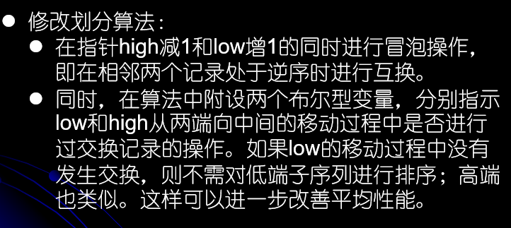
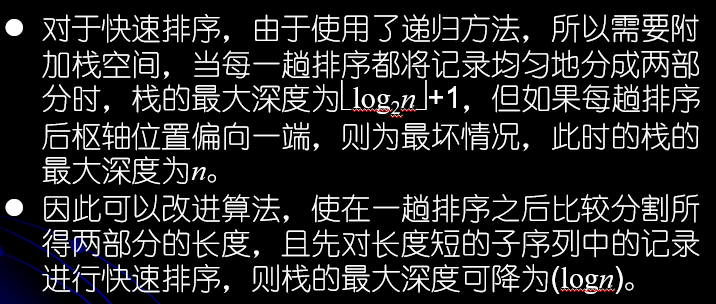
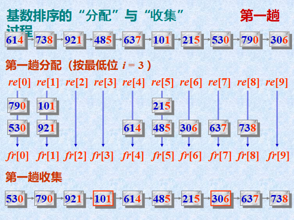
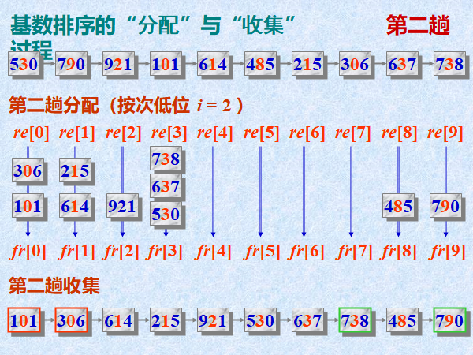
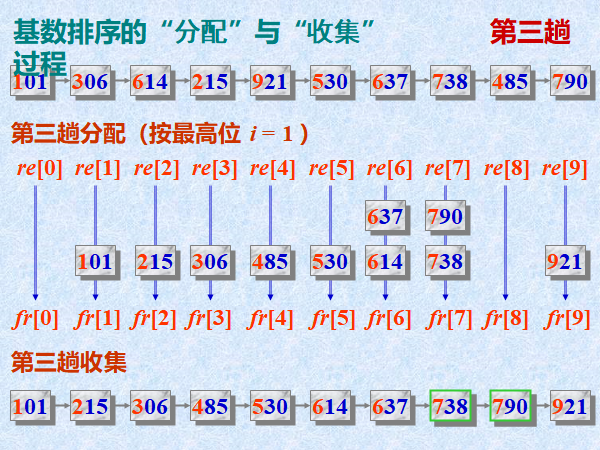
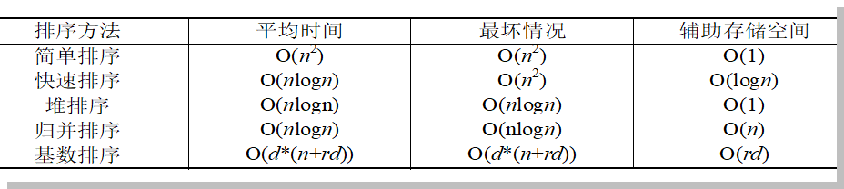
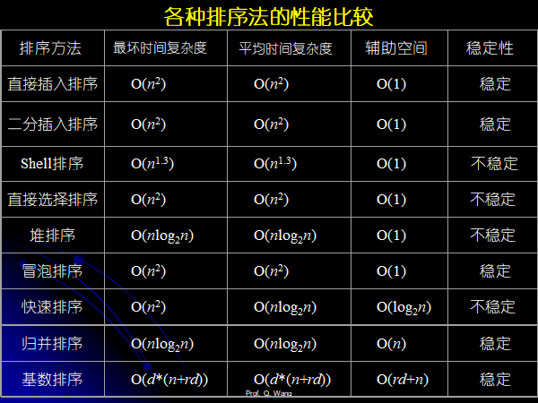
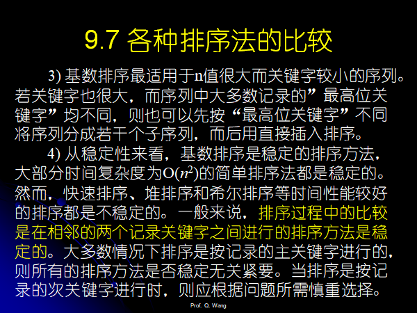
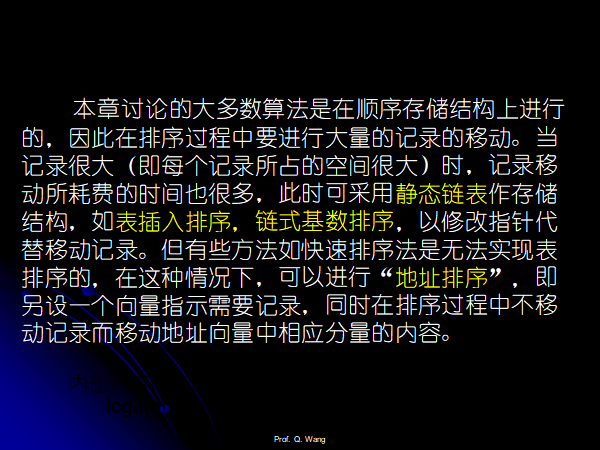

## Chapter 09 Internal sorting

1. Definition
2. Stable and Unstable

### Insertion based sorting

#### Straight inserting based sorting

1. 从小到达排序，很简单的思想，对于已经排序好的序列$a_i-a_j，0<=i<=j$，对于元素$a_{j+1}$，假设需要插入到第$k$个位置，那么从$a_k,i-1<=k<=j+1$开始的向后的所有的元素都要后移。

2. 时间复杂度分析，排序长度为$n$的序列第$i,1<=i<n$个元素需要的比较的次数最坏为$i$次，总共$\sum_{i=1}^{n-1}i=\frac{n(n-1)}{2}$次，需要移动的元素最多为$i$个，总共$\sum_{i=1}^{n-1}i=\frac{n(n-1)}{2}(没算移动a_i的那个元素)$。
3. 时间复杂度$O(n^2)$
4. 这个排序是Stable的。

```cpp
#pragma warning(disable:4996)
#include<cstdio>
#include<iostream>
#include<vector>
using namespace std;
const int maxn = 10005;
/*
struct Node{
    int val;
};
struct List{
    Noode node[maxn];
    int len=0;
};
*/
vector<int>llist;

void insertionBasedSorting(vector<int>& llist) {
    int n = llist.size();
    // 第一个元素已经有序，排序剩下的元素
    for (int i = 1; i < n; i++) {
        int tmp = llist[i];// 获取当前需要插入的元素
        int pos = i - 1;// 当前需要插入的元素前面的一个元素
        while (pos >= 0 && llist[pos] > tmp) {// 我们需要找到第一个llist[pos]<tmp的pos
            llist[pos + 1] = llist[pos];
            pos--;
        }
        // llist[i]这个元素最小，那么应该放在llist[pos]这个位置上
        if (pos == 0 && llist[pos] > tmp) { // 不写等于号使其成为稳定的排序
            llist[pos + 1] = llist[pos];
            llist[pos] = tmp;
        }
        // 这个元素不是最小的，应该放在pos+1的位置上
        else {
            llist[pos + 1] = tmp;
        }
    }
}

int main() {
    int n;
    cin >> n;
    int iin;
    for (int i = 0; i < n; i++) {
        scanf("%d", &iin);
        llist.push_back(iin);
    }
    insertionBasedSorting(llist);
    for (int i = 0; i < llist.size(); i++) {
        cout << llist[i] << " ";
    }
    cout << endl;
    return 0;
}

// 5 4 3 2 5 6
```

#### Dichotomy inserting based sorting

1. 对比直接插入排序，查找不再一个一个比较，采用二分的方法去寻找。

2. 二分查找减少的比较的时间破坏了稳定性。

3. 二分查找的过程需要注意一些细节。

4. 定义函数$int binarySearch(vector<int>\&v,int~begin\_pos,int ~end\_pos,int~val)$

    函数实现：

    当val比$a[begin\_pos]$海小的时候返回$begin\_pos-1$

    当val比$a[end\_pos]$还大的时候返回$end\_pos+1$

    当val比$a[]$中的某个元素大的时候，返回这个位置。

    总结起来就是这一段代码：很好记忆的是吧？

    ```cpp
    // 找到大于等于val的第一个元素的位置，如果没有大于val的元素，返回的是begin_pos-1
    int binarySearch(vector<int>& llist, int begin_pos, int end_pos, int val) {
        int left = begin_pos, right = end_pos;
        int mid;
        while (left<=right) {
            mid = (left + right) / 2;// (1,3)->2得到的中间的数字,(1,4)组合，那么得到(1+4)/2=2，得到一个偏近1的位置。。。 (a,b)代表left和right的位置分别为(a,b)
                                                // 特殊的，(1,1)->1, (1,2)->1
            if (llist[mid] == val) {
                return mid;
            }
            else if (llist[mid] < val) {
                left = mid + 1;
            }
            else {
                right = mid - 1;
            }
        }
        // 这个时候我们如何找到这个>=val的pos?
        // 跳出循环的条件只有left>right
        // 由于mid<=right，所以left最多只能大right 1个单位，也就是跳出循环的条件是right=left+1
        // 那么问题来了
        // 1. 假设之前通过else if(llist[mid]<val)增加left，left==(根据假设得到)mid+1==(通过left>right的跳出条件得到)right+1，也即是mid==right，那么a[mid]<=val,不是等于，
        //    那么必然是a[mid]==a[right]<val，这个时候肯定是返回left==mid+1==right+1
        // 2. 假设之前通过else if(llist[mid]<val)减小right, right==(根据假设得到)mid-1,left==right+1(通过left>right的跳出条件得到)，那么left=mid，也就是要么(1,1)这样的，要么(1,2)这样的，
        //    那么这个时候,a[mid]==a[left]>val，val是最小的元素，我们需要返回的是right，这是插入val的位置
        //    那么如果right<begin_pos，我们需要返回的是right，因为这个时候所有的元素都比val要大，我们直接返回right
        //    如果right>=0，说明>val的第一个元素是left==mid
        // 下面的代码很好记是吧？
        if (right < begin_pos) {
            return right;
        }
        if (left > end_pos) {
            return left;
        }
        return mid;
    }
    ```

    

5. 代码

```cpp
#pragma warning(disable:4996)
#include<cstdio>
#include<iostream>
#include<vector>
using namespace std;
const int maxn = 10005;
/*
struct Node{
    int val;
};
struct List{
    Noode node[maxn];
    int len=0;
};
*/
vector<int>llist;

// 找到大于等于val的第一个元素的位置，如果没有大于val的元素，返回的是begin_pos-1
int binarySearch(vector<int>& llist, int begin_pos, int end_pos, int val) {
    int left = begin_pos, right = end_pos;
    int mid;
    while (left<=right) {
        mid = (left + right) / 2;// (1,3)->2得到的中间的数字,(1,4)组合，那么得到(1+4)/2=2，得到一个偏近1的位置。。。 (a,b)代表left和right的位置分别为(a,b)
                                            // 特殊的，(1,1)->1, (1,2)->1
        if (llist[mid] == val) {
            return mid;
        }
        else if (llist[mid] < val) {
            left = mid + 1;
        }
        else {
            right = mid - 1;
        }
    }
    // 这个时候我们如何找到这个>=val的pos?
    // 跳出循环的条件只有left>right
    // 由于mid<=right，所以left最多只能大right 1个单位，也就是跳出循环的条件是right=left+1
    // 那么问题来了
    // 1. 假设之前通过else if(llist[mid]<val)增加left，left==(根据假设得到)mid+1==(通过left>right的跳出条件得到)right+1，也即是mid==right，那么a[mid]<=val,不是等于，
    //    那么必然是a[mid]==a[right]<val，这个时候肯定是返回left==mid+1==right+1
    // 2. 假设之前通过else if(llist[mid]<val)减小right, right==(根据假设得到)mid-1,left==right+1(通过left>right的跳出条件得到)，那么left=mid，也就是要么(1,1)这样的，要么(1,2)这样的，
    //    那么这个时候,a[mid]==a[left]>val，val是最小的元素，我们需要返回的是right，这是插入val的位置
    //    那么如果right<begin_pos，我们需要返回的是right，因为这个时候所有的元素都比val要大，我们直接返回right
    //    如果right>=0，说明>val的第一个元素是left==mid
    // 下面的代码很好记是吧？
    if (right < begin_pos) {
        return right;
    }
    if (left > end_pos) {
        return left;
    }
    return mid;
}

void insertionBasedSorting(vector<int>& llist) {
    int n = llist.size();
    // 第一个元素已经有序，排序剩下的元素
    for (int i = 1; i < n; i++) {
        int tmp = llist[i];// 获取当前需要插入的元素
        int pos = i - 1;// 当前需要插入的元素前面的一个元素
        int pos_insert = binarySearch(llist, 0, i - 1,tmp);
        if (pos_insert < 0) {
            for (int j = i - 1; j > pos_insert; j--) {
                llist[j + 1] = llist[j];
            }
            llist[0] = tmp;
        }
        else {
            for (int j = i - 1; j >= pos_insert; j--) {
                llist[j + 1] = llist[j];
            }
            llist[pos_insert] = tmp;
        }
    }
}

int main() {
    int n;
    cin >> n;
    int iin;
    for (int i = 0; i < n; i++) {
        scanf("%d", &iin);
        llist.push_back(iin);
    }
    insertionBasedSorting(llist);
    for (int i = 0; i < llist.size(); i++) {
        cout << llist[i] << " ";
    }
    cout << endl;
    return 0;
}

// 6 4 3 2 5 6 6
```


#### Two way inserting based sorting

1. 设待排序数组为$a[~]$，设置一个和$a[~]$数组相同长度的数组$b[~]$，令$b[0]=a[0]$，然后从$a[1]-a[n-1]$开始排序，得到的元素插在$b[0]$的前面或者后面（从小到大排序的话小的元素插在b[0]的前面），这样的一个排序的方法。
2. 当$a[0]$是待排序数组中最大的或者是最小的元素的时候，退化为直接插入排序。
3. 可以减少元素的移动的次数，比较的次数不变，记录移动的次数大概为$\frac{n^2}{8}$，需要$n$个辅助的存储空间。
4. 具体的实现：使用两个指针$first$和$last$指示$d[~]$中的第一个和最后一个元素，每次的插入排序是在$first$~$last$的范围内进行的。
5. Stable。

```cpp
#pragma warning(disable:4996)
#include<cstdio>
#include<iostream>
#include<vector>
using namespace std;

// first和last可能为负数，也即是last和first始终保持着last>=first的关系。
// 那么first和last指示的元素在d[]中的实际位置为(first+n)%n和(last+n)%n
int insert(vector<int>& v, vector<int>& d, int& first, int& last, int& val) {
    // val>=d[last]终止
    int n = v.size();
    int cur_pos_last = (last + n) % n;
    int cur_pos_first = (first + n) % n;
    int tmp_last = last;

    // 当val比所有的元素要小
    if (d[cur_pos_first] > val) {
        first--;
        return first;
    }

    // val并不比所有的元素要小
    while (d[cur_pos_last] > val) {
        // 移动元素
        d[(cur_pos_last + 1)%n] = d[cur_pos_last];

        tmp_last--;
        cur_pos_last = (tmp_last + n) % n;
    }
    // 说明当前满足d[last]<=val，那么插入位置就是last+1。
    last++;
    return tmp_last + 1;
}
void twoWayInsertionBasedSorting(vector<int>& v) {
    int n = v.size();
    vector<int>d(n);
    if (n == 0) {
        return;
    }
    d[0] = v[0];
    int first = 0, last = 0;
    for (int i = 1; i < n; i++) {
        int val = v[i];
        int insert_pos = (insert(v, d, first, last, val) + n) % n;
        d[insert_pos] = val;
    }
    for (int i = 0; i < n; i++) {
        v[i] = d[(first + n) % n];
        first++;
    }
}

int main() {
    vector<int> a({ 15,4,3,2,5,6,6,12,21,127,127,2,2,2,1,3 });
    twoWayInsertionBasedSorting(a);
    for (int i = 0; i < a.size(); i++) {
        cout << a[i] << " ";
    }
    cout << "\n";
}
```


#### Shell sorting

1. 缩小增量排序，直接插入排序中当**元素已经有序的时候**需要进行$n$次比较即可，时间复杂度为$O(n)$，这个时候直接插入排序的**效率比较高**。直接插入排序在**$n$值较小的时候插入的效率也高**（移动元素的次数少），这样的话我们结合这两个特征就可以得到**Shell**排序的方法。
2. 首先将待排记录分成若干个**子序列**，然后对这若干个小的序列进行插入排序，最后再对整个序列进行一次插入排序。
3. Unstable.
4. 平均时间复杂度大约为$O(n^{1.3})$，最坏$O(n^2)$。
5. [例子:](https://www.cnblogs.com/l199616j/p/10740165.html)


6. 实现起来的话也不难，设置一个步长变量$s=\frac{n}{2}$，变化规则如下$s,s/2,s/2^2...$，对于第$i$个元素和第$i+s$个元素，排序这两个元素，然后$s>>=1$，不断的重复这个过程，最后来一次插入排序。

```cpp
#pragma warning(disable:4996)
#include<cstdio>
#include<iostream>
#include<vector>
#include<algorithm>
using namespace std;

vector<int>llist;

void insertionBasedSorting(vector<int>& llist) {
    int n = llist.size();
    // 第一个元素已经有序，排序剩下的元素
    for (int i = 1; i < n; i++) {
        int tmp = llist[i];// 获取当前需要插入的元素
        int pos = i - 1;// 当前需要插入的元素前面的一个元素
        while (pos >= 0 && llist[pos] > tmp) {// 我们需要找到第一个llist[pos]<tmp的pos
            llist[pos + 1] = llist[pos];
            pos--;
        }
        // llist[i]这个元素最小，那么应该放在llist[pos]这个位置上
        if (pos == 0 && llist[pos] > tmp) { // 不写等于号使其成为稳定的排序
            llist[pos + 1] = llist[pos];
            llist[pos] = tmp;
        }
        // 这个元素不是最小的，应该放在pos+1的位置上
        else {
            llist[pos + 1] = tmp;
        }
    }
}

void shellBasedSorting(vector<int>& v) {
    int n = v.size();
    if (n <= 1) {
        return;
    }
    int s = n / 2;
    while (s >= 1) {
        for (int i = 0; i + s < n; i++) {
            if (v[i + s] < v[i]) {
                swap(v[i], v[i + s]);
            }
        }
        s >>= 1;
    }
    insertionBasedSorting(v);
}

int main() {
    vector<int> a({ 15,4,3,2,5,6,6,12,21,127,127,2,2,2,1,3 });
    shellBasedSorting(a);
    for (int i = 0; i < a.size(); i++) {
        cout << a[i] << " ";
    }
    cout << "\n";
}
```


### Swap based sorting

交换排序，基本的思想，两两比较需要排序的数据，需要交换的就交换，直到所有的数据都排列好。

#### Bubble sorting

1. 每次从前往后扫描所有的元素，找到最大的元素，不断地向后推，循环n次，这样得到的最终的序列就是已经排序号的序列。

2. 时间复杂度最坏的情况逆序的情况，$O(n^2)$，$n-1$次比较和元素的交换。
3. 稳定的算法。

```cpp
#pragma warning(disable:4996)
#include<cstdio>
#include<iostream>
#include<algorithm>
#include<vector>

using namespace std;
void bubbleSorting(vector<int>& v) {
	int n = v.size();
    // 第一次把最大的冒到最后，其次次大...
	for (int i = 0; i < n; i++) {
		for (int j = 0; j < n - i - 1; j++) {
			if (v[j] > v[j + 1]) {
				swap(v[j], v[j + 1]);
			}
		}
	}
	return;
}

int main() {
	vector<int> a({ 15,4,3,2,5,6,6,12,21,127,127,2,2,2,1,3 });
	bubbleSorting(a);
	for (int i = 0; i < a.size(); i++) {
		cout << a[i] << " ";
	}
	cout << "\n";
}
```


#### Quick sorting

1. 通过选出的基准将序列分为两个部分，小的一部分在一边，大的部分在一遍，然后对这两个部分重复上面的过程。

2. 附设两个指针low和high，它们的初值分别是一个序列的第一个和最后一个记录的位置，设枢轴记录的关键字为pivotKey。

    首先从high所指位置起向前搜索直到第一个关键字小于pivotKey的记录和枢轴记录交换，然后从low所指位置起向后搜索，找到第一个关键字大于pivotKey的记录和枢轴记录互相交换，重复交替这两步直到low=high为止。

3. 快速排序的平均时间复杂度经过研究为$T_{avg}(n)=kn~ln(n)$,k是一个常数。经过研究，快速排序的常数因子最小，平均性能最好，如果初始序列基本有序或者是基本无序，变成冒泡排序。

    因此，平均时间复杂度$O(nlog_2n)$

    空间复杂度$O(log_2n)$主要是栈的开销。

4. 改进：三者取中，选择合适的基准程序改善快速排序的性能。

5. 不稳定Unstable.

6. 快速排序算法的优化：

    

    如何进行优化？

    

    如何进行优化？

7. 快速排序代码：

```cpp
#pragma warning(disable:4996)
#include<cstdio>
#include<iostream>
#include<algorithm>
#include<vector>

using namespace std;

void quickSort(vector<int>& v, int left, int right) {
	if (left >= right) {
		return;
	}
	int original_left = left, original_right = right;
	int base = v[left];
	while (left < right) {
		// 找到第一个小于base的元素
		while (right > left && v[right] >= base) {
			right--;
		}
		// 该元素是第一个小于base的元素
		if (right > left) {
			v[left] = v[right];
		}
		// 如果没找到小于base的元素，那么必定有left==right,v[left]这个元素我们已经处理过了，不需要再处理，所以上面我们用left<right而不用left<=right

		// 找到第一个大于base的元素
		while (left < right && v[left] <= base) {
			left++;
		}
		if (left < right) {
			v[right] = v[left];
		}
	}
	// 跳出循环的时候必然有left==right
	// 那么
	v[left] = base;
	quickSort(v, original_left, left - 1);
	quickSort(v, left + 1, original_right);

}
void quickSorting(vector<int>& v) {
	int n = v.size();
	int left = 0, right = n - 1;
	quickSort(v, left, right);
}

int main() {
	vector<int> a({ 15,4,3,2,5,6,6,12,21,127,127,2,2,2,1,3 });
	//bubbleSorting(a);
	quickSorting(a);
	for (int i = 0; i < a.size(); i++) {
		cout << a[i] << " ";
	}
	cout << "\n";
}
```

### Selection based sorting

选择，顾名思义，每次从前往后选择相应的元素放在对应的位置。

#### Simple selection based sorting

1. 不稳定Unstable，因为将元素交换的时候可能出现把原本在前面的元素换到后面的况。
2. 时间复杂度$O(n^2)$

```cpp
#pragma warning(disable:4996)
#include<cstdio>
#include<iostream>
#include<algorithm>
#include<vector>

using namespace std;

void selectionBasedSorting(vector<int>& v) {
    int n = v.size();
    for (int i = 0; i < n; i++) {
        int min_val = v[i], min_pos = i;
        for (int j = i + 1; j < n; j++) {
            if (min_val > v[j]) {
                min_val = v[j];
                min_pos = j;
            }
        }
        if (min_pos != i) {
            // 不稳定是因为这个交换
            swap(v[min_pos], v[i]);
        }
    }
}

int main() {
    vector<int> a({ 15,4,3,2,5,6,6,12,21,127,127,2,2,2,1,3 });
    //bubbleSorting(a);
    //quickSorting(a);
    selectionBasedSorting(a);
    for (int i = 0; i < a.size(); i++) {
        cout << a[i] << " ";
    }
    cout << "\n";
}
```


#### Tree selection based sorting

**还没有自己写一遍**

1. 又称为Tournament Sorting
2. 首先在$n$个数字中进行两两的比较，然后再在$ceil(n/2)$的元素中进行两两的比较，重复上述过程，直到找到最大的元素位置，这个过程可以用满二叉树进行描述。
3. 每次两两的比较把关键码较小的元素上升到顶部，这个东西叫做**胜者树**，反之叫做败者树。
4. 该二叉树的深度为$ceil(nlog_2(n+1))$,n为待排序的元素的个数。
5. 第一次的比较的次数为$n-1$，下面的比较次数均为$log_2(n)$总的关键码的比较的次数为$O(nlog_2n)$。
6. 移动的次数不超过比较的次数。
7. 所以时间复杂度为$O(nlog_2(n))$
8. 空间复杂度$O(n)$。
9. Stable的排序算法。
10. 胜者树的一个实现如下所示：

```cpp
#pragma warning(disable:4996)
#include<cstdio>
#include<iostream>
#include<algorithm>
#include<vector>

using namespace std;

template <class Type>
class DataNode {
public:
	Type data;//  存放数据
	int index;// 索引，放在数组中的索引
	int active;// 是否参选
};

// 不处理溢出
int powerOfTwo(int n) {
	int res = 1;
	int pow = 2;
	while (n) {
		if (n & 1) {
			res = res * pow;
		}
		pow = pow * pow;
		n >>= 1;
	}
	return res;
}

// 更新的时候自下向上进行更新
template <class Type>
void updateTree(Type* tree, int i) {
	// 当前的索引是右边的节点
	if (i % 2 == 0 && tree[i-1].active==true) {// 对手是左边的节点
		tree[(i - 1) / 2] = tree[i - 1];// 更新其父亲节点

	}
	else if(i%2==1&&tree[i+1].active==true){// 对手是右边的节点
		tree[(i - 1) / 2] = tree[i + 1];// 更新其父亲节点
	}
	else {// 两个节点都是无效的
		tree[(i - 1) / 2].active = false;
	}
	i = (i - 1) / 2;//得到其父亲节点的索引
	int j;
	while (i) {
		if (i % 2 == 0) {//当前节点是右边的节点
			j = i - 1;// 获得左边的节点
		}
		else {
			j = i + 1;// 获得右边的节点
		}
		// 此时,i和j分别指示当前待比较的两个节点
		if (!tree[i].active || !tree[j].active) {
			if (tree[i].active) {
				tree[(i - 1) / 2] = tree[i];
			}
			else if(tree[j].active){
				tree[(i - 1) / 2] = tree[j];
			}
			else {
				tree[(i - 1) / 2].active = false;
			}

		}
		else {
			if (tree[i].data < tree[j].data) {
				tree[(i - 1) / 2] = tree[i];
			}
			else {
				tree[(i - 1) / 2] = tree[j];
			}
		}
		i = (i - 1) / 2;
	}
}
template<class Type>
// n应该是数组长度len满足2^{k-1}<len<=2^k的这个k,也就是k-1<log2(len)<=k,也就是ceil(log2(len))
void tournamentSort(Type a[], int n, int k) {
	DataNode<Type>* tree;
	DataNode<Type>item;
	// 长度为n的序列，建树的时候需要2^n的长度的数组去存储。
	int bottomRowSize = powerOfTwo(k);
	int treeSize = 2 * bottomRowSize - 1;
	int loadindex = bottomRowSize - 1;// 内部节点的个数
	tree = new DataNode<Type>[treeSize];
	// 下面复制a[]数据到胜者树的叶子节点
	for (int i = loadindex; i < treeSize; i++) {
		if (i - loadindex < n) {
			tree[i].index = i;
			tree[i].data = a[i - loadindex];
			tree[i].active = true;
		}
		else {
			tree[i].active = false;
		}
	}

	// 下面进行初始化的比较选择较小的项填入到我们的胜者树之中
	int i = loadindex, j;// i指示当前正在比较的那一排的第一个元素，j指示当前正在比较的两个元素的第一个
	while (i) {
		j = i;
		while (j < 2 * i) {// 遍历那一层所有的元素
			if (!tree[j + 1].active || tree[j].data < tree[j + 1].data) {
				tree[(j - 1) >> 1] = tree[j];
			}
			else {
				tree[(j - 1) >> 1] = tree[j + 1];
			}
			j += 2;
		}// 至此，下面的那一排比较完毕
		i = (i - 1) >> 1;// 开始比较上面的一排
	}

	// 下面处理其它的n-1个没有排序好的序列，送出最小的数字使其失去参选的资格
	for (i = 0; i < n - 1; i++) {
		a[i] = tree[0].data;//得到最小的数字
		tree[tree[0].index].active = false;// 该节点失效,只需要标记最下面的节点是否是失效的就可以了
		updateTree(tree, tree[0].index);
	}
	a[n - 1] = tree[0].data;
}

int main() {
	vector<int> a({ 15,4,3,2,5,6,6,12,21,127,127,2,2,2,1,3 });
	int b[] = { 15,4,3,2,5,6,6,12,21,127,127,2,2,2,1,3 };
	tournamentSort(b, 16, 4);
	for (int i = 0; i < 16; i++) {
		cout << b[i] << " ";
	}
	cout << "\n";

	//int b[] = { 4,3,2,5,6,6,7,8 };
	//tournamentSort(b, 8, 3);
	//for (int i = 0; i < 8; i++) {
	//	cout << b[i] << " ";
	//}
	//cout << "\n";
}
```


#### Heap sorting

1. 锦标赛排序的坏处是使用了过多的辅助的空间，并且给较大的元素进行了多次的比较，于是有了**堆排序**。

2. **堆的定义**：n个元素的序列$a_0,a_1,...,a_{n-1}$当且仅当满足如下的关系的时候，称之为堆：

    $$f(x)=
    \begin{cases}
    k_i<k_{2i+1}\\
    k_i<k_{2i+2}\\
    \end{cases}$$

    $$f(x)=
    \begin{cases}
    k_i>k_{2i+1}\\
    k_i>k_{2i+2}\\
    \end{cases}$$

    的时候，称为堆。

3. 堆排序的实现：

    * 如何由一个无序的序列建成一个堆，**自底向上**调整。

    * 输出堆顶的元素之后，如何调整剩余的元素使其成为一个新的堆，**自上向下**调整。

        输出堆顶的元素之后，堆顶用堆中最后一个元素替代，然后自顶向下的进行调整，使其满足堆的性质。首先堆顶的元素和左右的孩子进行比较，然后把比较小的孩子上升到堆顶部（假设是最小堆），假设该孩子是左孩子，那么左孩子的根发生了变化，需要重复上述的调整的过程（递归的过程），直到调整到根部的元素比两个孩子的元素都要小（相等）或者是到达叶子节点没有两个孩子为止。

4. 堆排序是**Unstable**不稳定的排序算法，因为每一次把最后的一个元素提到了前面，后续调整堆的时候不知道会不会被调整到相等值数据的前面。

5. 堆排序的比较次数为：$2n(\lfloor log_2n\rfloor)$，最坏的情况下，时间复杂度也是$O(nlogn)$，只需要一个记录大小的辅助空间。

6. 具体的实现，假设待排序的数字的个数为$n$，按照完全二叉树的形式组织这些数字编号为$0-(n-1)$，编号最大的非终端的节点其实就是第$\lfloor \frac{n}{2} \rfloor$个元素，也就是编号为$\lfloor \frac{n}{2} \rfloor+1$的元素，因此筛选需要从这一个元素开始，一致筛选到第一个元素。

堆排序的具体的实现。

```cpp
#pragma warning(disable:4996)
#include<cstdio>
#include<iostream>
#include<algorithm>
#include<vector>

using namespace std;
const int MAXN = 10005;

// 最大堆得到最小排列
void sift(vector<int>& pvector, int i, int n) {
	int child, tmp;
	tmp = pvector[i];
	child = 2 * i + 1;// 得到左孩子节点
	while (child < n) {
		// 三个节点选择小的放到父亲节点上

		// 如果右孩子小就选择右孩子
		if ((child < n - 1) && (pvector[child] < pvector[child + 1])) {
			child++;
		}
		// 父亲的值和孩子进行比较
		if (tmp < pvector[child]) {
			// swap(pvector[child],pvector[i]);
			pvector[i] = pvector[child];
			i = child;// 说明需要向孩子为根的子树上调整
			child = 2 * i + 1;
		}
		else break;// 说明不需要向下进行调整
	}
	// 跳出的条件一个是没有孩子节点了，也就是到达了叶子节点
	// 第二个可能的情况就是当前以i为根的子树不需要进行额外的调整了
	pvector[i] = tmp;
}
// 数组的编号从1开始
void heapSort(vector<int>& pvector) {
	int n = pvector.size();
	// 下面首先建立堆,这里序号是从0开始的，所以减去n/2-1,i-1
	for (int i = n / 2 - 1; i >= 0; i--) {
		sift(pvector, i, n);//从i号节点一直向下维护好堆,当前还剩余n个长度大小的堆需要维护。
	}

	// 接下来不断的删除堆顶的元素，不断的取出元素
	for (int i = n - 1; i > 0; i--) {
		swap(pvector[0], pvector[i]);// 最后一个元素放到堆顶进行调整
		sift(pvector, 0, i - 1);
	}
}

int main() {
	vector<int> a({ 15,4,3,2,5,6,6,12,21,127,127,2,2,2,1,3 });
	int b[] = { 15,4,3,2,5,6,6,12,21,127,127,2,2,2,1,3 };
	//tournamentSort(b, 16, 4);
	heapSort(a);
	for (int i = 0; i < a.size(); i++) {
		cout << a[i] << " ";
	}
	cout << "\n";

	//int b[] = { 4,3,2,5,6,6,7,8 };
	//tournamentSort(b, 8, 3);
	//for (int i = 0; i < 8; i++) {
	//	cout << b[i] << " ";
	//}
	//cout << "\n";
}
```


### Merging based sorting

#### 2-way merging based sorting

假设初始的序列的长度为n，看成是长度为n的子序列，每个子序列的长度为1，然后我们两两子序列进行归并，得到长度为$\lceil \frac{n}{2} \rceil$个长度为2或者1的有序的子序列。如此重复直到得到程度为n的有序的序列为止。

1. Stable的算法，但是很少适用于内部排序。
2. 归并排序可以采用顺序存储结构和静态链表的存储结构。

归并排序的一个实现，采用顺序存储结构：

时间复杂度$O(nlogn)$

空间复杂度$O(n)$，这个$O(n)$的空间主要用来辅助归并，栈的使用也需要使用额外的空间。

```cpp
#pragma warning(disable:4996)
#include<cstdio>
#include<iostream>
#include<algorithm>
#include<vector>

using namespace std;
const int MAXN = 10005;
void mergeSort(vector<int>& v, int left, int right, vector<int>vt) {
	if (left >= right) {
		return;
	}
	int mid = (left + right) / 2;
	mergeSort(v, left, mid, vt);
	mergeSort(v, mid + 1, right,vt);
	int pleft = left, pright = mid + 1;
	int pmerge = left;
	while (pleft <= mid && pright <= right) {
		if (v[pleft] <= v[pright]) {
			vt[pmerge++] = v[pleft++];
		}
		else{
			vt[pmerge++] = v[pright++];
		}
	}
	while (pleft <= mid) {
		vt[pmerge++] = v[pleft++];
	}
	while (pright <= right) {
		vt[pmerge++] = v[pright++];
	}

	for (int i = left; i <= right; i++) {
		v[i] = vt[i];
	}
}
void mergeBasedSort(vector<int>& v) {
	int n = v.size();
	int left = 0, right = n - 1;
	vector<int>vt(v.size());
	mergeSort(v, left, right,vt);
}

int main() {
	vector<int> a({ 15,4,3,2,5,6,6,12,21,127,127,2,2,2,1,3 });
	int b[] = { 15,4,3,2,5,6,6,12,21,127,127,2,2,2,1,3 };
	mergeBasedSort(a);
	for (int i = 0; i < a.size(); i++) {
		cout << a[i] << " ";
	}
	cout << "\n";
}
```

采用静态链表的方式实现归并排序，实际上便省去了复制和移动元素的时间。

[静态链表的归并排序的实现](https://www.cnblogs.com/zhanghaiba/p/3534521.html)

2021.3.16日需要去实现。

链表的归并排序和静态链表的归并排序大抵类似，这里先实现了一般单向链表的归并排序。

具体的思路是：

1. 排序的思想和数组为存储结构的归并排序是一致的，每次将链表一拆为二，分别对左右两边进行排序。

2. 链表排序和数组排序的不同有：

    * 无法轻易的找到一段链表中间的节点，这个我们可以用快慢指针来实现，初始设置一个$slow$和$fast$的指针，$slow=left,fast=left->right(列表只有一个元素的情况特殊处理)$,然后我们:

    ```cpp
    while (fast != right) {
        fast = fast->next;
        if (fast == right) {
            break;
        }
        slow = slow->next;
        fast = fast->next;
    }
    ```

    这样的话我们就可以从$slow$处去划分，将$[left,right]$划分为$[left,slow]$和$[slow->next,fast]$。

    * 将$[left,right]$划分为$[left,slow]$和$[slow->next,fast]$之后对$[left,slow]$和$[slow->next,fast]$分别进行排序，排序过后$left,slow,slow->next和fast$指向的值很可能发生变化，因此$mergeSort(left,right)$的两个参数改成引用的类型，便于修改，值得注意的是，引用类型不能传入$slow->next$这样的参数，否则会导致前面排好序的链表中的某个元素的$next$被神奇的修改掉。

3. 下面给出详细的代码：

```cpp
#pragma warning(disable:4996)
#include<cstdio>
#include<iostream>
#include<algorithm>
#include<vector>
#include<stack>

using namespace std;
const int MAXN = 10005;

struct Node {
	int val;
	Node* next;
	Node(int _val = 0, Node* _next = NULL) {
		val = _val;
		next = _next;
	}
};

struct Head {
	Node* head;
	int n;
	Head(Node* _head = NULL, int _n = 0) {
		head = _head;
		n = _n;
	}
};

void mergeSort(Node*& left, Node*& right) {
	if (left == right) {
		return;
	}
	// 至少两个元素
	Node* slow = left, * fast = left->next;
	while (fast != right) {
		fast = fast->next;
		if (fast == right) {
			break;
		}
		slow = slow->next;
		fast = fast->next;
	}
	Node* mid = slow;			// 分成[left,mid]和[mid+1,right]
	Node* mid_1 = slow->next;
	// 排完序之后left和mid都可能会被改掉
	mergeSort(left, mid);

	// 排完序之后left和mid都可能会被改掉
	mergeSort(mid_1, right);

	// 修改mid->next=NULL
	// 修改right->next=NULL
	// 为了下面方便合并
	mid->next = NULL;
	right->next = NULL;

	Node* head = NULL, * cur = NULL;
	Node* p1 = left, * p2 = mid_1;
	// 因为不知道p1的后面是什么元素，所以最后一个元素特殊处理
	while (p1 != NULL && p2 != NULL) {
		if (p1->val <= p2->val) {
			if (head == NULL) {
				cur = p1;
				head = cur;
			}
			else {
				cur->next = p1;
				cur = cur->next;
			}
			p1 = p1->next;

		}
		else {
			if (head == NULL) {
				cur = p2;
				head = cur;
			}
			else {
				cur->next = p2;
				cur = cur->next;
			}
			p2 = p2->next;
		}
	}

	while (p1 != NULL) {
		cur->next = p1;
		cur = cur->next;
		p1 = p1->next;
	}
	while (p2 != NULL) {
		cur->next = p2;
		cur = cur->next;
		p2 = p2->next;
	}

	// 改掉left和right
	left = head;
	right = cur;
	return;
}

void linkedListMergeSort(Head& head) {
	if (head.head == NULL) {
		return;
	}

	// 下面找到最右端的节点使right指向这个Node
	Node* left = head.head, * right = head.head;
	Node* lleft = NULL;// 最右端节点的前面的一个节点
	while (right != NULL) {
		lleft = right;
		right = right->next;
	}
	right = lleft;
	mergeSort(left, right);
	head.head = left;
}

int main() {
	//vector<int> a({ 15,4,3,2,5,6,6,12,21,127,127,2,2,2,1,3 });
	vector<int> a({ 7,5,1,2,3,4 });
	for (int i = 0; i < a.size(); i++) {
		cout << a[i] << " ";
	}
	cout << "\n";

	Head head;
	// 建立链表
	for (int i = 0; i < a.size(); i++) {
		Node* node = new Node();
		node->val = a[i];
		node->next = head.head;
		head.head = node;
	}
	linkedListMergeSort(head);
	Node* node = head.head;
	while (node) {
		cout << node->val << " ";
		node = node->next;
	}
	cout << "\n";
}
```


### Radix sorting

基数排序和之前说到的排序的方法都不大一样，前面排序的方法的基本操作都是比较和移动记录，基数排序**借助于多关键字排序思想对单逻辑关键字进行排序**的方法，不需要进行关键字的比较。

**多关键字排序**:假设序列$(R_1,R_2,...,R_n)$，每个$R_i$中含有$d$个关键字$(k_i^0,k_i^1,...,k_i^{d-1})$，该序列对关键字有序是指，对任意的$R_i,R_j,1<=i<j<=n$，都有:

$(k_i^0,k_i^1,...,k_i^{d-1})<(k_j^0,k_j^1,...,k_j^{d-1})$

$k^0$称为主关键字，其余的称为次关键字。

**最高位优先法**：先按照$k^0$排序，然后$k^1$，…，最后$k^{d-1}$

**最低位优先法**：先按照$k^{d-1}$排序，然后$k^{d-2}$，…，最后$k^{0}$

**注意**：从低位到高位**必须**使用**稳定的**排序方法，例如12和13排序，低位排完后，我们得到12在13的前面，这个时候我们需要排1这一位，这个时候如果采用不稳定的排序算法，13可能被排到12的前面，因此，从低位到高位排序必须使用稳定的排序算法。

从高位到地位排序则不必，因为10进制的数字，高位排完序之后，下面是按照每一个高位分为10个桶，在每一个桶里面重复刚才的排序的过程。

**时间复杂度**：假设有d个关键字，每一个关键字的取值范围为r，一趟分配的时间复杂度为$O(n)$，一趟收集的时间复杂度为$O(r)$，总的时间复杂度为**$O(d(n+r))$**。

**基数排序法某些情况下拥有更好的性能**,    例如：有1,000,000个8位的整数要进行排序，使用快速排序法，至少需要*n*log2*n*次比较，即2千万次，用基数排序法则只需要8*(1,000,000+10)，约8百万次。

**空间复杂度**：增加了$n+2r,(n是存放n个数据的空间，2r是r个头指针和尾指针)$的空间。

基本的**过程**：

1. **分配**

2. **收集**

    首先以**静态链表**（cpp里面的vector<>也不错）存储n个待排列的记录，**表头**指针指向第一个记录，例如：

    p→614→738→921→485→637→101→215→530→790→306

    第一趟分配对最低数位关键字进行，改变记录指针值将链表中的记录分配至10个链队列中去，每个队列中的记录关键字的个位数相等；第一趟收集是改变所有非空队列的队尾的指针域，令其指向下一个非空队列的队头记录，重新将10个队列中的记录链成一个链表；第二趟分配和收集是针对十位数位进行的，过程和个位数位相同。其他位数一样。

    

    

    

    实现的参考代码：

    ```cpp
    #pragma warning(disable:4996)
    #include<cstdio>
#include<iostream>
    #include<algorithm>
#include<vector>
    #include<stack>

    using namespace std;
const int MAXN = 10005;
    
    struct Node {
    	int val;
    	Node* next;
    	Node(int _val = 0, Node* _next = NULL) {
    		val = _val;
    		next = _next;
    	}
    };
    
    struct Head {
    	Node* head;
    	int n;
    	Head(Node* _head = NULL, int _n = 0) {
    		head = _head;
    		n = _n;
    	}
    };
    
    // 获取val右边第i位的数字
    int getNum(int val, int i) {
    	int res = 0;
    	for (int j = 0; j <= i; j++) {
    		res = val % 10;
    		if (res == 0) {
    			return res;
    		}
    		val /= 10;
    	}
    	return res;
    }
    void radixSort(Head& head, int d) {
    	if (head.head == NULL) {
    		return;
    	}
    	Node* nodesFirst[10] = { NULL };// 头
    	Node* nodesCur[10] = { NULL };	// 当前最后的一个节点
    
    	Node* first = head.head;
    	Node* cur = first;
    
    	// 开始分配
    	for (int i = 0; i < d; i++) {
    		cur = first;
    		Node* curr = first;
    		while (cur != NULL) {
    			// 取出右边第i位
    			int val = cur->val;
    			int num = getNum(val, i);
    			if (nodesFirst[num] == NULL) {
    				nodesFirst[num] = cur;
    				nodesCur[num] = cur;
    			}
    			else {
    				nodesCur[num]->next = cur;
    				nodesCur[num] = nodesCur[num]->next;
    			}
    			cur = cur->next;
    		}
    
    		// 进行收集
    		int j = 0;
    		while (nodesFirst[j] == NULL) {
    			j++;
    		}
    		first = nodesFirst[j];
    		cur = nodesCur[j];		// 前面一个列别的最后的一个Node
    		j++;
    		for (; j < 10; j++) {
    			if (nodesFirst[j] != NULL) {
    				cur->next = nodesFirst[j];	// 两边连起来
    				cur = nodesCur[j];
    			}
    		}
    		cur->next = NULL;
    		curr = first;
    		while (curr != NULL) {
    			cout << curr->val << " ";
    			curr = curr->next;
    		}
    		cout << "\n";
    		memset(nodesFirst, 0, sizeof(nodesFirst));
    		memset(nodesCur, 0, sizeof(nodesCur));
    	}
    	head.head = first;
    }
    
    int main() {
    	vector<int> a({ 15,4,3,2,5,6,6,12,21,127,127,2,2,2,1,3 });
    	//vector<int> a({ 7,5,1,2,3,4 });
    	for (int i = 0; i < a.size(); i++) {
    		cout << a[i] << " ";
    	}
    	cout << "\n";
    
    	Head head;
    	// 建立链表
    	for (int i = 0; i < a.size(); i++) {
    		Node* node = new Node();
    		node->val = a[i];
    		node->next = head.head;
    		head.head = node;
    	}
    	radixSort(head, 3);
    	Node* node = head.head;
    	while (node) {
    		cout << node->val << " ";
    		node = node->next;
    	}
    	cout << "\n";
    }
    ```
    
    
    
    ## 各种排序方法的总结
    
    1. 平均时间性能：以快速排序法最佳，但最坏情况下不如堆排序和归并排序；在*n*较大时，归并排序比堆排序快，但所需辅助空间最多。
    2. 简单排序以直接插入排序最简单，当下列中记录“基本有序” 或*n*值较小时，是最佳的排序方法。因此常和其他排序方法结合使用。
    
    
    
    








